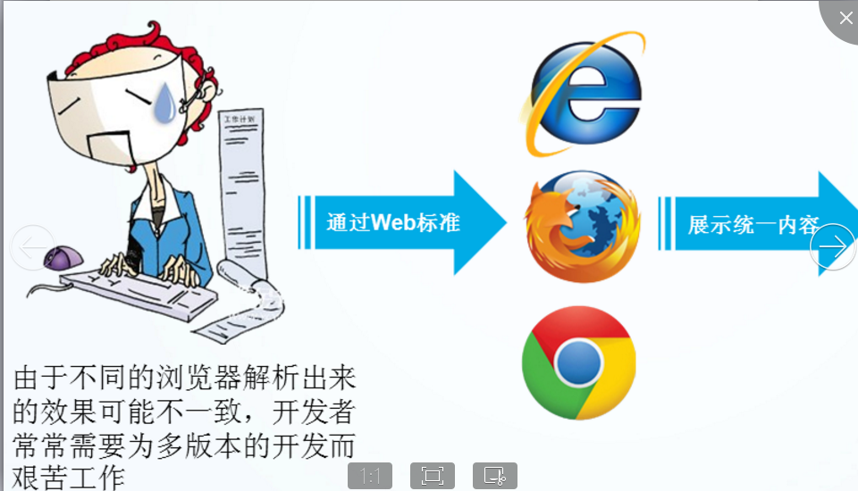
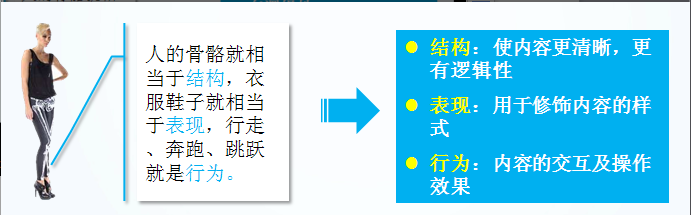
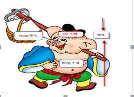
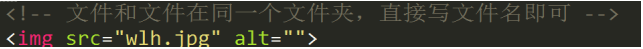
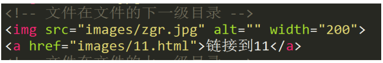
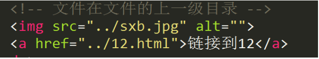
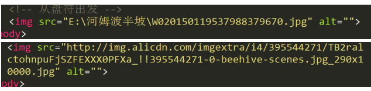

# 1 正确的引导学习方法

  一定强调学生少看视频，多理解，勤练习。每天案例要独自敲三遍。

# 2 web前端三大组成部分

HTML（结构）   CSS（样式）  JS（行为）

# 3 web标准 （重点）

→ 为什么需要web标准？
  不同的浏览器，渲染引擎可能不一样，所渲染的方式可能会有差别，以至于同样的代码在不同的浏览器中，显示的效果不一样。

→ web标准的好处？
(1) 让Web的发展前景更广阔

(2) 内容能被更广泛的设备访问

(3) 更容易被搜寻引擎搜索

(4) 降低网站流量费用

(5) 使网站更易于维护

(6) 提高页面浏览速度

→ web标准的组成部分
        Web标准不是某一个标准，而是由W3C和其他标准化组织制定的一系列标准的集合。主要包括结构（Structure）、表现（Presentation）和行为（Behavior）三个方面。

结构标准：结构用于对网页元素进行整理和分类，如html

样式标准：表现用于设置网页元素的版式、颜色、大小等外观样式，如css
行为标准：行为是指网页模型的定义及交互的编写，如js

直观感受：

总结：web标准右三部分组成，结构标准、样式标准、行为标准。

浏览器内核属于常见面试题（不要求必须背下来，做为提醒）

常见的内核
                常见的浏览器内核可以分这5种：Trident、Gecko、Blink、Webkit、Presto。

（1）Trident(IE内核)

国内很多的双核浏览器的其中一核便是 Trident，美其名曰 &quot;兼容模式&quot;。

代表： IE、傲游、世界之窗浏览器、Avant、腾讯TT、猎豹安全浏览器、360极速浏览器、百度浏览器等。

Window10 发布后，IE 将其内置浏览器命名为 Edge，Edge 最显著的特点就是新内核 EdgeHTML。

（2）Gecko(firefox)

Gecko(Firefox 内核)： Mozilla FireFox(火狐浏览器) 采用该内核，Gecko 的特点是代码完全公开，因此，其可开发程度很高，全世界的程序员都可以为其编写代码，增加功能。 可惜这几年已经没落了， 比如 打开速度慢、升级频繁、猪一样的队友flash、神一样的对手chrome。

（3） webkit(Safari)

Safari 是苹果公司开发的浏览器，所用浏览器内核的名称是大名鼎鼎的 WebKit。

现在很多人错误地把 webkit 叫做 chrome内核（即使 chrome内核已经是 blink 了），苹果感觉像被别人抢了媳妇，都哭晕再厕所里面了。

代表浏览器：傲游浏览器3、 Apple Safari (Win/Mac/iPhone/iPad)、Symbian手机浏览器、Android 默认浏览器，

（4） Chromium/Blink(chrome)

在 Chromium 项目中研发 Blink 渲染引擎（即浏览器核心），内置于 Chrome 浏览器之中。Blink 其实是 WebKit 的分支。

​ 大部分国产浏览器最新版都采用Blink内核。

（5） Presto(Opera)

Presto 是挪威产浏览器 opera 的 &quot;前任&quot; 内核，为何说是 &quot;前任&quot;，因为最新的 opera 浏览器早已将之抛弃从而投入到了谷歌怀抱了。

# 4 html基本骨架的详细解读

    &lt;!DOCTYPE html&gt;   声明文档类型

&lt;html&gt;            网页根标签

    &lt;head&gt;  网页头部标签

    &lt;title&gt;么么哒&lt;/title&gt; 标题标签

&lt;/head&gt;

    &lt;body&gt;呵呵哒&lt;/body&gt;  主体标签

&lt;/html&gt;

# 5 html标签之间的关系

  ◆单双标签分类

     ◇单标签

&lt;!DOCTYPE html&gt;

     ◇双标签

&lt;head&gt;&lt;/head&gt;  &lt;title&gt;&lt;/title&gt;

◆标签关系分类（重点强调，要清楚标签之间的关系，后期写css的时候很重要）

◇嵌套关系（包含） 父子关系

&lt;head&gt; &lt;title&gt;&lt;/title&gt;&lt;/head&gt;

◇并列关系  兄弟姐妹

&lt;head&gt;&lt;/head&gt;&lt;body&gt;&lt;/body&gt;

# 6 路径的讲解

相对路径

 ★文件和文件在同一个目录，直接写文件名即可

 

★文件在文件的下一级目录

文件夹名称+/+文件名

 ★文件在文件的上一级目录

   ../+文件名

绝对路径

