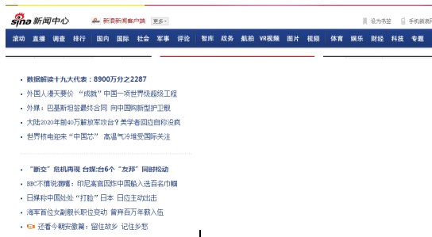
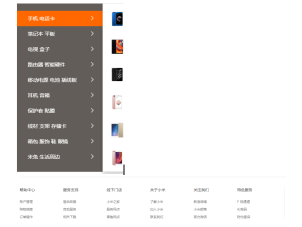
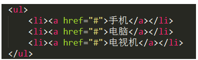
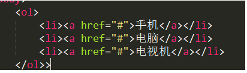
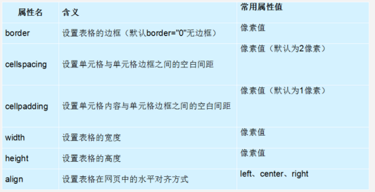
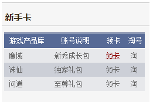
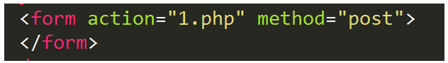
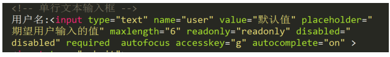
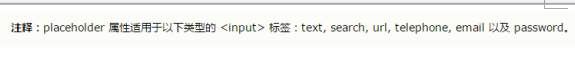
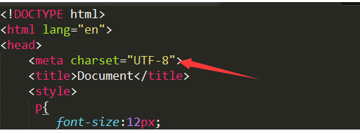

# 1 W3C文档的查看讲解

  让学生学会查文档，学会自我解决问题的能力

# 2 列表的实际应用

   列表是用来装数据的容器。

例如:新浪新闻网站 和小米网站截图，这些都是列表

◆无序列表

 注意: ul里边只能嵌套li，li里边可以嵌套任意标签。

◆ 有序列表

注意: ol里边只能嵌套li，li里边可以嵌套任意标签。

◆自定义列表

 

注意: dl里边只能嵌套dt和dd，dt里边可以嵌套行内元素，dd是可以嵌套任意标签的。

1.
# 3 表格属性的强调

跨行或跨列，针对的是单元格（th或td）的跨度
在单元格标签中通过属性：
        rowspan=&quot;数字&quot;
        colspan=&quot;数字&quot;

# 4 表单类型的讲解

   ◆表单

   ★action  收集的信息提交给谁处理

   ★method=&quot; get  |  post &quot;  传输数据的方法  貌似post比get安全一些

   ◆单行文本输入框&lt;input type=&quot;text&quot;&gt;

   ★name   表单控件的名称

   ★value   默认值

   ★placeholder  期望用户输入的值

 

   ★maxlength 输入的最长的字符数

   ★readonly=&quot;readonly&quot;   只读

   ★disabled=&quot;disabled&quot;    未激活

   ★required   填写的字段不能为空

   ★autofocus  自动光标
    

   ★accesskey=&quot;g&quot;  设置获取光标的快捷键  chrome需要配合alt键使用

   ★autocomplete=&quot;on  |  off&quot;  on是默认值 打开  off是关闭 记忆联想功能

# 5 字符集设置的强调

  [http://www.cnblogs.com/skynet/archive/2011/05/03/2035105.html](http://www.cnblogs.com/skynet/archive/2011/05/03/2035105.html)

   