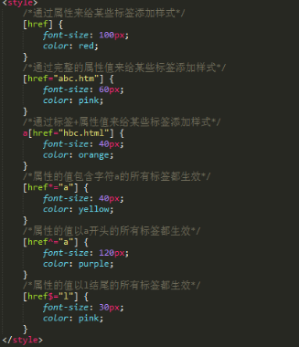

# 1 CSS的作用

#### CSS的作用就是用来美化网页，或者说美化html描述的结构和内容。

注意：在使用CSS之前，一定要先有html写好的结构和内容

# 2 CSS的使用方式

#### CSS的使用（语法规则）方式一：行内样式
                &lt;标签名style=&quot;样式属性名:值;样式属性名:值&quot;&gt;&lt;/标签名&gt;

注意：
                 →样式属性名和值之间要用英文的冒号:分割。
                →多个样式属性值之间要用英文的分号;分割。

这种方式不推荐使用！因为样式和html标签耦合在一起，不利于后期的维护

#### CSS的使用（语法规则）方式二：内部样式（学习中）
                &lt;style&gt;
                        美化的目标{
                                样式属性名:值;
                                样式属性名: 值;
                                ...
                                样式属性名: 值;
                        }
                &lt;/style&gt;

注意：
                 →样式属性名和值之间要用英文的冒号:分割。
                →多个样式属性值之间要用英文的分号;分割。
                →最后一组样式属性后面不用加分号。
                →style标签一般写在head标签中。
                →每一对样式属性名:值要独占一行

#### CSS的使用（语法规则）方式三：外部样式（实际项目使用的方式）
                &lt;link rel=&quot;stylesheet&quot; href=&quot;样式文件的路径&quot;&gt;

link标签属性：
        → rel告诉浏览器该标签所引用的内容是样式表
        → href通过路径引入样式表文件

注意：
        → 要单独建立一个后缀名为.css的样式表文件，文件里的内容格式和方式二

   中style标签里的内容是一样的。
         → link标签要写在head标签里。

#3 选择器

###  基础选择器

◆标签选择器  一打一大片

标签 { 属性:值; 属性:值;}

◆类选择器

.自定义类名 {属性:值; 属性:值;}

★特点

         ★谁调用，谁生效，不调用，不生效

         ★多个标签可以调用同一个类选择器

         ★一个标签可以同时调用多个类选择器

类选择器的命名规范

  ☆不能以纯数字或者数字开头来定义类名。

  ☆定义类名不能出现特殊字符(\_除外)。

  ☆不推荐使用中文来定义类名。

  ☆不推荐使用属性(属性的值)来定义类名。

  ☆复杂的类名推荐使用驼峰命名法（box\_content）

◆id选择器  只能打一个

#自定义id名 {属性:值; 属性:值;}

  ★特点

☆谁调用，谁生效

☆一个id选择器只能被调用一次，多次调用不符合w3c规范，js调用会出错。

☆一个标签不能同时调用多个id选择器

☆一个标签可以同时类选择器和id选择器

◆通配符选择器 （不推荐使用）

\* {属性:值; 属性:值;}

### 复合选择器

      ◆交集选择器

标签+类(id)选择器 {属性:值;}

交集选择器是一个即...又的关系，即是这个标签，同时这个标签调用了这个类(id选择器)

◆后代选择器

   选择器+空格+选择器+空格+选择器 {属性:值; 属性:值;}

   ★后代选择器发生的前提就是嵌套关系

   ★特点

        ★父元素在前，子元素在后

      ★后代选择器可以无限制隔代

      ★只要能代表父子标签，后代选择器可以是任意选择器的组合

◆并集选择器

选择器+逗号+选择器+逗号+选择器 {属性:值; 属性:值;}

◆子代选择器

选择器&gt;选择器 {属性:值; 属性:值;}

子代选择器选择的就是直接下一代元素

◆相邻选择器

选择器+&quot;+&quot;+选择器 {属性:值; 属性:值;}

◆属性选择器

