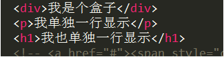
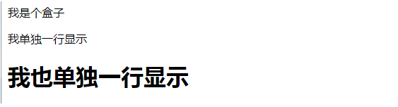
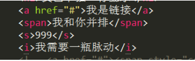
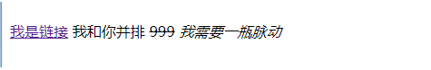
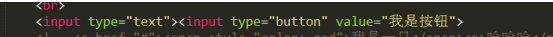
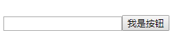
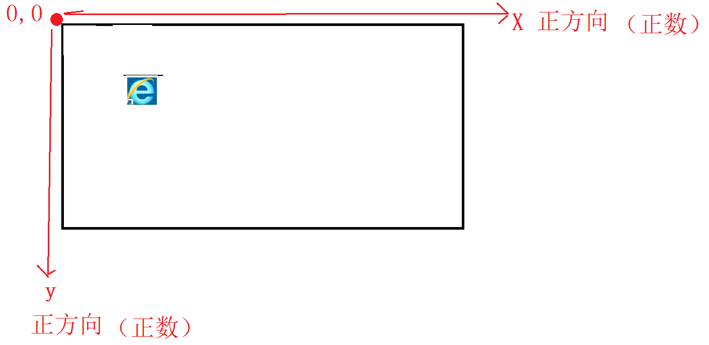
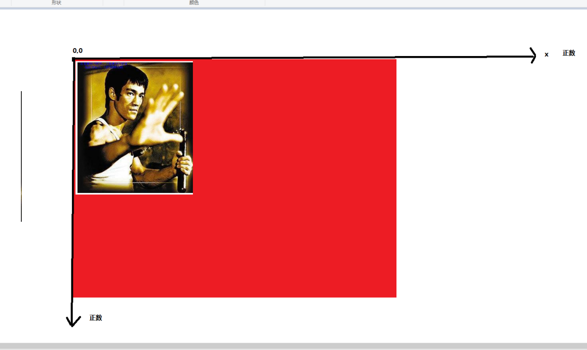

# 一．元素的显示模式 （重要）

### 模式一：块级元素
##### 特点：
* 独占一行（换行）
* 可设置宽高
##### 默认是块级元素的常用标签有：
* h1-h6、p、div、ul、ol、li、dl、dt、dd
##### 通过样式属性将一个元素设为块级元素：
* display:block;






### 模式二：行内元素
##### 特点：
* 不独占一行（不换行）
* 不能设置宽高，宽高由内容决定。
#####默认的是行内元素的标签有：
* a、span、s、b、i、u、del、strong、ins、em
##### 通过样式属性将一个元素设为行内元素： 
* display:inline;





### 模式三：行内块级元素
##### 特点：
* 不独占一行 （行内元素的特点）
* 可设置宽高 （块级元素的特点）
##### 默认的是行内块级元素的标签有：
* mg,input,select,textarea
##### 通过样式属性将一个元素设为行内块级元素：
* display:inline-block






# 2复合（组合）选择器

```
1 子代选择器：
  语法：
    选择器1 >选择器2  {
        样式属性1:值;
          样式属性2:值;
        ...
      }
      作用（特点）：
    对选择器2所选定的元素进行样式修饰，但条件是所选定的元素的父元素必须符合选择器1。

```

````
2 后代选择器：
  语法：
    选择器1  选择器2  {
        样式属性1:值;
          样式属性2:值;
        ...
      }
      作用：
    对选择器2所选定的元素进行样式修饰，但条件是所选定的元素的父元素或祖先元素必须符合选择器1。

```
```
3 兄弟选择器：
  语法：
    选择器1+选择器2  {
        样式属性1:值;
        }
```
```
4 交集选择器：
  语法：
    选择器1选择器2  {
        样式属性1:值;
          样式属性2:值;
        ...
      }
      作用：
    对选择器2所选定的元素进行样式修饰，但条件是所选定的元素同时必须符合选择器1。

  注意：
      → 选择器1通常是标签选择器或类选择器。
      → 选择器2通常是类选择器。
```
```
5 并集选择器：
  语法：
    选择器1,选择器2 {
      样式属性1:值;
          样式属性2:值;
        ..
    }
  作用：
    对于符合选择器1或符合选择器2的元素进行样式修饰。
```
# 3标签属性选择器
|  语法 | 作用    |示例
|-------|---------|-----
|E[attr] |选择元素含有某个属性为attr时 |input[name] { background-color: blue;}
|E[attr=val] |选择元素含有某个属性为attr并且属性值为val时 |input[type=button] {width: 100px;}
|E[attr*=val] | 选择元素含有某个属性为attr并且属性值中任意位置包含val时| li[class*=boy] {background-color: gold;}
                                                                        
|E[attr^=val] | 选择元素含有某个属性为attr并且属性值中开头位置等于val时| li[name^=box] {background-color: pink;}
                                                                        
|E[attr$=val] | 选择元素含有某个属性为attr并且属性值中结尾位置等于val时| input[name$=user] {width: 300px;}  
                                                                        
|E[att~="val"]| 选择具有att属性且属性值为一用空格分隔的字词列表，其中一个等于val的E元素（包含只有一个值且该值等于val的情况）。|  div[class~=d] {background-color: gold;}

|E[att|="val"|选择具有att属性且属性值为以val开头并用连接符"-"分隔的字符串的E元素，如果属性值仅为val，也将被选择。 |div[class|=test] { background-color:gold;}

# 4 CSS3伪元素选择器
|语法  |作用  |示例
|------|------|-----
|E::first-letter |美化文本的第一个字符（如中文、日文、韩文等| p::first-letter {font-weight:bold;}
|E::first-line |美化文本第一行；| p::first-line {background-color:red;}
|E::selection | 美化可改变选中文本的样式；|p::selection {background-color:gold;color:red;}
|E::before |美化并在元素的最开始位置添加内容 |div::before {content:”开始”;color:red;}
|E::after | 美化并在元素的最结尾位置添加内容 | div::after{content:”结束”;color:red;}


```
E:after、E:before 在旧版本里是伪元素，CSS3的规范里“:”用来表示伪类，“::”用来表示伪元素，但是在高版本浏览器下E:after、E:before会被自动识别为E::after、E::before，这样做的目的是用来做兼容处理。
E:after、E:before后面的练习中会反复用到，目前只需要有个大致了解
":" 与 "::" 区别在于区分伪类和伪元素
```
# 5 背景样式属性
背景常用的样式属性（重要）

- background-color:
作用：设置元素的背景色
语法：
      background-color:颜色值;（单词、十六进制、rgb、rgba）

- background-image:
作用：设置元素的背景图
语法：
    background-image:url(图片路径);


- background-repeat:
作用：设定背景图是否重复和如何重复
语法：
      background-repeat:repeat; 水平和垂直方向都重复，默认
    background-repeat:no-repeat; 背景图像仅仅显示一次 
      background-repeat:repeat-x;   仅水平方向重复
      background-repeat:repeat-y;   仅垂直方向重复

- background-position:
 作用：设置背景图像的起始位置
 语法：
    background-position:水平方向值  垂直方向值;

 -水平方向值：
   方位名词：left   center  right;
   
 -垂直方向值：
方位名词：top    center   bottom


 数值：
 
 
- background-attachment:
作用：
  设置背景图像是否固定或者随着页面的其余部分滚动。
语法：
    background-attachment:scroll;  滑动  默认
    background-attachment:fixed;   固定