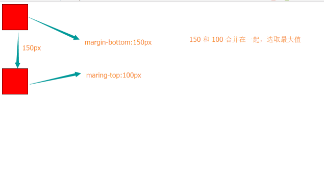

### 1 外边距 （重点）

**  margin的四个方向：top上、right右、bottom下、左left**

| **语法** | **作用** | **示例** |
| --- | --- | --- |
| margin-top | 设定盒子上外边距 | margin-top:10px; |
| margin-right | 设定盒子右外边距 | margin-right:5px; |
| margin-bottom | 设定盒子下外边距 | margin-bottom:20px; |
| margin-left | 设定盒子左外边距 | margin-left:50px; |

**margin**** 联写**

| **语法** | **作用** | **示例** |
| --- | --- | --- |
| margin:值1; | 设定四个方向的外边距 | margin:10px; |
| margin:值1 值2; | 值1：上 下值2：左 右 | margin:5px 10px; |
| margin:值1 值2 值3; | 值1：上值2：左 右值3：下 | margin:10px 40px 20px; |
| margin:值1 值2 值3 值4; | 值1：上值2：右值3：下值4：左 | margin-left:50px; |

**2 盒子水平居中**

盒子水平居中的必备条件：
        → 盒子必须是块级元素。
        → 盒子必须有指定的宽度。

盒子实现水平居中的样式：
        margin:0 auto;

### 3 清除所有元素的内外边距（理解）

我们所学的元素（标签），在默认显示时都有一些默认的内外边距,而且不同的浏览器下内外边距值可能默认不一样，使我们在按照需求控制指定元素的内外边距时容易受到干扰，所以我们在写页面结构布局和样式时，先初始化所有的元素的内外边距统一归为0，这样便于我们统一控制。
\* {
        margin:0;

padding:0;
}

### 4 内外边距的兼容性能问题（理解）

行内元素的内外边距上下兼容问题：

对于行内元素，设定外边距上下是没有效果的。设定内边距上下有时也会有异常。
所以，针对行内元素，我们尽量不要对它设定内外的上下边距。
代码：

效果：

外边距合并问题一：

对于两个同级的盒子，一个在上一个在下。若上面的盒子margin-bottom与下面的盒子margin-top一起作用时。这时，上下两个盒子的间距会选择margin-bottom 与 margin-top中最大的值。

代码：

效果：

解决方案：避免上元素的margin-top和下元素的margin-bottom一起使用！

外边距合并问题二：
对于一个父元素里所嵌套的子元素。若父元素没有上边框没有上内边距，设置子元素的margin-top值时，margin-top对子元素无效，并且父元素会受到影响。
代码：

效果：

解决方案：

就是给父元素加个上边框或上内边距。
        给父元素加一个overflow:hidden 样式属性

### 5 盒子的大小（重点）

首先，我们来看一张图，来体会下什么是盒子模型

  /\*外盒尺寸计算（元素空间尺寸）\*/

  Element空间高度 = content height + padding（上下） + border（上下） + margin（上下）

  Element 空间宽度 = content width+ padding（左右）+ border（左右+ margin（左右）

  /\*内盒尺寸计算（元素实际大小）\*/

  Element Height = content height + padding（上下） + border（上下）

  Element Width = content width + padding（左右） + border（左右）

特殊情况：
针对两个元素，一个父元素和一个子元素。

对于子元素，若不设置它的width时，它的大小默认等于它父元素的width。

对于子元素,若不设置它的width时,给子元素设定padding或border时，子元素的总大小不会改变，且会自适应父元素。

代码：

效果：

