## 浮动的特性（重要）

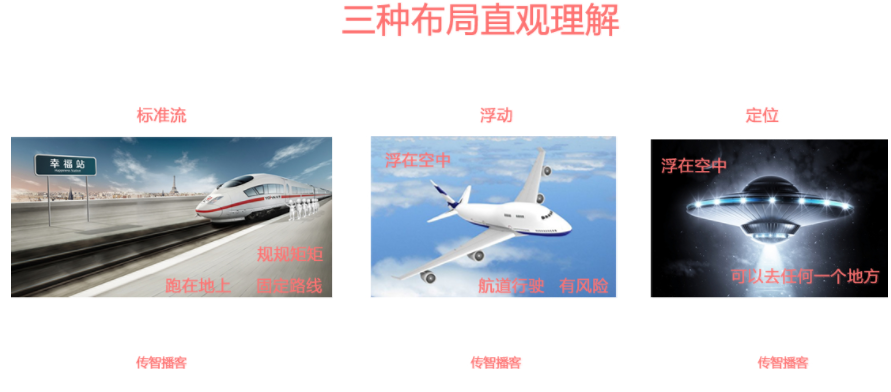

* 特点一：脱离标准文档流[普通流]（重要)
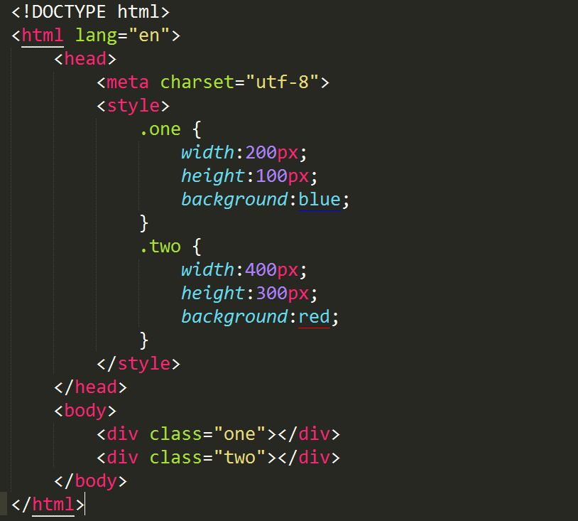
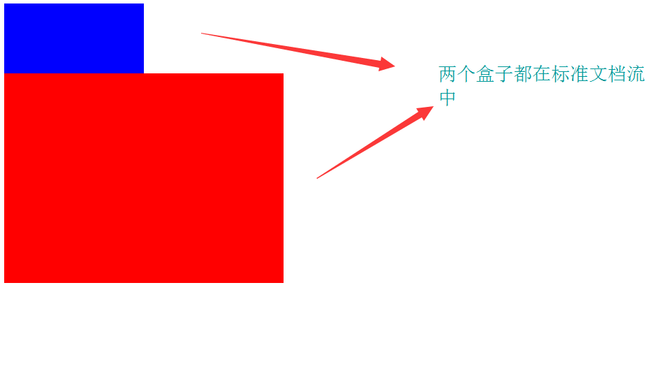
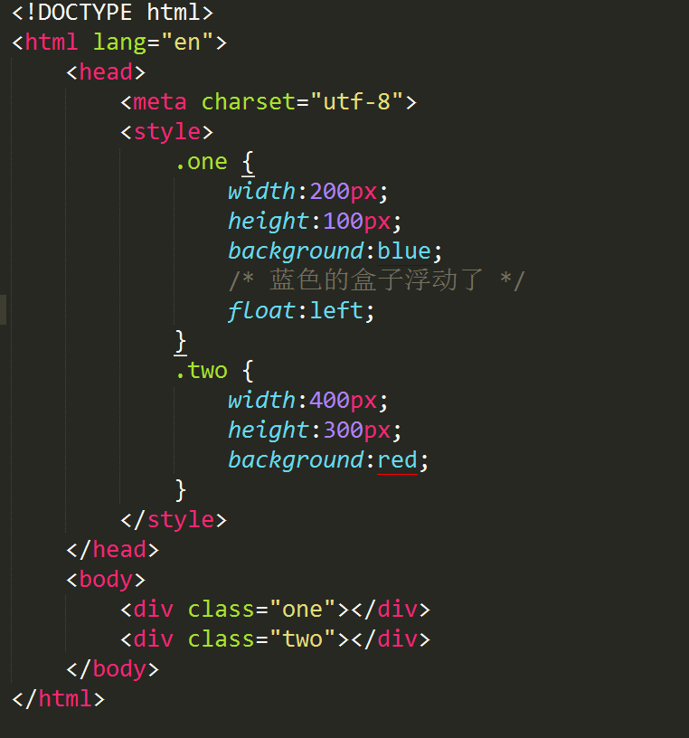
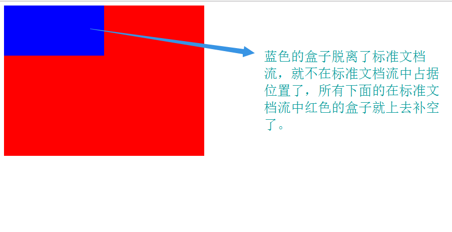
* 特点二：浮动找浮动（重要）
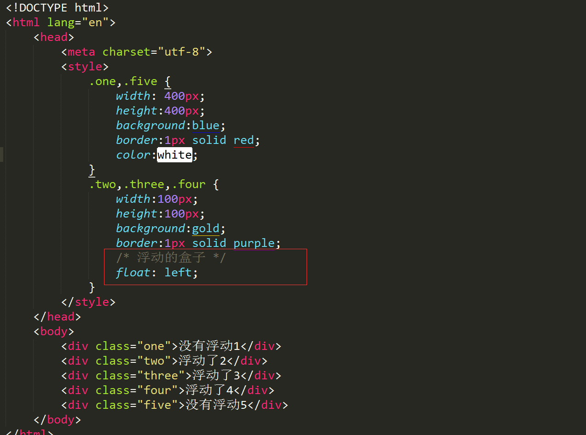
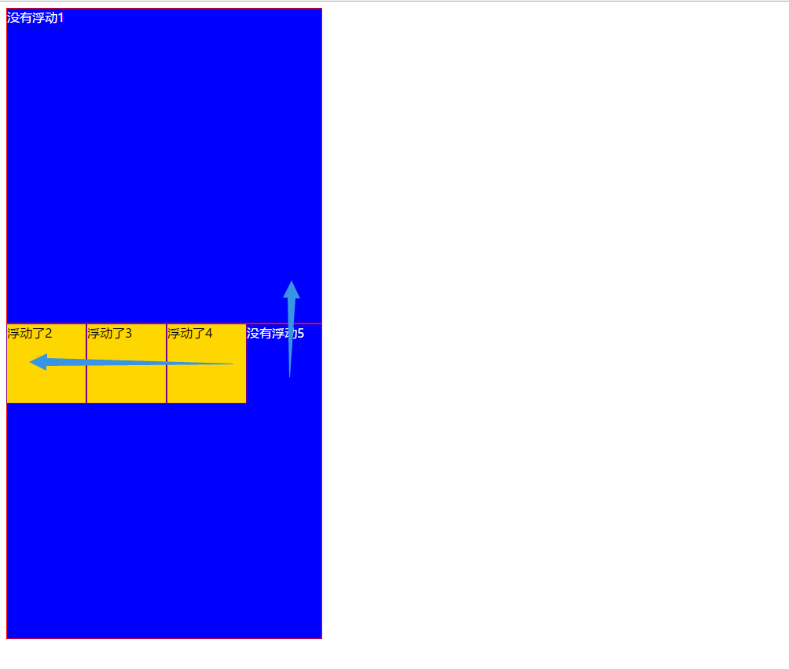
* 特点三：浮动会影响后面的元素（重要）
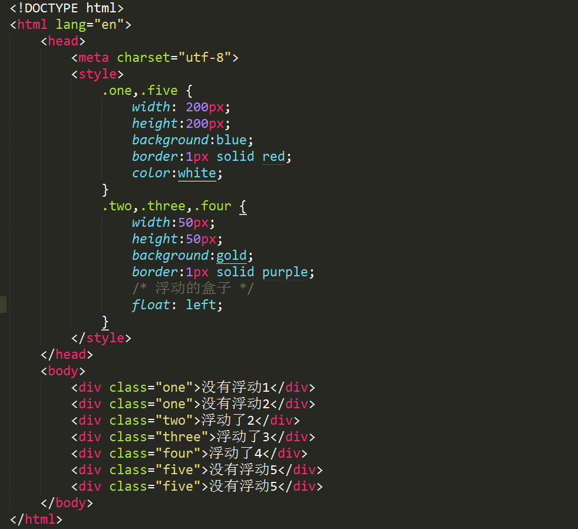
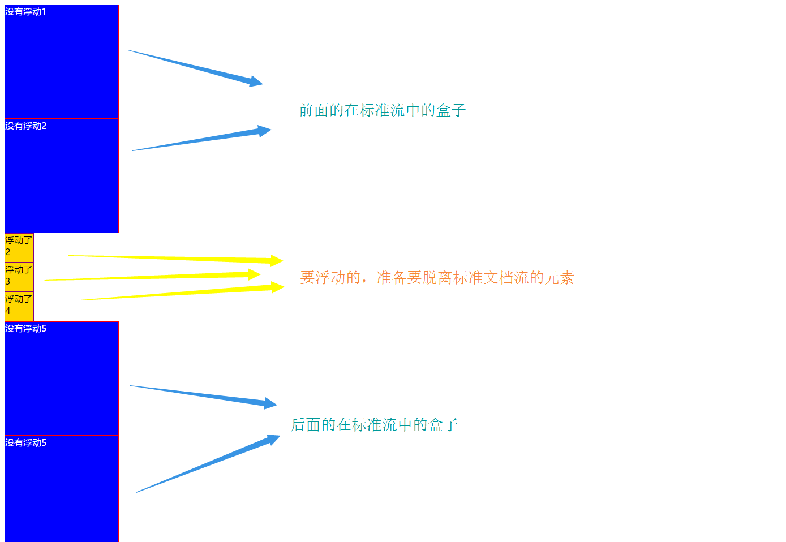
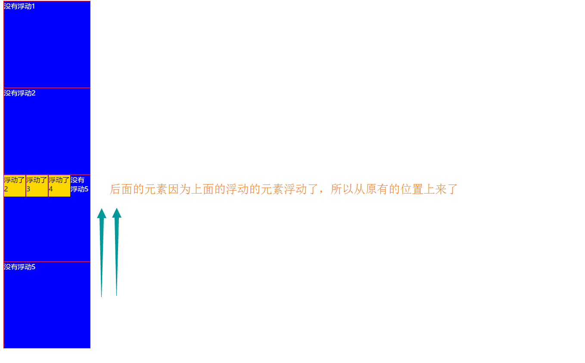
* 特点四：多个浮动的元素，以顶部基准对齐（重要）
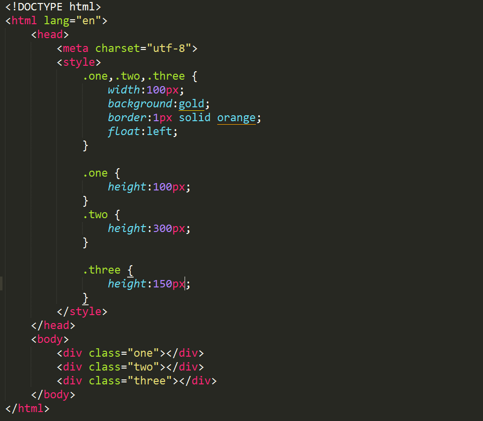
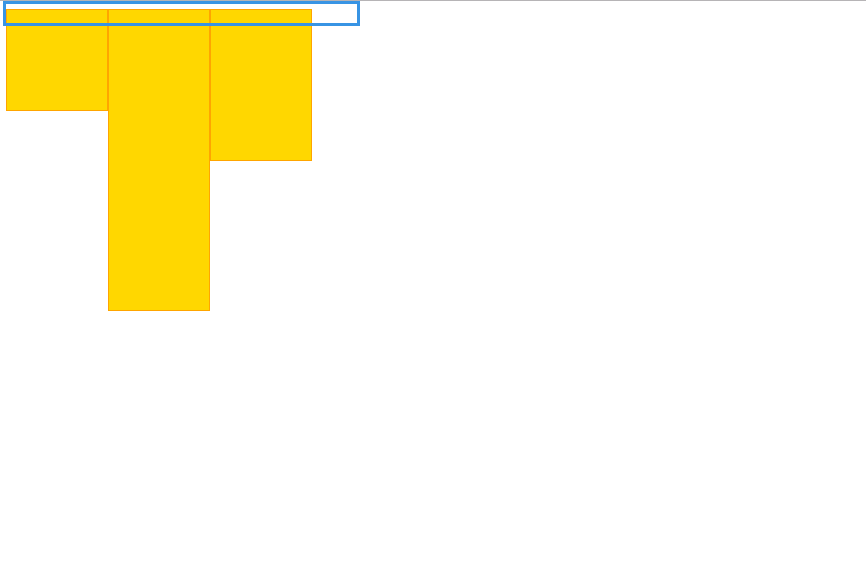
* 特点五：浮动会改变元素的显示模式（重点）
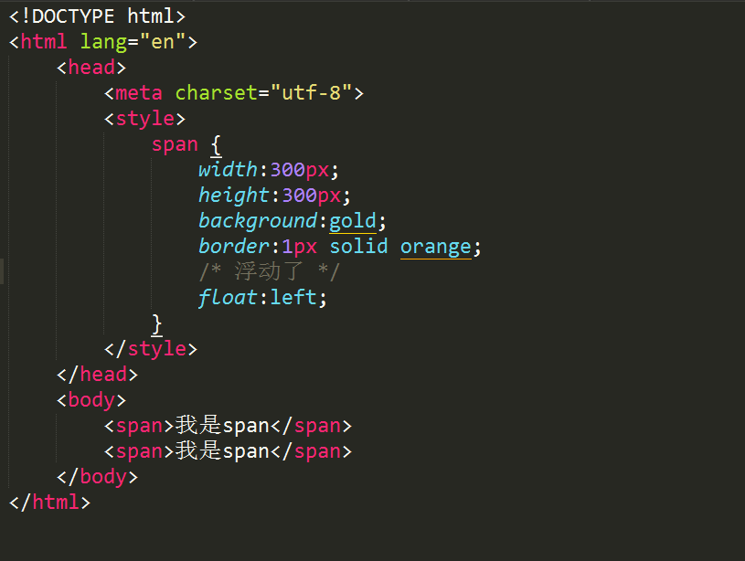

* 特点六：文字环绕浮动的元素（了解）
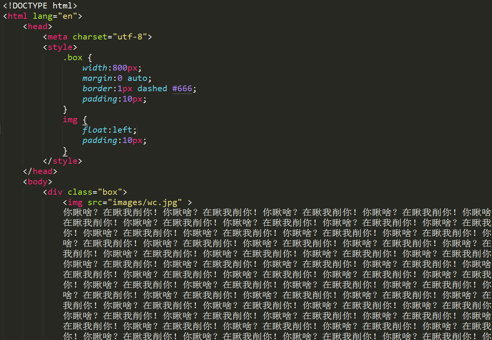
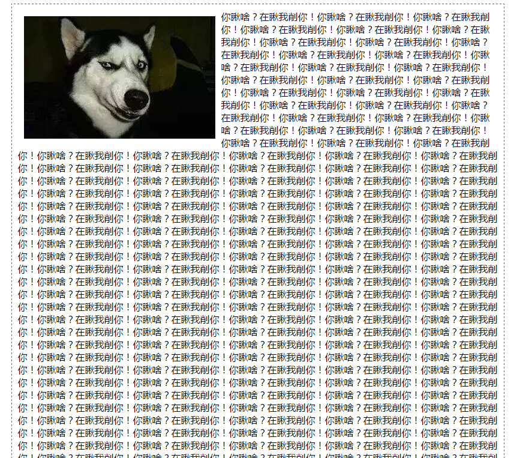

## 清除浮动

当父容器没有设置高度，里面的盒子没有设置浮动的情况下会将父容器的高度撑开。一旦父容器中的盒子设置浮动，脱离标准文档流，父容器立马没有高度，下面的盒子会跑到浮动的盒子下面。出现这种情况，我们需要清除浮动
清除浮动不是不浮动，是清除浮动产生的不利影响

### 清除浮动的方法

* 给浮动元素的父元素设置高度
* 额外标签法
  >给最后一个浮动元素后边添加额外标签，使用clear:both; 不推荐使用，会产生冗余代码。
* 给浮动元素的父元素使用overflow:hidden;  触发bfc,
  >如果有子元素，出了父元素的范围，多出的部分会隐藏掉。
* 后伪元素清除浮动
  给浮动元素的父元素使用clearfix

```
.clearfix:after {
content:”.”;
display:block;
height: 0;
line-height: 0;
visibility:hidden;
clear:both;
}
.clearfix {
Zoom: 1;
}
```
* 双伪元素清除浮动  
给浮动元素的父元素使用双伪元素清除浮动
```
.clearfix:before,.clearfix:after {
	content:"";
	display: table;
}
.clearfix:after {
	clear: both;
}
```
