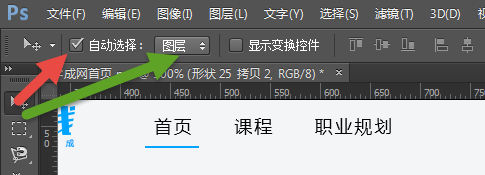
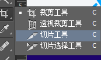
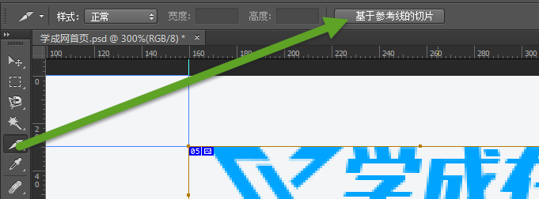
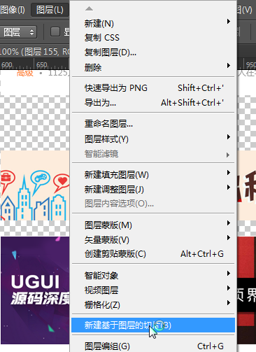
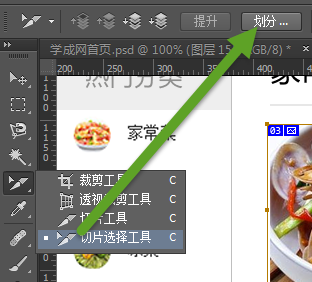
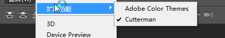
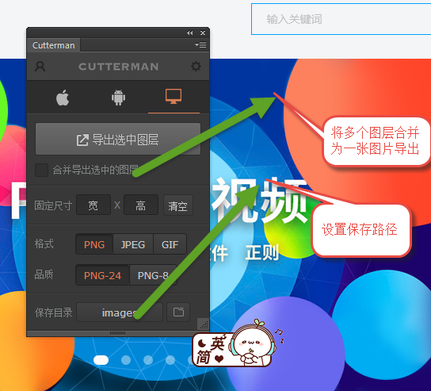

## 网页切图
* F7  调出(隐藏)图层面板
* Ctrl+alt+z  撤销多步
* 空格  抓手工具

#### 自动选择图层  移动工具状态下--选项

#### 切片工具

#### 切片方法
      ◆手动切片  拖拽切片到合适大小
      ◆基于参考线的切片 ，首先拖拽好合适的参考线，在切片状态下选择-基于参考线的切片

◆基于图层切片 选择合适的图层     图层---基于图层的切片

◆等分切图  
首先拖拽出大切片，然后选择切片选项工具，选择划分

◆cutterman切图

                   

