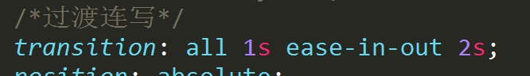
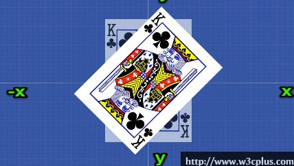
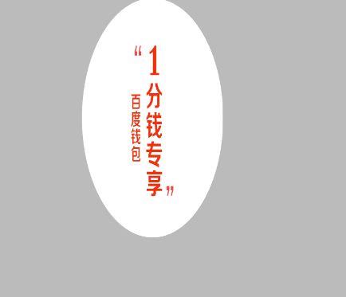
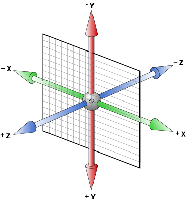
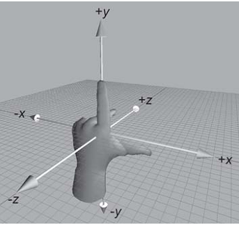

## 1过渡

初始状态

当鼠标移到一个盒子上面的状态

过渡是2个状态，从a状态到b状态
◆过渡属性
Transition-property: none  |  all;  all全部属性过渡
◆ 过渡时间
transition-duration:1s;
◆过渡速度
transition-timing-function：linear;  linear(匀速)

◆过渡延时
Transition-delay: 2s;
◆过渡连写

☆过渡时间为必写属性

## 2 2D变形(CSS3) transform

移动 translate(x, y)
translate 移动平移的意思
缩放 scale(x, y)
旋转 rotate(deg)
可以对元素进行旋转，正值为顺时针，负值为逆时针；
transform-origin可以调整元素转换变形的原点
倾斜 skew(deg, deg)
## 3 3D变形(CSS3) transform

用X、Y、Z分别表示空间的3个维度，三条轴互相垂直。如下图

左手坐标系
伸出左手，让拇指和食指成“L”形，大拇指向右，食指向上，中指指向前方。这样我们就建立了一个左手坐标系，拇指、食指和中指分别代表X、Y、Z轴的正方向。如下图

#### 左手法则
左手握住旋转轴，竖起拇指指向旋转轴正方向，正向就是其余手指卷曲的方向。

#### 理解透视距离

透视会产生“近大远小”的效果

x左边是负的，右边是正的
y 上面是负的， 下面是正的
z 里面是负的， 外面是正的
rotateX()
就是沿着 x 立体旋转.
rotateY()
沿着y轴进行旋转
rotateZ()
沿着z轴进行旋转
透视(perspective)
translateX(x)
仅水平方向移动**（X轴移动）
translateY(y)
仅垂直方向移动（Y轴移动）
translateZ(z)
translate3d(x,y,z)

