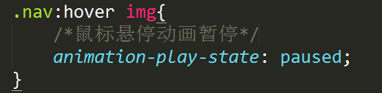
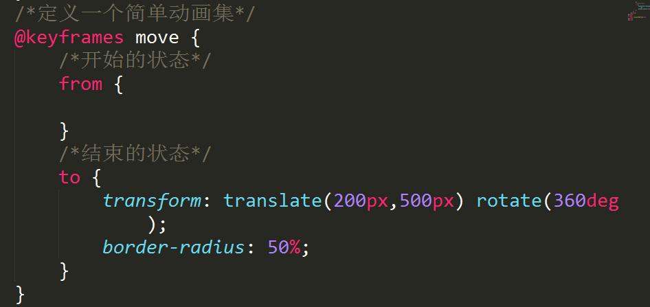
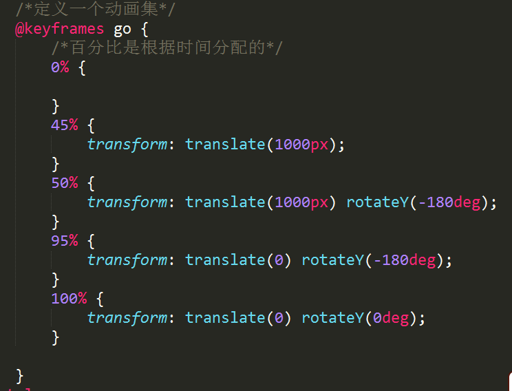

# 1伸缩盒子(弹性盒子)(移动端)
* 伸缩盒子默认主轴水平方向，侧轴为垂直方向
#### 调整主轴的对齐方式
* justify-content:flex-start;  默认值，从主轴开始的位置对齐
* flex-end;  主轴结束的位置对齐
* center;    主轴居中对齐
* space-between;  两端对齐，中间等距分布
* space-around; 两端距离是中间等距分布的一半
#### 调整侧轴的对齐方式
* align-items: flex-start;  从侧轴开始的位置对齐
* flex-end;  从侧轴结束的位置对齐
* center;    侧轴居中对齐
* Stretch;   自动拉伸(如果侧轴是垂直方向，高度设置为auto，才会拉伸，如果侧轴是水平方向，宽度设置为auto，才会拉伸，)
baseline.;  基线对齐
#### 调整主轴的方向
* flex-direction: row;  默认值  主轴水平方向
* column; 主轴垂直方向(侧轴变成水平方向)
* row-reverse;  水平倒序显示
* column-reverse; 垂直倒序显示
#### 多行伸缩盒子
* flex-wrap:nowrap;  不换行
*  wrap;    换行
*  wrap-reverse;  倒序显示
#### 调整多行对齐方式
* align-content: flex-start; 多行起始位置对齐
* flex-end;   多行结束位置对齐
* center;     多行居中对齐
* space-between;  两端对齐，中间等距分布
* space-around;   两端是中间等分的一半
* Strech;  默认值 (实现拉伸效果，需要将宽或者高设置为auto)
#### flex 设置比例
flex:1;   flex:2;  flex:3;  三个子盒子，第一个1/6,第二个2/6,第三个3/6
# 2动画
#### 动画名称
* animation-name:  move;
#### 动画播放时间
* animation-duration: 1s;
#### 动画播放延时
* animation-delay: 2s;
#### 动画播放次数
* animation-iteration-count: 1;  默认值是1，
                    :infinite;  循环播放
#### 动画播放速度
* animation-timing-function: ease;  默认值

#### 动画的方向
* animation-direction: normal;  默认值 只正向运行，不反向
* :reverse;  反向运动
* :alternate;  先正向，再反向，交替运行
* :alternat-reverse; 先反向，再正向，交替运行
#### 动画结束的状态
*  :forwards; 动画停止在结束状态
* :backwards;  动画停止在开始状态
* :both;  根据次数决定结束状态
#### 动画属性连写

#### 动画属性连写：动画名称和播放时间为必写属性
#### 动画的暂停和播放
* animation-play-state: running;  默认值   播放
* :paused;   暂停

#### 定义动画集
◆简单动画集(动画序列)

◆复杂的动画序列

