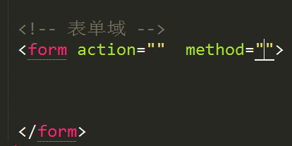
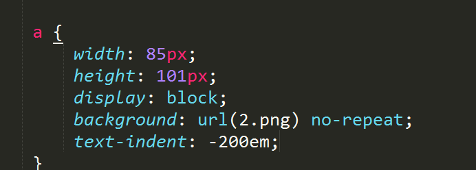

#### 1	Text-align: center; (内容居中显示，包括文字图片) 给块级元素设置不起作用。
#### 2 选择器：选择谁的过程
#### 3	后代选择器 选择器中间用空格隔开
#### 4	并集选择器 选择器中间用逗号隔开
１.1并集选择器

注意：并集选择器中，标签之间可以是并列关系也可以是嵌套关系。
子代选择器：选择器>选择器{属性：值}
属性选择器：选择器[属性=值]{属性：值}

#### 5	选择器的优先级：
   标签选择器<类选择器<ID选择器<行内样式<(!important)<
   继承的权重为0；
#### 6颜色设置方式：background-color：1颜色名 2 16进制显示法 3 rgb 例：rgb（23,45,35）4 rgba设置颜色（alpha）半透明 例：rgba（0，0,0，.5）
#### 7	Opacity设置半透明方式：
opacity: .5; 取值0-1
#### 8类选择器的特点
  1一个类样式可以被多个标签调用（谁调用谁起作用）

  2一个标签可以调用多个类样式（例如一个人有多个名字）

#### 9类选择器命名规范
◆不能以纯数字或者以数字开头定义类名
◆不推荐使用汉字定义类名
◆不能是特殊字符或者以特殊字符开头（“_”除外）定义类名
◆建议不要使用标签名定义类名。
◆类通用命名
          
#### 10ID选择器的特点
注意：
  ◆ 在页面中一个id样式最好只让一个标签调用 
  ◆ 页面中每一个标签的id名称必须唯一（相当于人的身份证）
  ◆一个标签只能调用一个id样式
#### 11 通配符选择器 *{}
#### 12 提取公共类
  当定义样式的时候，如果样式的代码一样。需要将代码一样的样式提取到一个公共类中。供其他标签调用
#### 13  font-size 
 
font-weight：normal   bold   
 ☞ 100-700   数字700与bold    （推荐写法）
   
font-style：normal  intalic
Font-family：1字体中文名 2字体对应的英文表示 
3设置unicode显示
   
注意：font-family可以设置多个字体，字体与字体之间用逗号隔开。
#### 14 font属性连线
Font: italic 700 30px/40px  宋体; 红色的/40px代表行高
注意：
◆font属性联写中，必须有font-size  和font-family 的值
◆font属性联写中，font-size 的值必须放到font-family前面

#### 15鼠标属性
  cursor:pointer;小手move移动样式 help 帮助
#### 16行内元素的宽度与高度与其内容有关
#### 17新窗口打开 target=“_blank”
#### 18行内块元素inline-block
  典型代表  < input>
  特点1一行显示  2可以设置宽度高度
#### 19元素之间转换display: inline inline-block block
注意：行内块元素不能转换为行内元素
#### 20 css特性
1层叠性
1》当一个标签的样式发生冲突的时候并且权重相同的情况下，  最后定义的样式会将前面定义的样给覆盖掉（层叠性） 
2》样式层叠性与样式定义的顺序有关，与调用的顺序无关。
2继承性
   ◆子元素的样式会受到父元素的样式影响
   ◆样式属性发生继承关系时，标签之间的关系必须是嵌套关系
   ◆与文字相关的属性都可以实现继承，文字颜色可以被继承
   ◆超链接标签(a)的文字颜色不能直接受父元素中的文字颜色影响
  ◆标题标签(h1-6)不能直接受父元素中的文字大小影响

3优先级
 标签选择器 < 类选择器< ID选择器<行内样式 <  important

◆继承的权重为0
◆权重叠加
#### 21 伪类
a:link  a:visited  a:hover  a:active   input:focus
注意：伪类的书写顺序
 ◆如果全部伪类都要设置样式必须按照  l ,v, h,a
  ◆伪类中可以单独设置hover
#### 22◆ 当给一个元素设置背景图片的时候，该元素必有有宽度和高度！

#### 23 ◆background-attachment  设置背景图片是否固定
☞scroll   默认滚动
 ☞fixed   背景图片固定
   ◆background-position   设置背景图片位置
  ☞直接设置数字 background-position:20px（左） 40px（顶）;
  ☞设置具体方位名词： top   bottom   left   right  center
#### 24 注意： 
    ◆设置background-position属性的时候，如果只写一个值，第二值代表center
   ◆设置background-position 如果有具体数字，那么第一个值代表		水平方向 backgrond-position：20px  30px；
#### 25背景属性联写
◆background属性联写没有顺序限制
◆属性个数没有限制
#### 26默认浏览器字体大小16px（浏览器可以设置默认值）
默认文字行高 18px
注意：影响行高的值有文字大小与文字字体
行高值=文字大小+上间距+下间距
#### 27行高的作用
可以设置文本垂直居中
设置方法：设置文本行高值与盒子的高度值相等
#### 28
|行高单位	|文字大小|	设置行高值	| 最终行高值
|---------|--------|--------------|------------
| px	    | 30px	 |40px	 |行高=设置的行高值 （与文字大小无关）
| em	    |30px	   |2em	|行高=设置的行高值*文字大小
|  %	    |30px  	 |200%	|行高=设置的行高值*文字大小
|不带单位	| 30px	 |2	|行高=设置的行高值*文字大小

|父行高单位	| 父文字大小|	子文字大小	|父行高值|	子行高
|-----------|-----------|-------------|--------|--------
|  Px	|30px |	20px |	40px	|子元素行高=父元素设置的行高值（行高继承性）
|  em	|30px	|20px	|2em	|子元素行高=父元素文字大小*父元素行高值 （继承）
|%	  |30px	|20px	|200%	|子元素行高=父元素文字大小*父元素行高值 （继承）
|不带单位	|30px	|20px	|2	|子元素行高=子元素文字大小*父元素行高值
 注意： 
◆如果一个文字没有设置具体的行高值，默认的行高与文字大小有关系
◆如果给一个文字设置了行高值单位为px，那么页面中的行高与文字大小没有关系。

◆推荐以后行高直接设置以px为单位

◆如果标签没有设置高度，行高也可以将盒子撑开。
行高  约等于  高度值   
#### 29	  border-style: dotted点线 dashed虚线 solid 实线
隐藏边框：border:0 none;
去掉轮廓线：outline-style: none;

合并边框
border-collapse:collapse；只适合表格

#### 30    
      

#### 31	盒子计算
◆页面中盒子最终的大小（宽度）=设置的盒子内容宽度+左右边框+左右内边距

#### 32继承（嵌套）的盒子（常用）
 ◆如果一个子盒子没有设置宽度，如果给子盒子设置padding的时候，子盒子宽度在父盒子宽度范围内不会发生改变。
 ◆继承的盒子padding不会影响盒子大小。
#### 33 外边距特点：（重点）
 ☞外边距合并（盒子与盒子之间垂直并列显示）：以最大外边距的值为准。
       ☞外边距塌陷（问题bug）:
 	◆给父盒子添加border属性
 	◆给父盒子添加overflow:hidden;
 	   overflow:hidden;  触发bfc (格式化上下文)
#### 34 以下只针对IE低版本浏览器

#### 35 windows+d 显示桌面  windows+e 打开资源管理器
Alt+table 切换应用程序 Ctrl+table 页面内部切换
#### 36

#### 37

  alt 属性： 对图片进行文字描述    是为搜索引擎提供服务的
  title属性： 设置鼠标移动到图片上显示的文字提示
#### 38 路径问题 1绝对路径 2相对路径
  
#### 39 target优化的写法：
      注意：在head标签中添加base标签即可。
   <head><base target=”_blank”></head>
#### 40锚链接  （超链接的另一种用法）
实现页面的内部跳转

注意：超链接不跳转到其他页面写法如下

#### 41特殊字符
    &lt;      ----< 小于号  
    &gt;     -----> 大于号
    &nbsp;   -------- 一个空格
#### 42自定义列表
 		<dl>
<dt>列表中的标题</dt>
<dd></dd>
<dd></dd>

</dl>
#### 43   meta
<meta   charset="utf-8">  ：告诉浏览器当前页面的编码
网页优化（为搜索引擎提供服务）

网页重定向

#### 44  link
应用外部样式表

设置网页图标

注意： 
  ◆一般网页小图标放到网页根目录下
  ◆一般网页小图标后缀名为.ico
#### 45表格
   Cellspacing=“2”      设置单元格内容与单元格边框的距离 ，默认值为2
cellpadding      设置单元格内容与单元格边框的距离 
   注意： cellpadding 会影响表格大小。
   bgcolor:    设置背景颜色
   ☞如果将aling=center设置给table，只能让table整体居中显示
   ☞如果给tr或者td设置aling=center 内容会居中显示
   ☞表格中的其他标签用法
   <th></th>  设置表头 
    
  <caption><caption>   表格标题标签
   
Colspan=“2”横向合并单元格
Rowspan=“2”纵向合并单元格
表格正规写法：
<table><thead><tbody><tfoot>
#### 46表单控件（获取表单数据）
☞表单的组成：
          ◆表单控件  （重点）
 			  ◆表单域    
           ◆提示信息
表单域
      
     action：  设置一个后台处理程序 
     method： get | post    表单提交方式
       get提交将表单数据在地址栏中显示 （不安全）
       post提交数据通过后台的方式提交（安全）
表单控件
      
    属性： maxlength 设置最多能输入多少字符
    属性： value   设置默认值
    属性： readonly=”readonly”   设置控件为只读，不能编辑
属性： disabled="disabled"    控件不能编辑  （控件没有被激活）

单选控件（属性： checked="checked"   设置控件默认选中项）

多选控件（属性： checked="checked"   设置控件默认选中项）

多行文本域

Rows  cols
上传控件

表单提交按钮：

 普通按钮：（与js组合使用）

重置按钮： 将表单中的数据恢复到默认值

图片按钮： （表单数据提交）

表单分组控件介绍：

  隐藏控件：
 
#### 47标签语义化
概念：
根据内容的结构化（内容语义化），选择合适的标签（代码语义化）
意义：
    1:网页结构合理
    2:有利于seo:和搜索引擎建立良好沟通，有了良好的结构和语     	                   			义你的网页内容自然容易被搜索引擎抓取；
    3:方便其他设备解析（如屏幕阅读器、盲人阅读器、移动设备）
    4:便于团队开发和维护
语义化好的页面表现：
让页面裸奔（CSS），网页结构清晰。
怎么做？
1：尽可能少的使用无语义的标签div和span；
2：在语义不明显时，既可以使用div或者p时，尽量用p, 因为p在默认情况下有
上下间距，对兼容特殊终端有利；
3：不要使用纯样式标签，如：b、font、u等，改用css设置。
4：需要强调的文本，可以包含在strong或者em标签中strong默认样式是加粗（不
要用b），em是斜体（不用i）

#### 48文档流（normal  flow）
☞块级元素独占一行显示（文档流）
☞行内元素在一行上显示（文档流）
#### 49 浮动（float）
☞用法：
 float： left  |  right
  ☞特点：
 ◆浮动的元素 不占位置
 ◆浮动的元素不再受标准流的影响(脱标)元素不占位置）
 ◆浮动可以让块级元素在一行上显示（浮动脱标引起的）
 ◆浮动的元素会影响其后面的元素
 ◆浮动可以实现模式转换
  		☞浮动的作用：
 ◆浮动最初的作用：实现文字与图片环绕效果
 ◆制作网页导航： 
 ◆网页布局
#### 50 清除浮动：
◆什么时候清除浮动？
  			 ☞父元素没有高度（高度为0）
   		☞父元素中的所有子元素都设置了浮动
◆清除浮动的方式
1☞使用clear属性清除浮动：
clear: left | right | both;
在浮动的元素下面新建一个空的样式，定义类名为class=“clear”
例如：

         2 给父元素添加overflow：hidden
◆注意： 如果父元素中有定位的元素，会对定位的元素造成影响
3推荐写法（使用伪元素清除浮动）

注意：
 使用伪元素清除浮动的时候，将清除浮动的样式给设置了浮动的元素的父元素调用即可！

#### 51CSS初始化
   作用： 保证页面中的样式在不同浏览器中保持一致。
一般用并集选择器初始化，少用通配符选择器。

#### 52Overflow的用法
 ☞overflow: visible;  默认值 （内容超出盒子部分也会显示）
   ☞overflow:hidden；

  ☞overflow: scorll;

  ☞overflow：auto;    自适应 
   内容超出添加滚动条，否则不添加

53 定位
☞静态定位 static
position: static;
      注意：静态定位与标准流的显示方式一样。
 ☞绝对定位 absolute
position:absolute;
      绝对定位的元素定位方式：
◆如果一个元素设置了绝对定位，如果它的父元素没有设置定位，那么该子元素是以body标签左上角（浏览器左上角）为基准设置定位的。
	 ◆如果该元素的父元素设置了定位，那么该子元素设置绝对定位是以父元素左上角为基准设置定位。
 绝对定位特点：
    		◆绝对定位的元素不占位置
			◆绝对定位的元素也是脱标的
			◆绝对定位的元素可以实现模式转换
 ☞相对定位 relative
 ☞相对定位的元素设置定位方式
一个元素设置了相对定位后，该元素是以元素自己原来的位置为基准设置定位的。
☞相对定位的元素特点
		◆相对定位的元素占位置
		◆相对定位的元没有脱标
		◆相对定位的元素不能实现模式转换
☞相对定位的使用：
	◆一般页面中出现绝对定位就肯定出现相对定位
	◆子绝父相
   ☞固定定位 fixed
☞定位的元素与方位名称组合使用
    Left: 20px;  Top：Right:   Bottom:
固定定位的方式
一个元素设置了固定定位后，该元素以body标签左上角为基准设置定位的。
  ☞固定定位的特点
		◆固定定位的元素不占位置
◆固定定位的元素脱离标准流
	◆固定定位的元素可以实现模式转换

54 z-index层级
  ◆ 在页面中只有定位的元素才有z-index值
  ◆ 定位的元素z-index值默认值为auto 相当于0
☞特点：
 ◆当z-index值相同的情况，后面的元素会压着前面的元素（后来居上原则）
  ◆当元素的父元素设置了z-index值后，以父元素的设置的z-index为准。
55绝对定位盒子居中显示  （重点）
◆标准流下盒子居中使用margin: 0  auto;  
        ◆如何让绝对定位的盒子居中显示？
  ☞首先子盒子通过left移动父元素宽度一半（50%）
  ☞然后子元素向相反的方向使用margin-left移动自己宽度一半

56  CSS标签嵌套规范
 	◆段落标签不能包含标题标签
  ◆段落标签不能包含div标签
  ◆段落标签不能包含列表标签
  ◆行内元素最好包含行内元素

57规避脱标流  
   ◆网页布局中，优先考虑标准流
   ◆然后考虑使用浮动
   ◆最后考虑定位

注意： 
 ◆元素进行模式转换的时候 使用display
 ◆ 绝对定位或者浮动 都可以配合display使用
58图片垂直显示方式 （重点）
☞图片（行内块元素） 
 ◆图片默认与基线对齐vertical-align: baseline
 ◆让图片垂直居中显示：
     ■设置行高值
     ■给图片设置vertical-align: middle
 ☞ vertical-align 属性只能和行内块元素配合使用 （表格中也可以使用）
☞常用的属性：
 baseline   基线对齐 （默认值）
 top      顶端对齐
 middle   中间对齐
 bottom    底部对齐
59CSS可见性
  ☞ overflow: hidden;     溢出隐藏
  ☞ display: none;        元素隐藏
  display:block；       显示元素
  ☞ visibility:hidden;      元素隐藏

 区别：
◆ display: none; 
display: none;    隐藏元素后不占位置
◆ visibility:hidden; 
   visibility:hidden;  隐藏元素后占位置
60Logo内容移除 （网页优化）
  ◆设置text-indent一个负值即可

61精灵图：
   ◆精灵图的使用
   ◆浏览器中的坐标系
      ☞原点以上为负方向，原点以下为正方向。
 		☞原点以右为正方向，原点以左为负方向。
注意： 精灵图只能使用打开的方式！
62滑动门 （难点）
 ☞ 使用滑动门制作导航。

