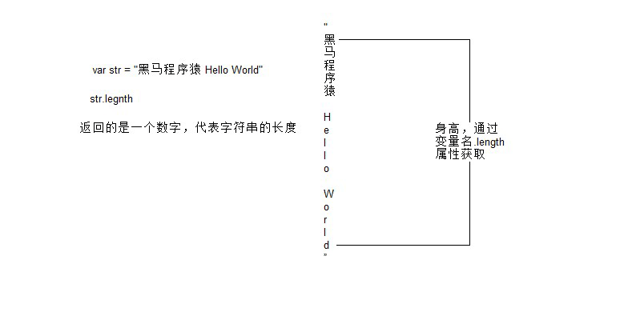
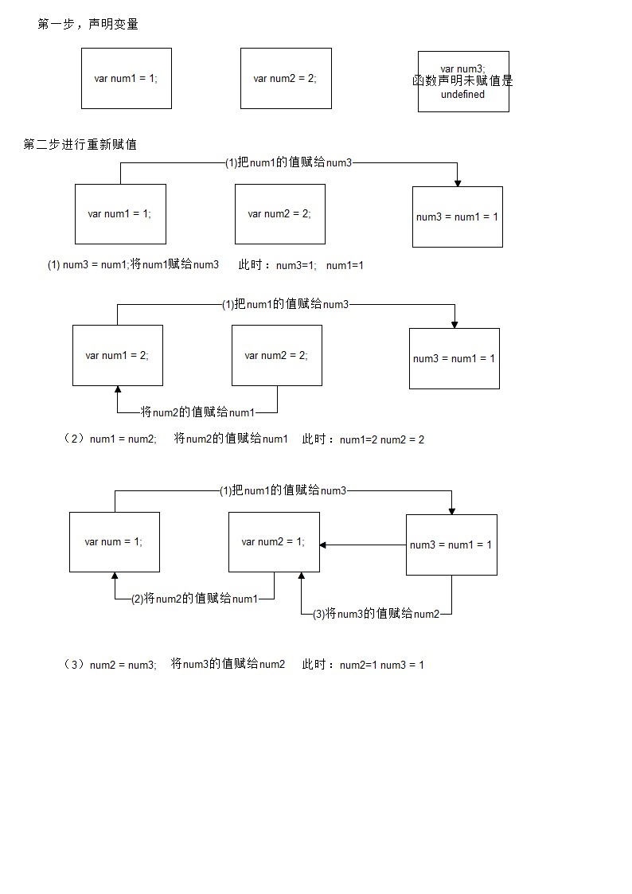
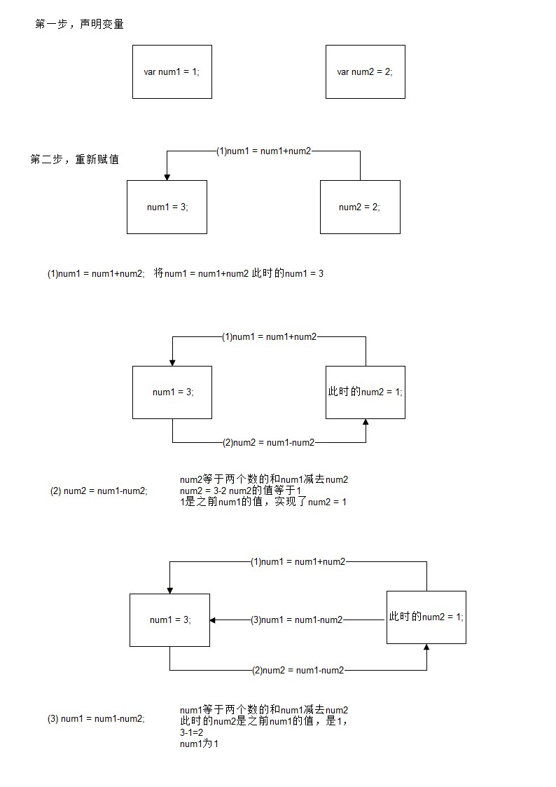

# JavaScript基础

## 1.变量的声明和使用

### (1)什么是变量

- 什么是变量

  官方:

  ​	变量是计算机内存中存储数据的标识符，根据变量名称可以获取到内存中存储的数据

  民间：

  ​	装着月饼的的盘子

  ​

  

  1.其中月饼是数据

  2.盘子是存着月饼的变量

- 为什么要使用变量

  官方：

  ​	使用变量可以方便的获取或者修改内存中的数据

  民间：

  ​	通过盘子可以操作盘子里面的月饼（吃,送人...）

### 如何使用变量

- var声明变量（声明盘子）

```javascript
var age;
```

- 变量的赋值（往盘子里面放东西）

```javascript
var age;
age = 18;
```

- 同时声明多个变量

```javascript
var age, name, sex;
age = 10;
name = 'zs';
```

- 同时声明多个变量并赋值


```javascript
var age = 10, name = 'zs';
```


## 2.数据类型

### 简单数据类型

Number、String、Boolean、Undefined、Null

#### Number类型（数字）

- 数值字面量：10，20，21.1
- 字面量：从字面上能看懂是啥，一眼能瞅出来事啥玩意
- 数字进制

```
十进制
	var num = 9;
	进行算数计算时，八进制和十六进制表示的数值最终都将被转换成十进制数值。
十六进制
	var num = 0xA;
	数字序列范围：0~9以及A~F
  
八进制
    var num1 = 07;   // 对应十进制的7
    var num2 = 019;  // 对应十进制的19
    var num3 = 08;   // 对应十进制的8
    数字序列范围：0~7
    如果字面值中的数值超出了范围，那么前导零将被忽略，后面的数值将被当作十进制数值解析
```

- 浮点数（小数）

  - 浮点数的精度问题

```
浮点数
	var n = 5e-324;   // 科学计数法  5乘以10的-324次方  
浮点数值的最高精度是 17 位小数，但在进行算术计算时其精确度远远不如整数
   var result = 0.1 + 0.2;    // 结果不是 0.3，而是：0.30000000000000004
   console.log(0.07 * 100);
   不要判断两个浮点数是否相等
```

- 数值范围

```
最小值：Number.MIN_VALUE，这个值为： 5e-324
最大值：Number.MAX_VALUE，这个值为： 1.7976931348623157e+308
无穷大：Infinity
无穷小：-Infinity
```

- 数值判断

  - NaN：not a number
    - NaN 与任何值都不相等，包括他本身    NaN==NaN  // false
  - isNaN: is not a number
    - 如果是一个数字返回是false
    - 如果不是一个数字返回true

#### String类型

- 字符串字面量

  只要通过“ ”或者''引起来的都是字符串类型

  “123”，‘3.21’，“长得帅”，“谢谢”

- 字符串长度

  官网：

  ​	length属性用来获取字符串的长度

  民间：

  ​	length属性用来获取字符串的身高，返回的是一个数字（字符串中空格也占一个）

  ```javascript
  var str = '黑马程序猿 Hello World';
  console.log(str.length); //17
  ```
  

- 字符串拼接

  字符串拼接使用 + 连接

  +号起到连接符的作用

  ```javascript
  //1.如果两个是数字，+号是算数
  console.log(11 + 11);//
  //2.如果其中有一项是字符串，+号起到字符串的拼接作用
  console.log('11' + 11);
  console.log('male:' + true);
  //3.如果两个是字符串，+号起到字符串的拼接作用
  console.log('hello' + ' world');
  console.log('100' + '100');
  ```


#### Boolean类型

- Boolean字面量：  只有两个值
  - true和false(真,假)

    
- 计算机内部存储：true为1，false为0

#### Undefined和Null

1. undefined表示一个声明了没有赋值的变量，变量只声明的时候值默认是undefine

2. ```
   var num; 
   console.log(num)//undefined
   ```

3. null表示一个空，变量的值如果想为null，必须手动设置

4. ```
   var str = null;
   ```

### 复杂数据类型

​	Object

## 3.数据类型转换

### (1)转换成字符串类型

- toString()

  语法：

  ​	变量名.toSting(); 

  注意：

  ​	undefined和null没有toSting方法

  ```
  var num = 5;
  console.log(num.toString());
  ```

- String()

  语法：

  ​	Sting(变量名); 

  ```
  var num = 5;
  console.log(String(num))
  ```

- 拼接字符串方式

  语法:

  ​	变量名+“ ”（加号起到连接符的作用）

  ```
  var num = 123;
  console.log(num+"")
  ```

### (2)转换成数值类型

- Number()

  语法：

  ​	Number(变量名)

  注意:

  ​	如果要转换的字符串中有一个不是数值的字符，返回NaN

  ```
  var num = "123";
  console.log(Number(num)) //123
  var str = "123a"; 如果遇到一个不是数值的字符，返回NaN
  console.log(Number(str)) //NaN
  ```

- parseInt()

  语法：

  ​	parseInt(变量名)

  注意:

  ​	如果要转换的字符串中有一个不是数值的字符，保留整数

  ```javascript
  var num1 = parseInt("12.3abc");  // 返回12，如果第一个字符是数字会解析知道遇到非数字结束
  var num2 = parseInt("abc123");   // 返回NaN，如果第一个字符不是数字或者符号就返回NaN
  ```

- parseFloat()

  语法：

  ​	parseFloat(变量名)

  注意:

  ​	如果要转换的字符串中有一个不是数值的字符，保留浮点数（小数）

  ```
  var num1 = parseInt("12.3abc"); //返回12.3，如果第一个字符是数字会解析直到遇到非数字结束,保留小数
  var num2 = parseInt("abc123");//返回NaN,如果第一个字符不是数字或者符号就返回NaN
  ```
  ###(3)转换成布尔类型


- Boolean()

  语法：

  ​	Boolean(变量名)

  注意：

  ​	0  ''(空字符串) null undefined NaN 会转换成false  其它都会转换成true

  ```
  var num = 123
  console.log(Boolean(num));//true
  ```

- !!

  语法:

  ​	!!变量名

## 4.运算符

### (1)算术运算符

```
+ - * / %  
% 是取余数
```

### (2)一元运算符

一元运算符：只有一个操作数的运算符

++  自身加1

-- 自身减1

- 前置++

  ​	先自增，后参与运算

  ```javascript
  var num1 = 5; //声明一个num1的值为5
  ++ num1; //++num1,先自增1，现在的num1是6

  var num2 = 6; //声明一个num2的值为6

  console.log(num1 + ++ num2);//num1为6
  							//++num2，++在前先自增1,所以现在num2为7，然后再去参与运算
  							//num1+num2 6+7=13
  ```

- 后置++

  先运算，在自增

  ```javascript
  var num1 = 5;   //声明一个num1的值为5
  num1 ++;        //num1++,先运算，在自增1，现在的num1是6 
  var num2 = 6    //声明一个num1的值为5
  console.log(num1 + num2 ++);   //num1为6
  							  //num2++，++在后先运算,所以参与运算num2为6，在自增1,num2为7
  							  //num1+num2 6+6=12
  ```
  ​

### (3)逻辑运算符(布尔运算符)
	&& 与 两个操作数同时为true，结果为true，否则都是false
	|| 或 两个操作数有一个为true，结果为true，否则为false
	!  非  取反

### (4)关系运算符(比较运算符)
	<  >  >=  <= == != === !==
```javascript
==与===的区别：
  ==只进行值得比较
  ===类型和值同时相等，则相等

var result = '55' == 55;  	// true
var result = '55' === 55; 	// false 值相等，类型不相等
var result = 55 === 55; 	// true
```

### (5)赋值运算符

=   +=   -=   *=   /=   %=
```javascript
例如：
var num = 0;
num += 5;	//相当于  num = num + 5;
```

###案例

####01.交换两个变量的值

```
 //1.采用第三个变量
    var num1 = 1;
    var num2 = 2;
    var num3;
    num3 = num1;
    num1 = num2;
    num2 = num3;
    console.log(num1);//2
    console.log(num2);//1
    console.log(num3);//1
```



```
	//不采用第三个值
	var num1 = 1;
    var num2 = 2;
    num1 = num1+num2;
    num2 = num1-num2;
    num1 = num1-num2;
    console.log(num1);//2
    console.log(num2);//1

```

