## 分支结构

### if语句

语法结构

```javascript
1.
if (/* 条件表达式 */) {
  // 执行语句
}
    如果条件成立,进入{}里面执行语句

2.
 if (/* 条件表达式 */){
  // 成立执行语句
} else {
  // 否则执行语句
}
如果条件成立，进入{}里面执行语句
如果条件不成立，进入else后面的{}执行语句

3.
if (/* 条件1 */){
  // 成立执行语句
} else if (/* 条件2 */){
  // 成立执行语句
} else if (/* 条件3 */){
  // 成立执行语句
} else {
  // 最后默认执行语句
}
如果条件1成立，执行条件1后面{}里面执行语句
如果条件1不成立，条件2成立，执行条件2后面{}里面执行语句
如果条件1不成立，条件2不成立，条件3成立，执行条件3后面{}里面执行语句
           。。。
          如果条件都不成立，执行最后一个else后面的{}里面的执行语句
```
### 三元运算符

语法：

	表达式1 ? 表达式2 : 表达式3
	是对if……else语句的一种简化写法

表达式成立吗？成立时执行 : 不成立是执行;

## 循环结构

> 在javascript中，循环语句有三种，while、do..while、for循环。

### while语句

基本语法：

```javascript
// 当循环条件为true时，执行循环体，
// 当循环条件为false时，结束循环。
while (循环条件) {
  //循环体
}
```

代码示例：

```javascript
// 计算1-100之间所有数的和
// 初始化变量
var i = 1;
var sum = 0;
// 判断条件
while (i <= 100) {
  // 循环体
  sum += i;
  // 自增
  i++;
}
console.log(sum);
```

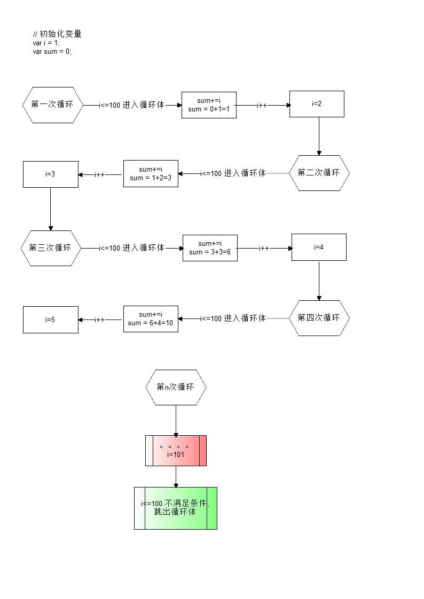

### do...while语句

> do..while循环和while循环非常像，二者经常可以相互替代，
>
> 但是do..while的特点是不管条件成不成立，都会执行一次。

基础语法：

```javascript
do {
  // 循环体;
} while (循环条件);
```

代码示例：

```javascript
// 初始化变量
var i = 1;
var sum = 0;
do {
  sum += i;//循环体
  i++;//自增
} while (i <= 100);//循环条件
```

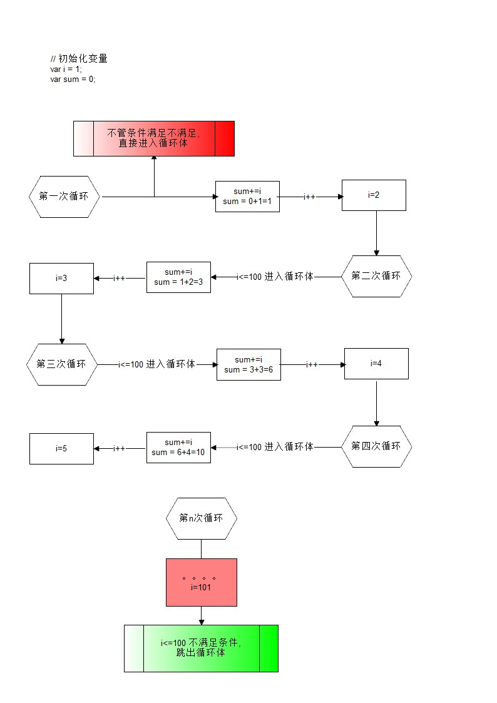

### for语句

>  while和do...while一般用来解决无法确认次数的循环。for循环一般在循环次数确定的时候比较方便

for循环语法：

```javascript
// for循环的表达式之间用的是;号分隔的，千万不要写成,
for (初始化表达式1; 判断表达式2; 自增表达式3) {
  // 循环体4
}
```

```
//求1-100之间所有数的和
var sum = 0;
for(var i = 0;i<=100;i++){
    sum+=i;
}
console.log(sum)
```

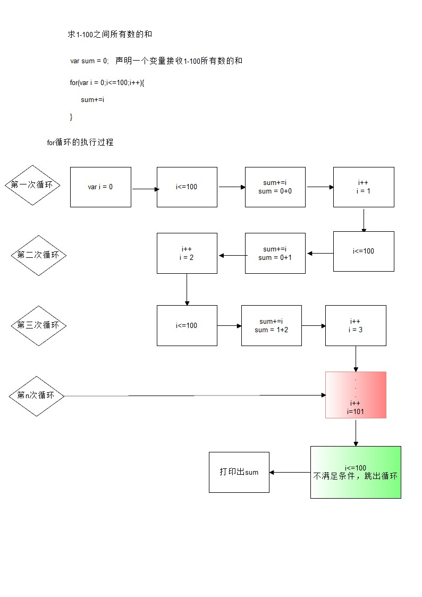


### continue和break

> break:
>
> ​	立即跳出整个循环，即循环结束，开始执行循环后面的内容（直接跳到大括号）
>
> 求200-300之间第一个能被7整数的数（break）
>
> ```
> for(var i = 200;i<300;i++){
>             if(i%7==0){
>                 console.log(i);
>                 break;
>             }
>         }
> ```
>
> 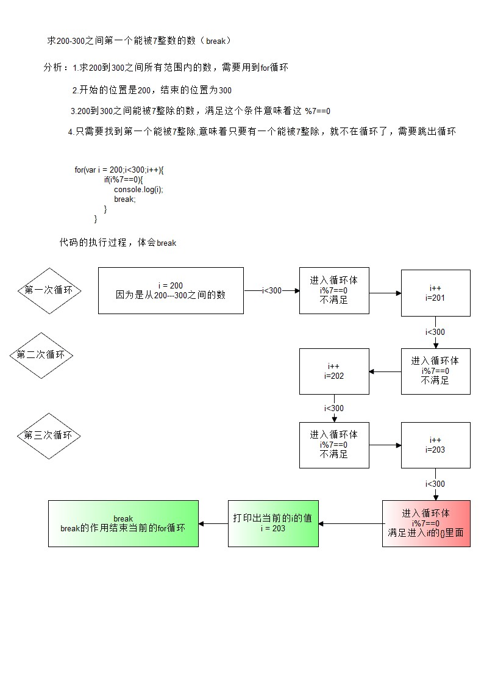
>
> continue:
>
> ​	立即跳出当前循环，继续下一次循环（跳到i++的地方）

求1-10之间不能被7整除的整数的和（用continue）

```javascript
 		var sum = 0;
        for(var i = 1;i<10;i++){
            if(i%7==0){
                continue;
            }
            sum+=i;
        }
        console.log(sum)
```

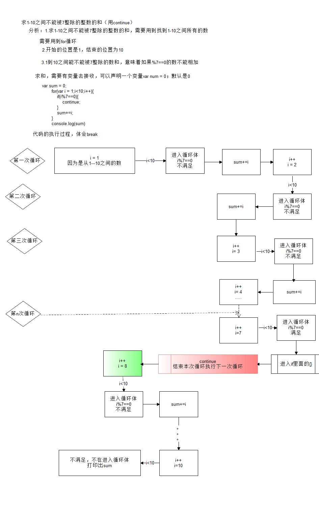

### 调试

- 过去调试JavaScript的方式
  - alert()   //弹窗
  - console.log()  //控制台输出
- 断点调试

>断点调试是指自己在程序的某一行设置一个断点，调试时，程序运行到这一行就会停住，然后你可以一步一步往下调试，调试过程中可以看各个变量当前的值，出错的话，调试到出错的代码行即显示错误，停下。

- 调试步骤

```javascript
浏览器中按F12-->sources-->找到需要调试的文件-->在程序的某一行设置断点
```

1. 浏览器中按F12，调出控制面板

   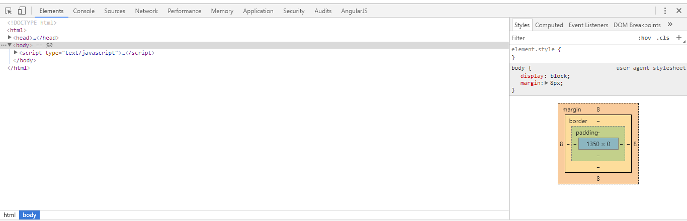

2. 点击sources

   ​	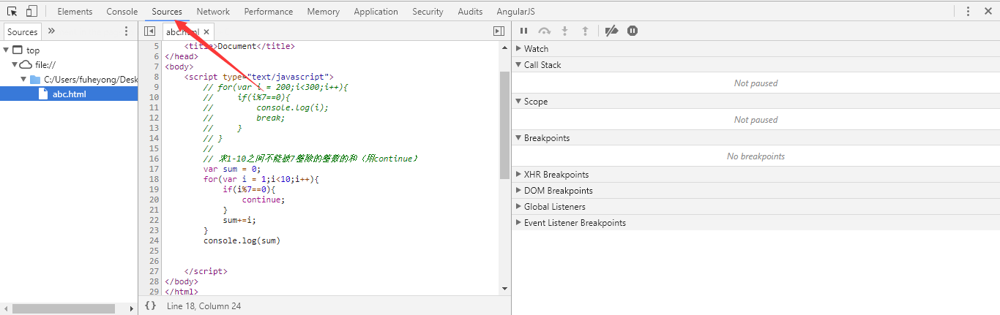

   3.在需要调试的代码所对应的行数身上点击，确定一个断点

   ​	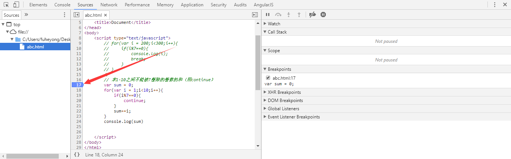

   4.刷新页面,浏览器会在你打的断点的位置确定光标

   ​	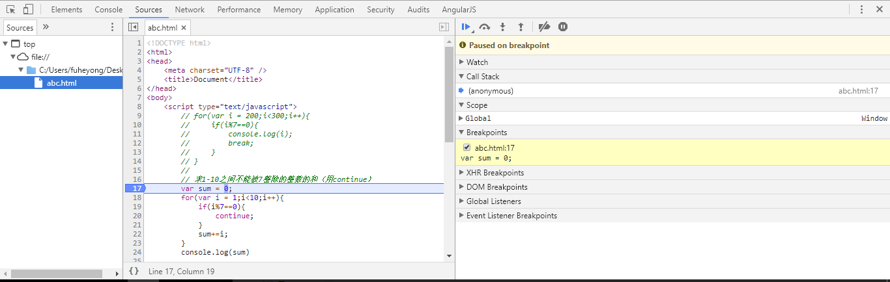

   5.点击下一步按钮，一步步执行代码

   ​	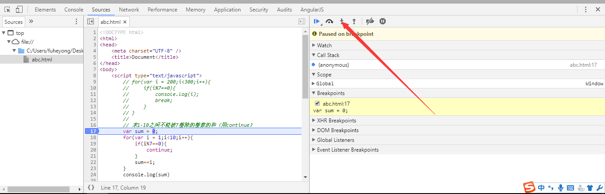

## 案例

#### 打印直接三角形

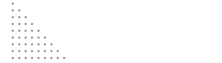


~~~
var start = '';
for (var i = 1; i < 10; i++) {
  for (var j = 0; j < i; j++) {
    start += '* ';
  }
  start += '\n';
}
console.log(start);
~~~

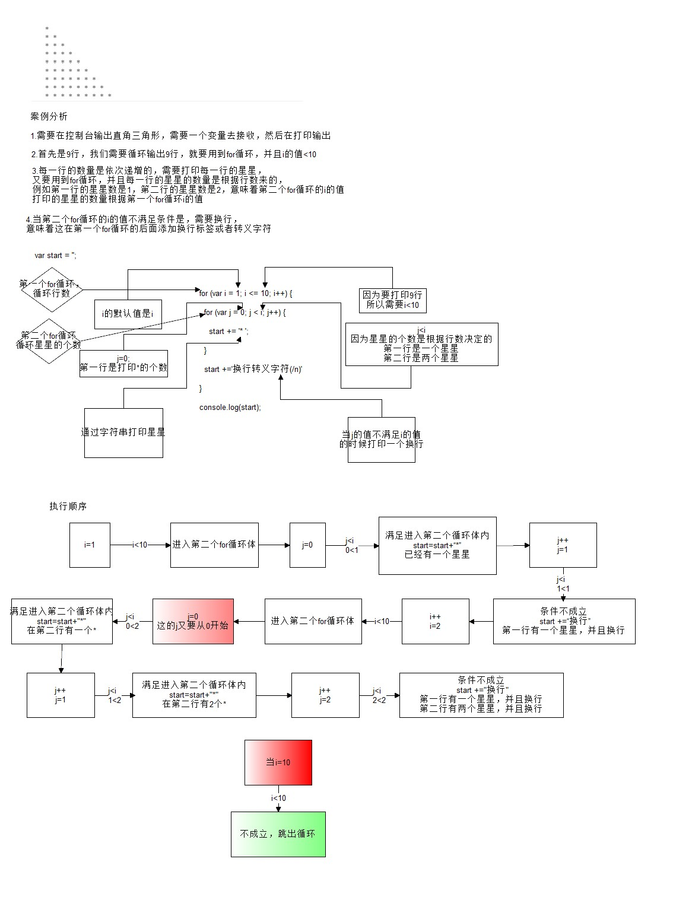

#### 打印久久乘法表

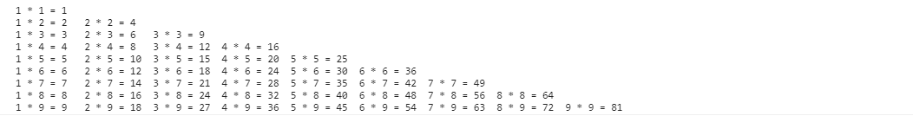


~~~
var str = '';
for (var i = 1; i <= 9; i++) {
  for (var j = 1; j <=i; j++) {
    str += j + ' * ' + i + ' = ' + i * j + '\t';
  }
  str += '\n';
}
console.log(str);
~~~

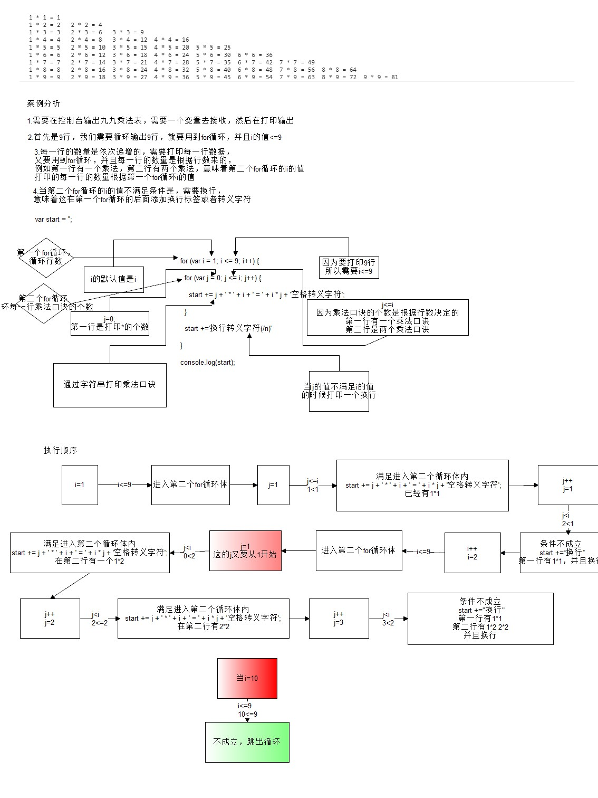


