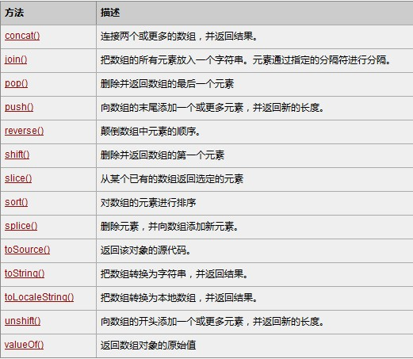
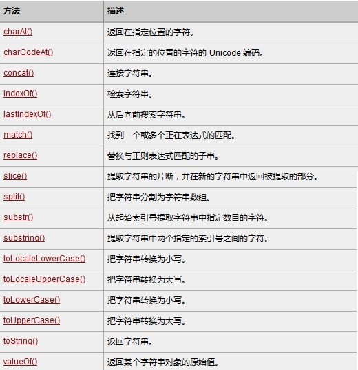
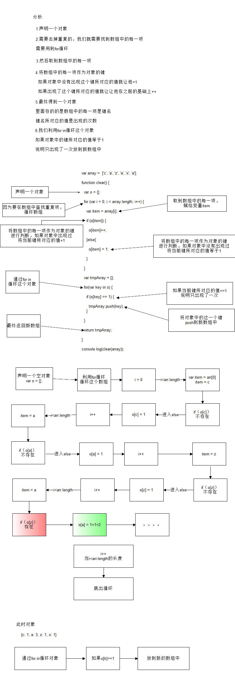
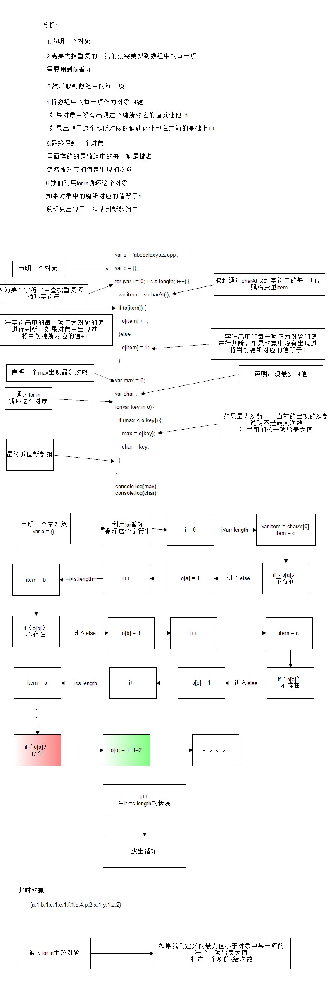

### Array对象

- 创建数组对象的两种方式
  - 字面量方式
  - new Array()

```javascript
// 1. 使用构造函数创建数组对象
// 创建了一个空数组
var arr = new Array();
// 创建了一个数组，里面存放了3个字符串
var arr = new Array('zs', 'ls', 'ww');
// 创建了一个数组，里面存放了4个数字
var arr = new Array(1, 2, 3, 4);


// 2. 使用字面量创建数组对象
var arr = [1, 2, 3];

// 获取数组中元素的个数
console.log(arr.length);
```

- 检测一个对象是否是数组

  - instanceof

    ~~~
     var arr = [1, 2, 3, 4, 5];
     console.log(arr instanceof Array);//true
     console.log({} instanceof Array);//false
    ~~~

    ​

  - Array.isArray()     HTML5中提供的方法，有兼容性问题

    ~~~
     var arr = [1, 2, 3, 4, 5];
    console.log(Array.isArray(arr))//true
    console.log(Array.isArray({}));//false
    ~~~

    ​

  函数的参数，如果要求是一个数组的话，可以用这种方式来进行判断

- toString()

  - toString()		把数组转换成字符串，逗号分隔每一项

    ~~~
    var arr = [1, 2, 3, 4, 5];
    console.log(arr.toString());   //1,2,3,4,5
    ~~~

    ​

  - valueOf()         返回数组对象本身

    ~~~
    var arr = [1, 2, 3, 4, 5];
    console.log(arr.valueOf()); //返回数组本身
    ~~~

    ​

- 数组常用方法

  演示：push()、shift()、unshift()、reverse()、sort()、splice()、indexOf()

```javascript
// 1 栈操作(先进后出)
var arr = [1, 2, 3, 4, 5]; 
push()      //从后面添加元素 返回新数组的长度
console.log(arr.push(6)) //6
pop() 		//从后面删除元素 返回被删除的元素
console.log(arr.pop()); //5
// 2 队列操作(先进先出)
shift()		//从前面删除元素 返回被删除的元素
unshift() 	//从前面删除元素 返回被删除的元素
// 3 排序方法
reverse()	//翻转数组
sort(); 	//即使是数组sort也是根据字符，从小到大排序
// 4 操作方法
concat()  	//把参数拼接到当前数组
slice() 	//从当前数组中截取一个新的数组，不影响原来的数组，参数start从0开始,end从1开始
splice()	//删除或替换当前数组的某些项目，参数start, deleteCount, options(要替换的项目)
// 5 位置方法
indexOf()、lastIndexOf()   //如果没找到返回-1
// 6 迭代方法 不会修改原数组(可选)
every()、filter()、forEach()、map()、some()
// 7 方法将数组的所有元素连接到一个字符串中。
join()
```



- 清空数组

```javascript
// 方式1 推荐 
arr = [];
// 方式2 
arr.length = 0;
// 方式3
arr.splice(0, arr.length);
```


### 基本包装类型

为了方便操作基本数据类型，JavaScript还提供了三个特殊的引用类型：String/Number/Boolean

```javascript
// 下面代码的问题？
// s1是基本类型，基本类型是没有方法的
var s1 = 'zhangsan';
var s2 = s1.substring(5);

// 当调用s1.substring(5)的时候，先把s1包装成String类型的临时对象，再调用substring方法，最后销毁临时对象, 相当于：
var s1 = new String('zhangsan');
var s2 = s1.substring(5);
s1 = null;
```

```javascript
// 创建基本包装类型的对象
var num = 18;  				//数值，基本类型
var num = Number('18'); 	//类型转换
var num = new Number(18); 	//基本包装类型，对象
// Number和Boolean基本包装类型基本不用，使用的话可能会引起歧义。例如：
var b1 = new Boolean(false);
var b2 = b1 && true;		// 结果是什么
```

### String对象

- 字符串的不可变

```javascript
var str = 'abc';
str = 'hello';
// 当重新给str赋值的时候，常量'abc'不会被修改，依然在内存中
// 重新给字符串赋值，会重新在内存中开辟空间，这个特点就是字符串的不可变
// 由于字符串的不可变，在大量拼接字符串的时候会有效率问题
```

- 创建字符串对象

```javascript
var str = new String('Hello World');

// 获取字符串中字符的个数
console.log(str.length);
```

- 字符串对象的常用方法

  字符串所有的方法，都不会修改字符串本身(字符串是不可变的)，操作完成会返回一个新的字符串

```javascript
// 1 字符方法
charAt()    	//获取指定位置处字符
charCodeAt()  	//获取指定位置处字符的ASCII码
str[0]   		//HTML5，IE8+支持 和charAt()等效
// 2 字符串操作方法
concat()   		//拼接字符串，等效于+，+更常用
slice()    		//从start位置开始，截取到end位置，end取不到
substring() 	//从start位置开始，截取到end位置，end取不到
substr()   		//从start位置开始，截取length个字符
// 3 位置方法
indexOf()   	//返回指定内容在元字符串中的位置
lastIndexOf() 	//从后往前找，只找第一个匹配的
// 4 去除空白   
trim()  		//只能去除字符串前后的空白
// 5 大小写转换方法
to(Locale)UpperCase() 	//转换大写
to(Locale)LowerCase() 	//转换小写
// 6 其它
search()
replace()
split()
fromCharCode()
// String.fromCharCode(101, 102, 103);	 //把ASCII码转换成字符串
```



#### 案例

1.编写一个方法去掉一个数组的重复元素

~~~
var array =  ['c', 'a', 'z', 'a', 'x', 'a'];
function clear() {
  var o = {};
  for (var i = 0; i < array.length; i++) {
    var item = array[i];
    if (o[item]) {
      o[item]++;
    }else{
      o[item] = 1;
    }
  }
  console.log(o)
  var tmpArray = [];
  for(var key in o) {
    if (o[key] == 1) {
      tmpArray.push(key);
    }
  }
  return tmpArray;
}

console.log(clear(array));
~~~



2.判断一个字符串中出现次数最多的字符，统计这个次数

```javascript
var s = 'abcoefoxyozzopp';
var o = {};

for (var i = 0; i < s.length; i++) {
  var item = s.charAt(i);
  if (o[item]) {
    o[item] ++;
  }else{
    o[item] = 1;
  }
}

var max = 0;
var char ;
for(var key in o) {
  if (max < o[key]) {
    max = o[key];
    char = key;
  }
}

console.log(max);
console.log(char);
```



