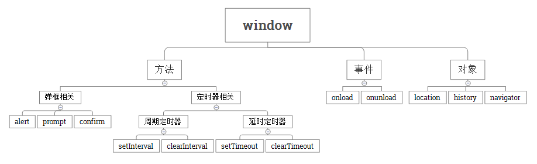
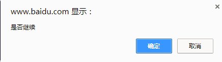

### API的概念

API就是用来简化操作的东西。比如一台汽车，钥匙就是打开汽车的api，方向盘就是改变方向的api等。不需要了解汽车内部原理，就可以打开汽车，改变方向。

### Web API的概念

操作浏览器和网页的api

#### BOM - 浏览器对象模型

操作浏览器功能的API

通过BOM可以控制浏览器，比如：控制浏览器跳转，控制浏览器刷新

#### DOM - 文档对象模型

操作页面元素的API

修改网页中元素的大小，背景颜色，边框，内容等

## 常用BOM对象



### window 
    window是BOM中的顶级对象

### 对话框

- alert() 弹出提示信息,没有返回值,效果如下
  
  
- prompt() 接收用户输入信息,返回用户输入内容，没有输入内容返回null，效果如下
  
  
- confirm() 确认框，返回点击确定返回true，点击取消返回false，效果如下
  


### 页面加载事件

- onload

```javascript
window.onload = function () {
  // 当页面加载完成执行
  // 当页面完全加载所有内容（包括图像、脚本文件、CSS 文件等）执行
}
```

- onunload

```javascript
window.onunload = function () {
  // 当用户退出页面时执行
}
```

### 定时器

#### setTimeout()和clearTimeout()

在指定的毫秒数到达之后执行指定的函数，只执行一次

```javascript
// 创建一个定时器，1000毫秒后执行，返回定时器的标示
var timerId = setTimeout(function () {
  console.log('Hello World');
}, 1000);

// 取消定时器的执行
clearTimeout(timerId);
```


#### setInterval()和clearInterval()

定时调用的函数，可以按照给定的时间(单位毫秒)周期调用函数

```javascript
// 创建一个定时器，每隔1秒调用一次
var timerId = setInterval(function () {
  var date = new Date();
  console.log(date.toLocaleTimeString());
}, 1000);

// 取消定时器的执行
clearInterval(timerId);
```


### location对象

location对象是window对象下的一个属性，使用的时候可以省略window对象

location.href可以控制浏览器跳转网页

```javascript
      //跳转到百度网站
      location.href = 'http://www.baidu.com';
      
      //获取当前网页地址赋值给url变量
      var url = location.href;
```


### history对象

- back() //回退一个网页
- forward() //前进一个网页
- go() //跳到指定网页，参数为整数，正整数为前进的次数，负整数为后退的次数


### navigator对象

- userAgent

通过userAgent可以判断用户浏览器的类型


- platform

通过platform可以判断浏览器所在的系统平台类型.


## DOM

### DOM的概念

DOM又称为文档树模型


- 文档：一个网页可以称为文档
- 节点：网页中的所有内容都是节点（标签、属性、文本、注释等）
- 元素：网页中的标签
- 属性：标签的属性

### 模拟文档树结构


## 获取页面元素

### 根据id获取元素

```html
   <div id="main"></div>
```

```javascript
//获取页面中id为main的元素，并赋值给div变量
var div = document.getElementById('main');
console.log(div);
```


### 根据标签名获取元素

```html

   <ul>
      <li>第一条</li>
      <li>第二条</li>
      <li>第三条</li>
   </ul>

```

```javascript
//获取页面中所有标签名为li的元素，返回值为伪数组
var lis = document.getElementsByTagName('li');

//遍历伪数组，根据索引把每一项拿出来
for (var i = 0; i < lis.length; i++) {
  var li = lis[i];
  console.log(li);
}
```


## 属性操作

### 非表单元素的属性

href、title、id、src、className

```javascript
//获取id为link的元素的href与title属性
var link = document.getElementById('link');
console.log(link.href);
console.log(link.title);
```


```javascript
//获取id为pic的元素的src属性
var pic = document.getElementById('pic');
console.log(pic.src);
```


- innerHTML和innerText
  innerHTML用来设置或者获取元素的内容
  innerText用来设置或者获取元素内的文本

```html
  <div id="box">
      我是文本<p>我会生成为标签</p>
  </div>
```

```javascript
var box = document.getElementById('box');
console.log(box.innerHTML);
console.log(box.innerText);
```

- innerHTML和innerText的区别


  

###案例
1.用定时器在页面显示当前时间
