### 表单元素属性

- value 大部分用于表单元素的内容获取
  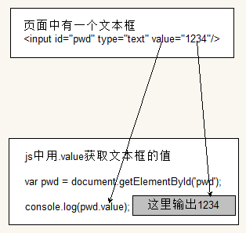
  
- type 可以获取input标签的类型(输入框或复选框等)
- 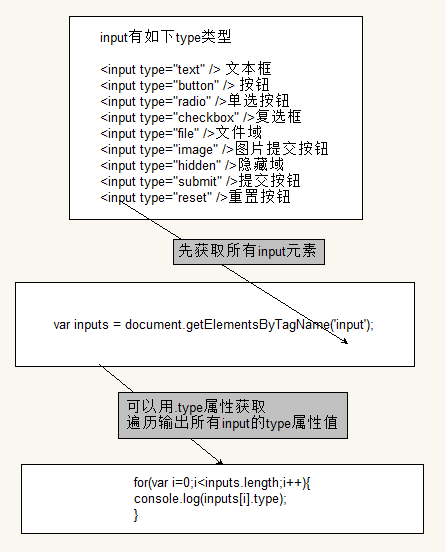

- disabled 禁用属性
  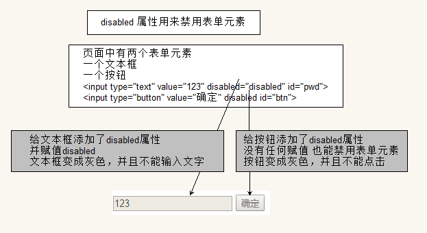
  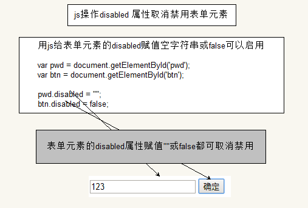
  
- checked 复选框选中属性
  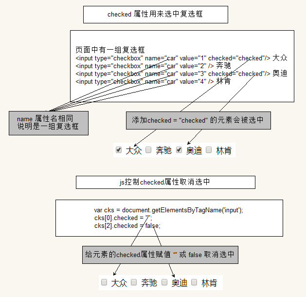
  
- selected 下拉菜单选中属性
  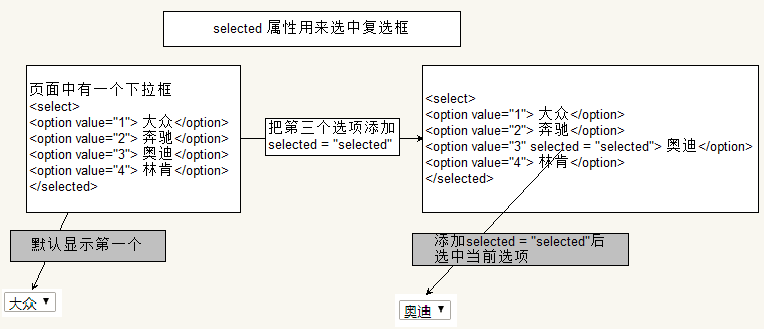

### 自定义属性操作

- getAttribute() 获取标签行内属性
  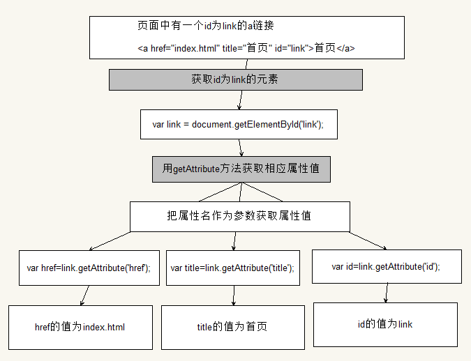
  
- setAttribute() 设置标签行内属性
  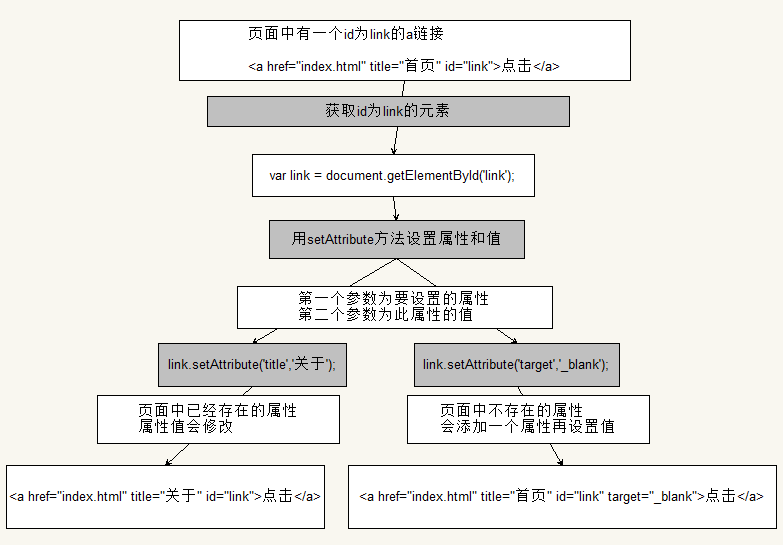
  
- removeAttribute() 移除标签行内属性
  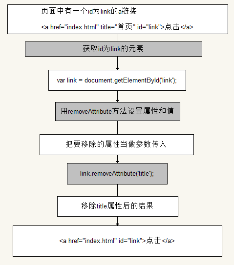
  
- 与element.属性的区别: 上述三个方法用于获取任意的行内属性。
  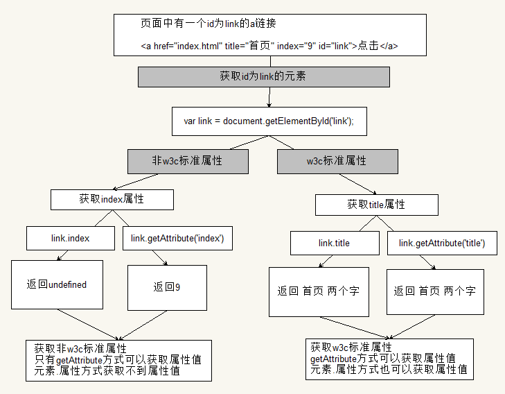


### 样式操作

- 使用style方式设置的样式显示在标签行内

```html
  <div id="box">传智播客</div>
```
```javascript
var box = document.getElementById('box');
box.style.color = "red";
box.style.backgroundColor = "pink";
```
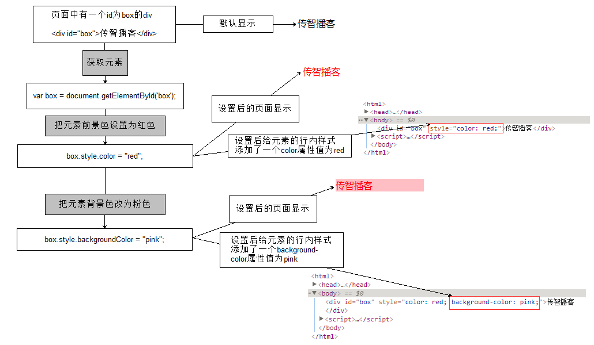


### 类名操作

- 修改标签的className属性相当于直接修改标签的类名

```css
    .boom{
			width:100px;
			height:100px;
			background-color: pink;
		}

		.doom{
			width:50px;
			height:50px;
			background-color: green;
		}
```
```javascript
  var box = document.getElementById('box');
			box.className = "boom";
			box.className = "doom";
```
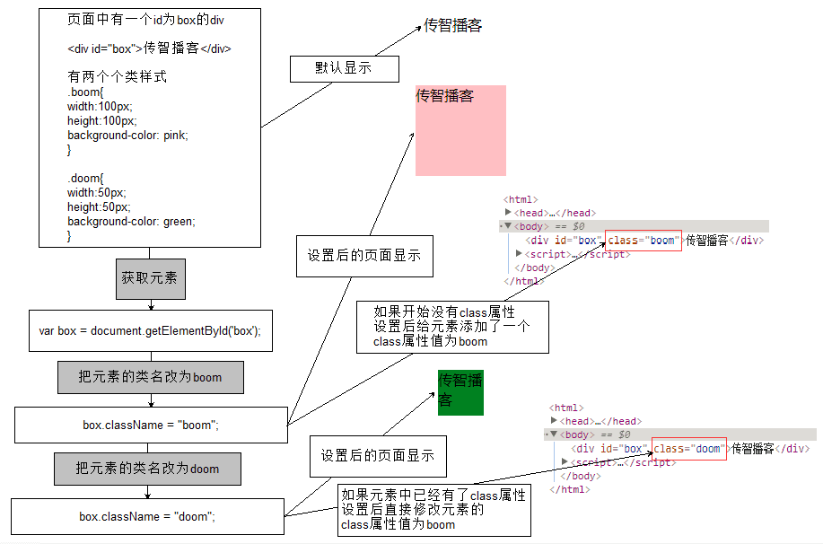

### 节点层级

- 获取子节点
  childNodes
  
- 获取子元素
  children
  
- 获取父节点
  parentNode
  
- 获取下一个兄弟节点
  nextSibling

- 获取上一个兄弟节点
  previousSibling

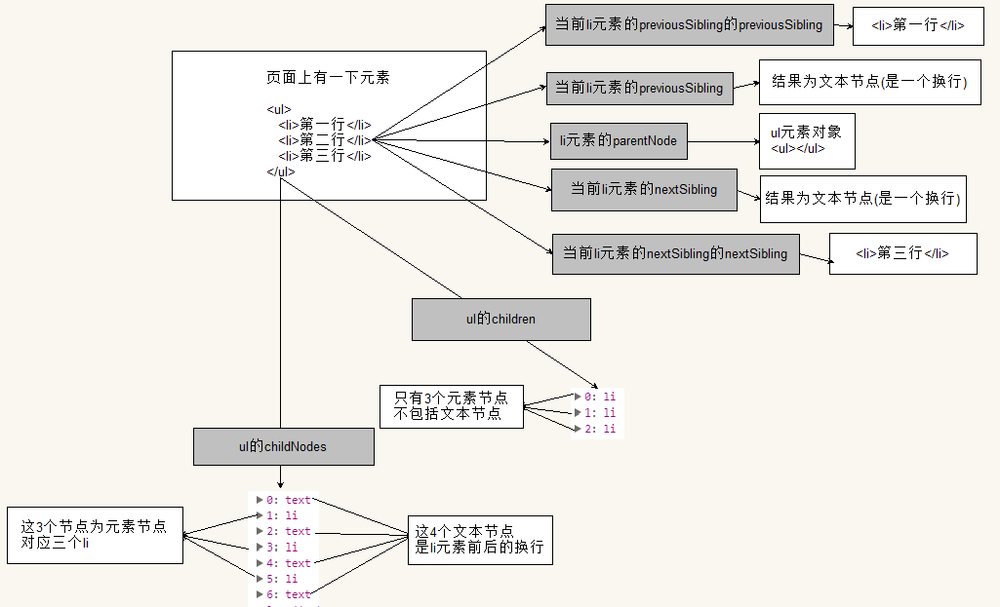

###案例
1.美女相册
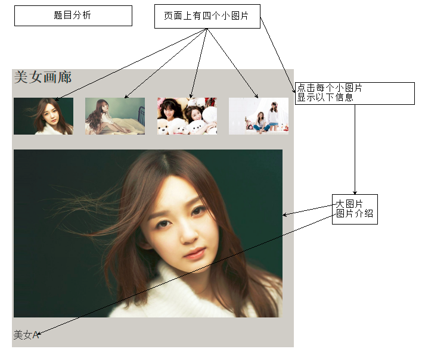
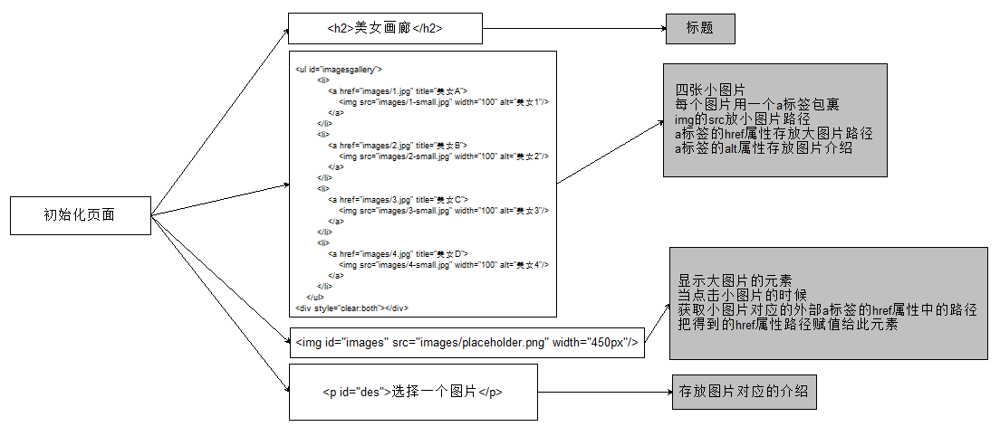
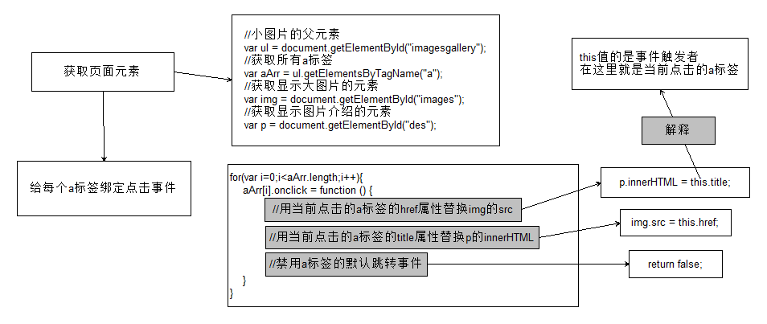

2.开关灯
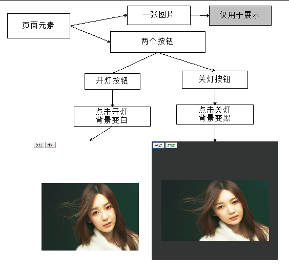
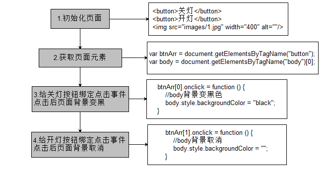

3.隔行变色
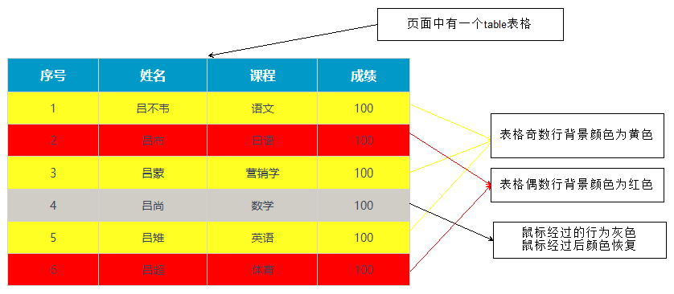
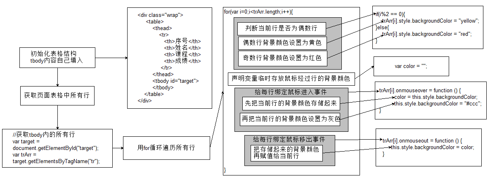