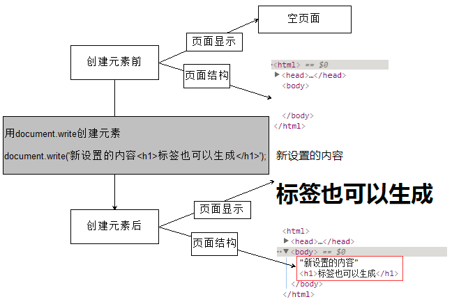
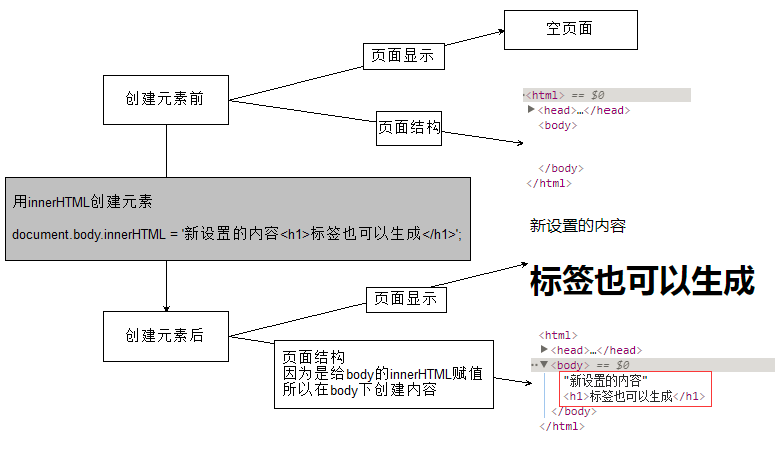
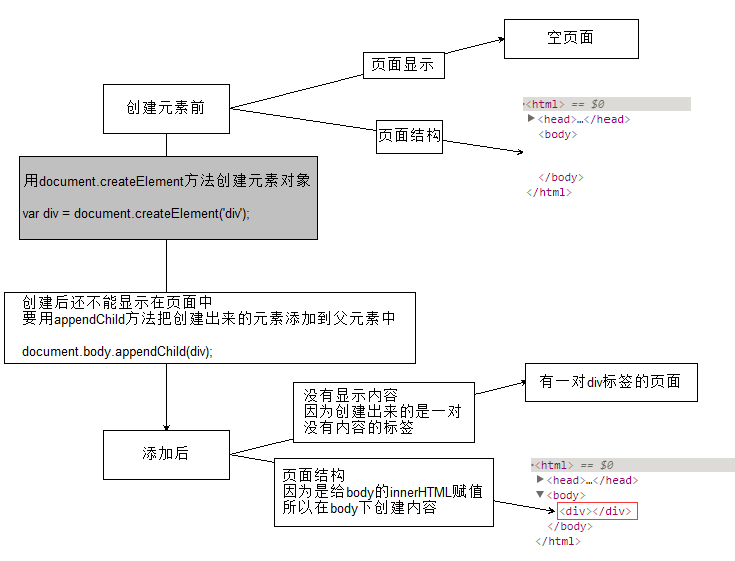
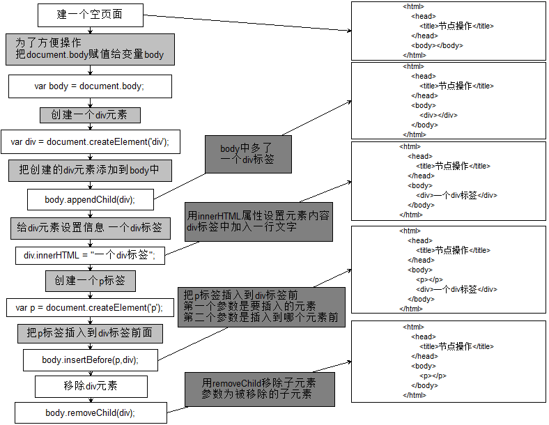
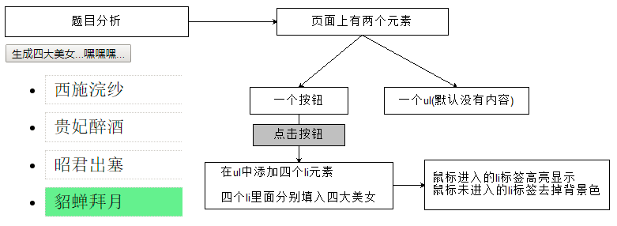
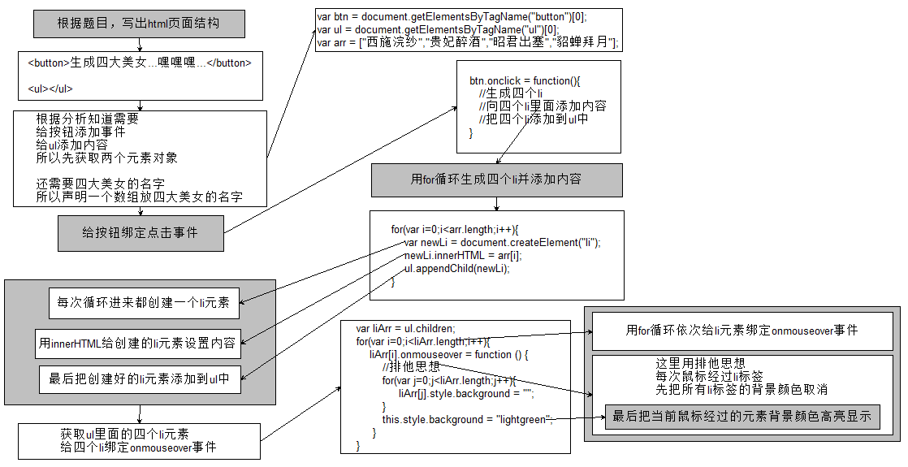
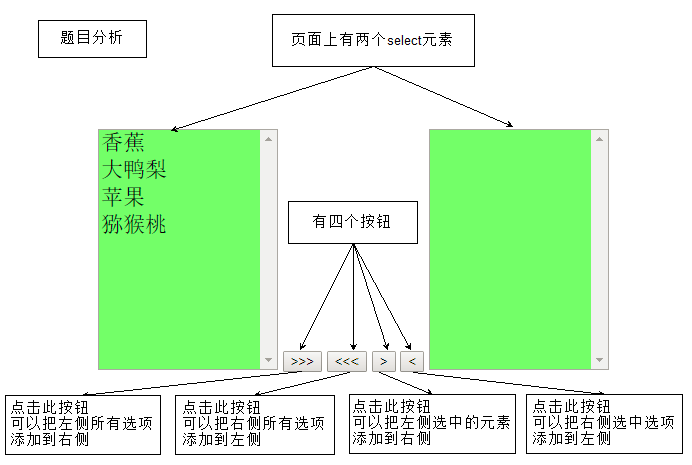
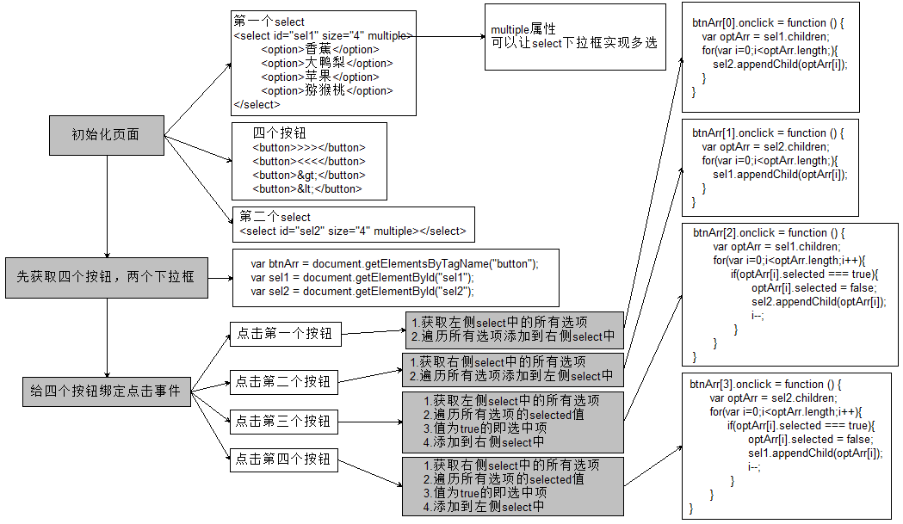
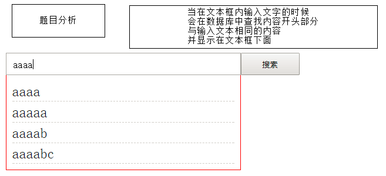
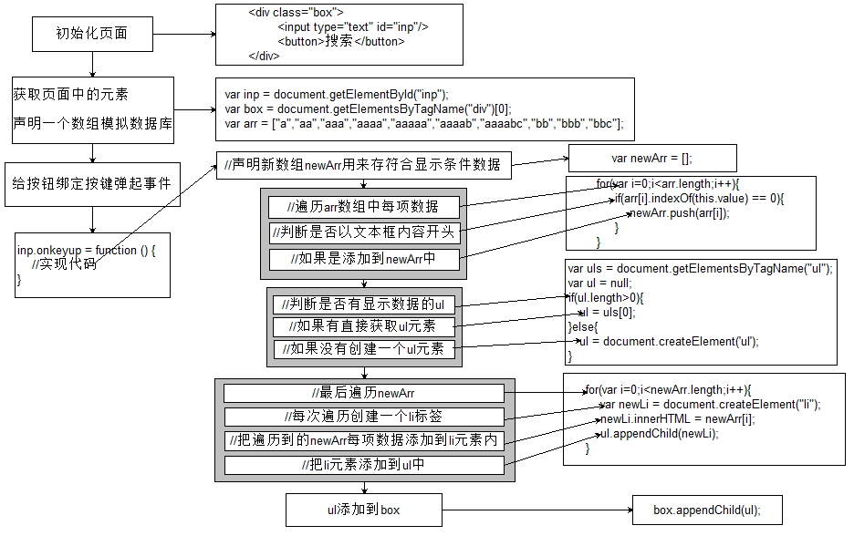

## 创建元素的三种方式

### document.write()

```javascript
document.write('新设置的内容<h1>标签也可以生成</h1>');
```


### innerHTML

```javascript
document.body.innerHTML = '新设置的内容<h1>标签也可以生成</h1>';
```


### document.createElement()

```javascript
var div = document.createElement('div');
document.body.appendChild(div);
```



## 节点操作

```javascript
var body = document.body;

//创建div节点
var div = document.createElement('div');

//将上面创建的节点添加到body中
body.appendChild(div);

//给div元素设置信息 一个div标签
div.innerHTML = "一个div标签";

//创建一个p标签
var p = document.createElement('p');

//把p标签插入到div标签前面
body.insertBefore(p,div);

//移除div标签
body.removeChild(div);
```


###案例
1.四大美女



2.移动水果



3.模拟百度搜索框


		
		
