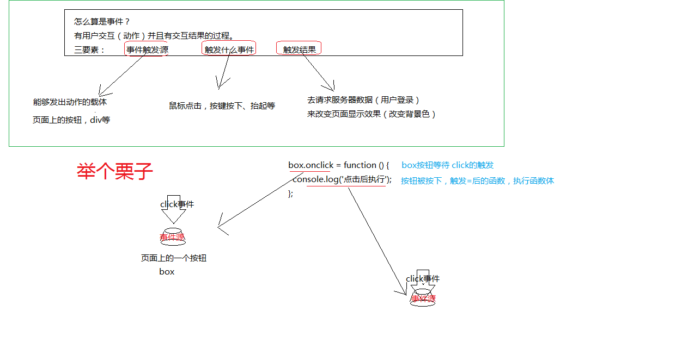
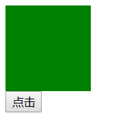
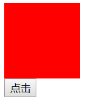
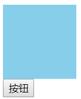
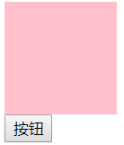
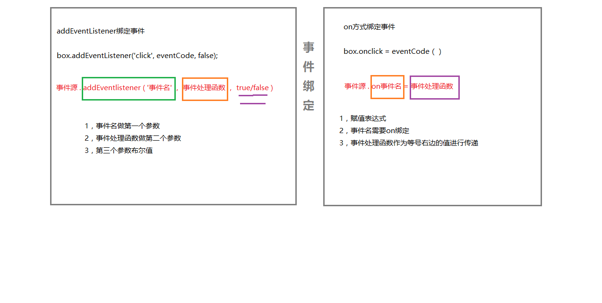
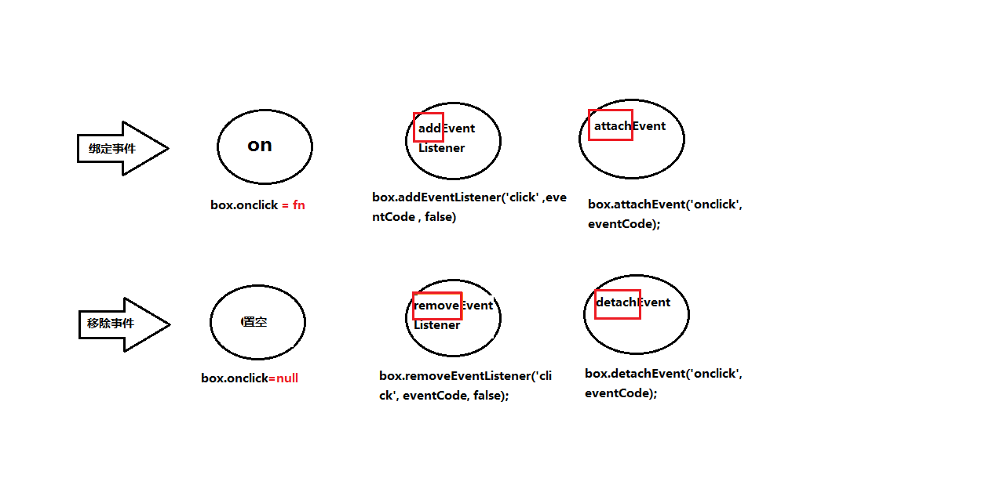
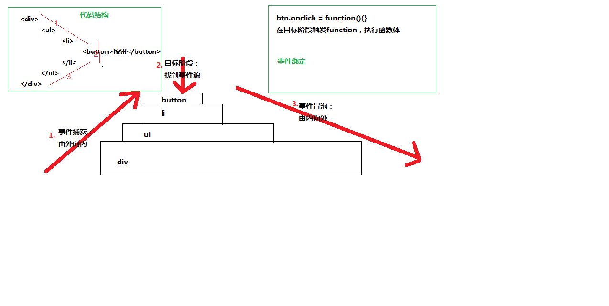
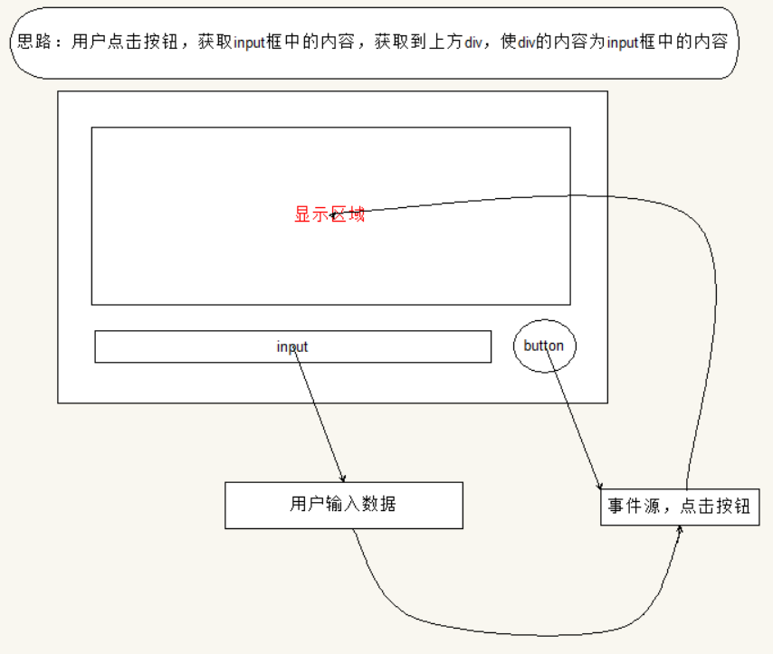

## 事件


### 一 ，**事件三要素**

- 事件源:触发(被)事件的元素

- 事件类型:事件的触发方式(例如鼠标点击或键盘点击)

- 事件处理程序:事件触发后要执行的代码(函数形式)

  如何理解事件三要素：

  

### 二 ，**注册/移除事件的三种方式**

####  2.1  注册事件的三种方式：

##### 	1，on方式:

```
target.onclick = function(){eventCode};
```

**target： 文档节点、document、window 或 XMLHttpRequest**。此处是‘点击’按钮；



        document.getElementById('btn').onclick = function(){    
            document.getElementById('box').style.backgroundColor = 'red';
        	//点击按钮使div变红色
        }


​	使用**onclick**，**触发**绑定**事件函数**：使div背景变成红色；


##### 	2，addEventListener方式:

```
target.addEventListener(type, listener, useCapture);
```

**target： 文档节点、document、window 或 XMLHttpRequest。** 
**type： 字符串，事件名称，不含“on”，比如“click”、“mouseover”、“keydown”等。** 
**listener ：实现了 EventListener 接口或者是 JavaScript 中的函数。** 
**useCapture ：是否使用捕捉，一般用 false** 。例如：


```
    document.getElementById("btn").addEventListener("click", function () { 
    //添加事件监听
    	document.getElementById('box').style.backgroundColor = 'skyblue';
    	//事件处理函数
    ); }, false);
```



​	使用**addEventListener**给按钮添加事件监听，，监听**click**触发**绑定**事件函数：使div背景变成天蓝色；


##### 	3，attachE vent方式(IE中)

```
target.attachEvent(type, listener); 
```


**target： 文档节点、document、window 或 XMLHttpRequest。** 
**type： 字符串，事件名称，含“on”，比如“onclick”、“onmouseover”、“onkeydown”等。** 
**listener ：实现了 EventListener 接口或者是 JavaScript 中的函数。 例如：**

```
document.getElementById("txt").attachEvent("onclick",function(event){alert(event.keyCode);}); 
```


```
    document.getElementById("btn").attachEvent("onclick", function () { 
    //添加事件监听
    	document.getElementById('box').style.backgroundColor = 'black';
    	//事件处理函数
     });
```



​	使用**attachEvent**给按钮添加事件监听，，监听**onclick**触发**绑定**事件函数：使div背景变成粉色；


##### 	4, addEventLisener和on绑定事件间的区别：




####**2.2 移除事件的方式：**

##### 	1，将绑定的事件函数置为null

```javascript
var box = document.getElementById('box');
box.onclick = function () {
  console.log('点击后执行');
};
box.onclick = null;
```


#####	2，用addEventListener添加事件监听,removeEventlistener移除事件监听
```javascript
box.addEventListener('click', eventCode, false);
box.removeEventListener('click', eventCode, false);
```

#####	3，用attachEvent添加事件监听,detachEvent移除事件监听
```javascript
box.attachEvent('onclick', eventCode);
box.detachEvent('onclick', eventCode);

function eventCode() {
  console.log('点击后执行');
}
```


## 三 ， 事件冒泡的理解：

### 	1，原理：

​	事件从根节点开始，逐级派送到子节点，若节点绑定了事件动作，则执行动作，然后继续走，这个阶段称为“**捕获阶段(Capture)**”；
​	执行完捕获阶段后，事件由子节点往根节点派送，若节点绑定了事件动作，则执行动作，然后继续走，这个阶段称为“**冒泡阶段(Bubble)**”；

##### 	在捕获和冒泡阶段之间存在目标阶段。


### 	2，利用事件冒泡的场景：

当页面上绑定事件的元素，是我们首次加载页面时并不存在的，而是后期我们动态生成的元素，这是时候绑定事件是没有事件源的，但是这个当前不存在的元素在创建出来时 ，是有父元素的。我们可以讲事件绑定到这个父容器上来触发。

### 	3，如何理解冒泡原理：



## 四，模拟论坛发帖案例思路



1，获取按钮元素给按钮注册监听事件

2，定义发帖函数

 -  发帖函数功能：

    ​	1，获取input框输入内容

    ​	2，获取显示区域元素，动态创建列表

    ​	3，在显示区域元素中添加input框中内容

    ```
    //获取按钮元素
    var btn = document.getElementsByClassName('btn')[0];
    //给btn按钮注册监听事件
    btn.addEventListener('click',sendTie,false);
    //定义发帖函数
    function sendTie(){
          //避免重复发送，进入方法后先移除事件
          btn.removeEventListener('click',sendTie,false);
          //获取文本信息
          var txt = document.getElementsByClassName('myInput')[0].value;
          //创建li元素
          var li  = document.createElement('li');
          li.innerText = txt;
          //把li添加到ul列表中
          list.appendChild(li);
           //发送成功后，添加事件
           btn.addEventListener('click',sendTie,false);
    }
    ```

    ​