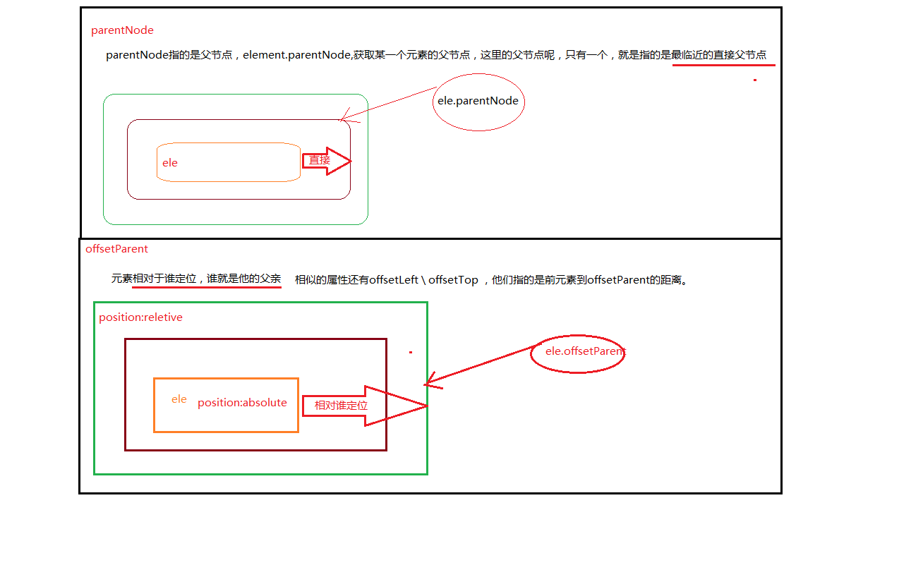
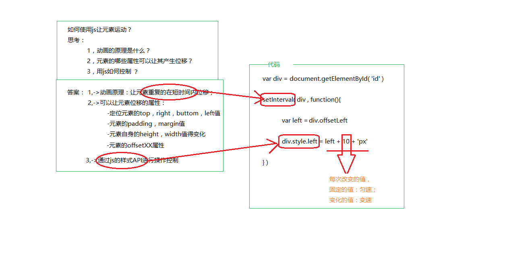
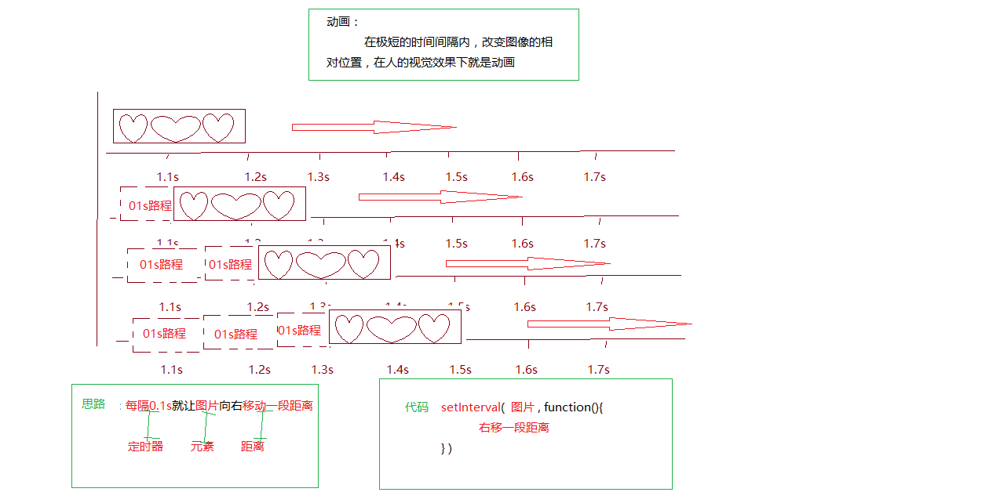
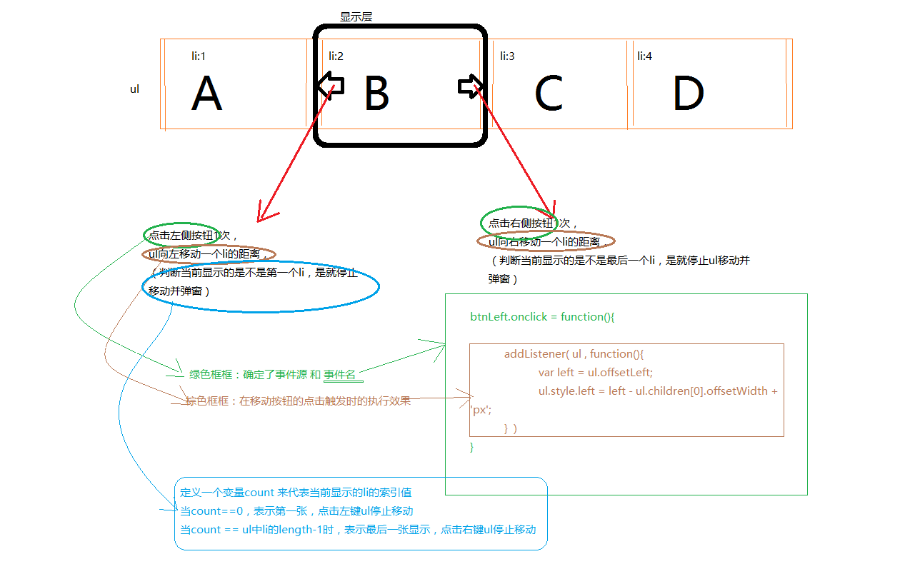

## 一 ，offsetParent和parentNode的区别

- offsetParent用于获取定位的父级元素，是只读属性 离当前元素最近的一个有定位属性的父节点；

  如果没有定位父级，默认是body，有兼容性问题。Ie7以下，如果当前元素没有定位默认是body，如果有定位则是html。

- parentNode用户获取任意元素的父级元素，ele.parentNode是只读属性，指当前元素的父级节点；没有什么兼容问题。

  

  ​

  ​

## 二 ， 动画（动画原理，匀速动画）

#### 1,如何使用js让一个元素运动起来？



  所以让元素在不同时间显示到不同位置，连续执行就会产生动画效果:

​	1，让元素再重复的时间内移动我们需要：**定时器；**

​	2，操作哪些属性可以让元素的位置发生变化呢？  **元素自身的宽，高，margin，right，offsetXX属性；**

​	3，使用**js样式API进行控制**就能完成元素的动画效果了。

  ```css
    #id{
      position:absolute;
      width:100px;
      height:100px;
      background-color:red;
    }
  ```

  ```html
    <div id="id"></div>
  ```

  ```javascript
  //获取页面中id为id的元素
    var box = document.getElementById('id');  
    //声明两个变量分别控制box元素距离页面的横向距离和纵向距离
    var left=0,top=0;    
    //定义一个定时器，没500毫秒执行一次
    setInterval(function(){
      //每次执行 随意生成两个数，赋值给left和top
      left = parseInt(Math.random()*800);
      top = parseInt(Math.random()*400);    
      //将这两个值赋值给box元素的left和top
      box.style.Left = left+'px';
      box.style.Top = top+'px';  
    },500);
  ```


#### 2,匀速动画

  在定时器中我们让元素每隔相同的时间移动相等的距离，就会产生匀速动画效果。

  ```javascript
    
    //获取页面中id为box的元素
    var box = document.getElementById('box')
    //声明变量控制box元素距离页面的横向距离
    var left=0；   
    //声明变量控制box元素每次移动的距离
    var step = 20    
    //定义一个定时器，没500毫秒执行一次
    setInterval(function(){      
      //让left值每次增加固定距离
      left += step;     
      //将每次增加后的left值赋值给box元素
      box.style.Left = left+'px';  
    },500);
  ```




## 三 ， 轮播图的原理

​	轮播图是欺骗用户视觉的动画：使用一个较小的父容器承载一个成几何倍数的图片容器ul，ul中每一个li代表一个显示内容，当我们给ul的父容器设置了溢出隐藏之后就能只显示一个完整的li标签中的内容，当控制ul每次左移或者右移一个li标签的宽度的时候就呈现出轮播图的效果了。

​	优化效果：当用户操作到下图A内容显示在显示层中时，应该禁用掉左侧按钮；同理当D内容显示在显示层中的时候我们应该禁用掉右按钮。所以在动画代码执行前，我们需要先校验当前显示的li标签是不是第一个或者最后一个，如果是的话就警告且禁用相应按钮



            var index = 0 ;
            right.onclick = function () {
                index++;
                //index的值是有范围的[0-3]
                if(index == 4){
                    index = 3;
                    alert("这已经是最后一张了，不能再次点击了！！！");
                    return;
                }
                //移动ul;
                var sss = -index*imgWidth;
                //通过animate产生动画
                animate(ul,sss);
            }
    
            //左侧逻辑相反
            left.onclick = function () {
                index--;
                //index的值是有范围的[0-3]
                if(index == -1){
                    index = 0;
                    alert("这已经是第一张了，不能再次点击了！！！");
                    return;
                }
                //移动ul;
                var sss = -index*imgWidth;
                //通过animate产生动画
                animate(ul,sss);
            }