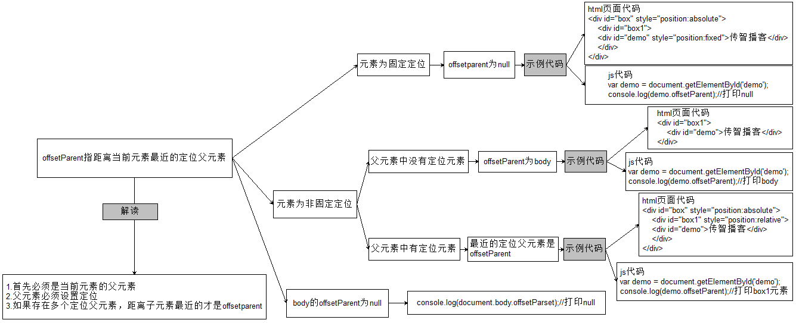
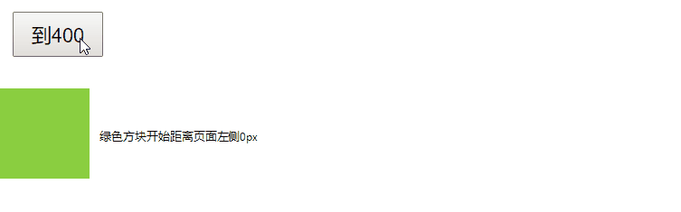
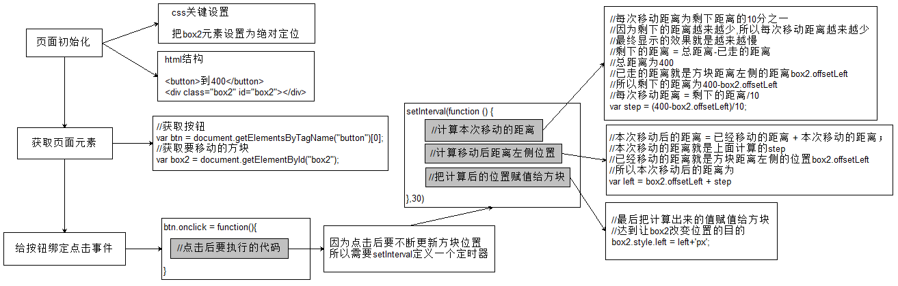
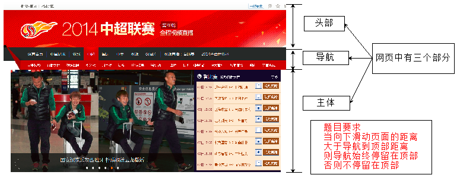
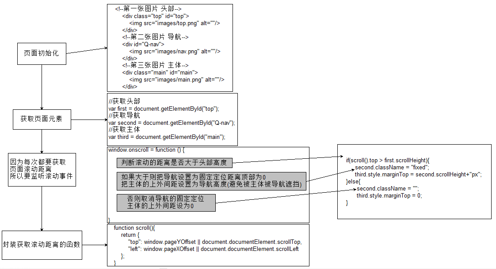
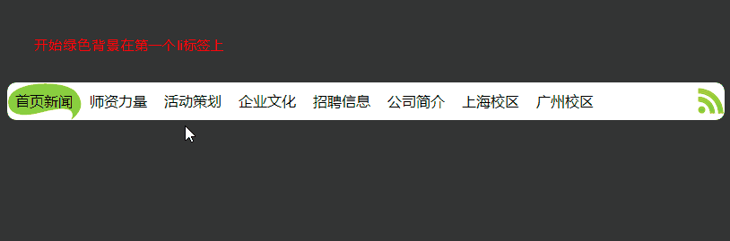
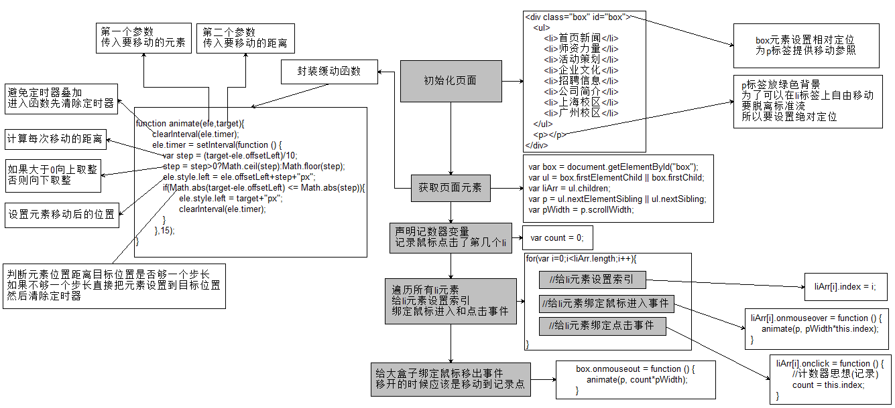

###偏移量
```javascript
var box = document.getElementById('box');
console.log(box.offsetParent);
console.log(box.offsetLeft);
console.log(box.offsetTop);
console.log(box.offsetWidth);
console.log(box.offsetHeight);
```




### 客户区大小

```javascript
var box = document.getElementById('box');
console.log(box.clientLeft);
console.log(box.clientTop);
console.log(box.clientWidth);
console.log(box.clientHeight);
```


### 滚动偏移

```javascript
var box = document.getElementById('box');
console.log(box.scrollLeft)
console.log(box.scrollTop)
console.log(box.scrollWidth)
console.log(box.scrollHeight)
```


### 变速动画

   动画效果预览
   
   让盒子每次移动距离都不等，就会产生变速动画。
   例如：盒子每次移动距离 = (目标距离-当前距离)/10；
   
   
```css
  * {
            padding: 0;
            margin: 0;
        }
        button {
            width: 100px;
            height: 50px;
            font-size: 22px;
            margin: 15px;
        }
        .box1 {
            width: 100%;
            height: 500px;
            position: relative;
            background-color: #eee;
        }
        .box2 {
            width: 100px;
            height: 100px;
            position: absolute;
            top: 100px;
            left: 0;
            background-color: yellowgreen;
        }
```

```html
  <!--缓动动画必须设置目标位置-->
    <button>到200</button>
    <div class="box1">
        <div class="box2" id="box2"></div>
    </div>
```

```javascript
  //体验缓动动画（步长越来越小）
  var btn = document.getElementsByTagName("button")[0];
  var box2 = document.getElementById("box2");

  //绑定事件
  btn.onclick = function () {
     //通过定时器
     setInterval(function () {
        //动画原理 = 盒子本身位置 + 步长(越来越小)
        //(目标距离-当前距离)/10;
        
        //计算本次移动的距离
		    var step = (400-box2.offsetLeft)/10;
		    //计算移动后距离左侧位置
		    var left = box2.offsetLeft + step;
		    //把计算后的位置赋值给方块
		    box2.style.left = left + "px";
     },30);
  }
```


###案例
1.固定导航



2.筋斗云

