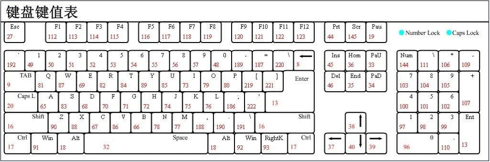
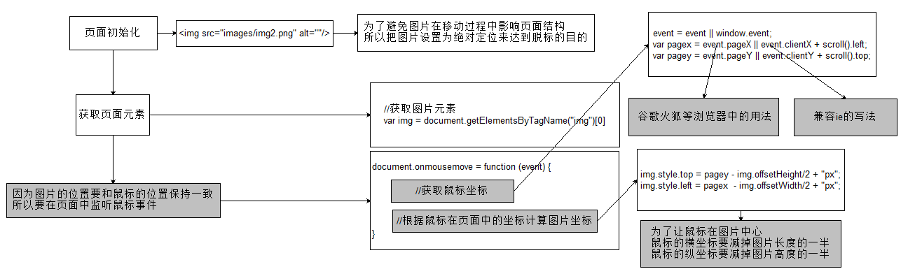
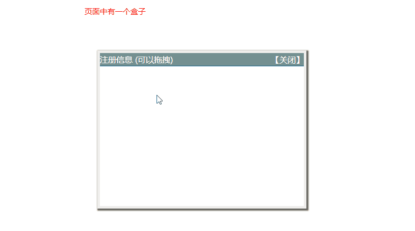
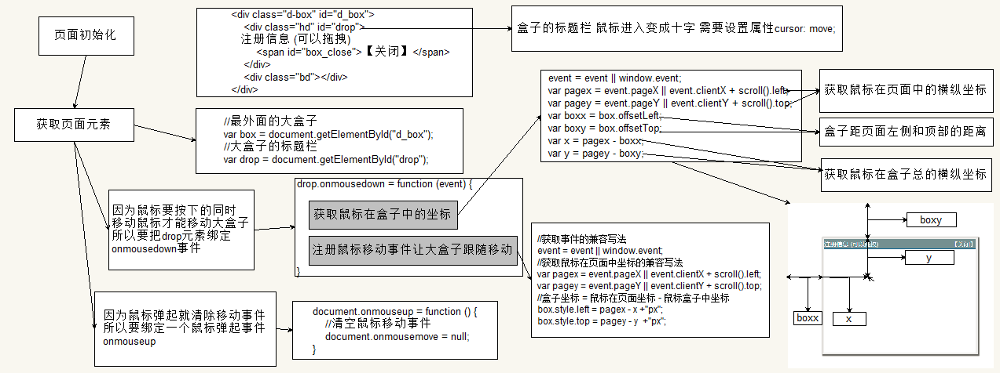

### 事件对象的属性和方法

- event.type                      获取事件类型（事件名称）

- event.clientX/event.clientY     鼠标在窗口中位置

- event.pageX/event.pageY         鼠标在页面中位置(IE8以前不支持)

- event.target || event.srcElement 用于获取触发事件的元素

- event.preventDefault() 取消默认行为

- event.keyCode       获取用户按下的键盘码（一个数字），通过键盘码对应到相应的按键(见下图)，如果keyCode是13，说明按下了Enter键


```javascript
  document.body.onkeydown = function (event) {
      event = event || window.event;
      //通过keyCode获取按下的键盘码，并赋值给num
      var num = event.keyCode;
      alert(num);
  }
```


### 常用的鼠标和键盘事件

- onmouseup 鼠标按键放开时触发
- onmousedown 鼠标按键按下触发
- onmousemove 鼠标移动触发
- onkeyup 键盘按键按下触发
- onkeydown 键盘按键抬起触发


### 案例
1.鼠标跟随小天使



2.拖拽案例

