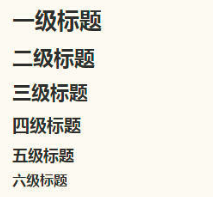
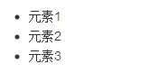
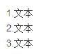

# markdown

## markdown是什么
  markdown是一种轻量级的标记语言，类似于html通过一些标记来改变文字样式和排版，只是markdown的标记和html的标记不一样
  
## markdown的优点
  - 纯文本，所以兼容性极强，可以用所有文本编辑器打开。
  - 让你专注于文字而不是排版。
  - 格式转换方便，Markdown 的文本你可以轻松转换为 html、电子书等。
  - Markdown 的标记语法有极好的可读性。

## markdown基本语法

### 标题
在markdown中，用`#`标记标题，标题一共分为六级，前面加几个`#`就是几级标题
`#`越多，字体越小【类似于html中的h1~h6标签】
```markdown
  # 一级标题
  ## 二级标题
  ### 三级标题
  #### 四级标题
  ##### 五级标题
  ###### 六级标题
```
效果如下



### 列表
在markdown中,用`-`标记列表

#### 无序列表
```markdown
  - 元素1
  - 元素2
  - 元素3
```

效果如下


#### 有序列表
```markdown
  1.文本
  2.文本
  3.文本
```
效果如下



### 超链接
在 Markdown 中，你只需要使用 `[显示文本](链接地址)` 这样的语法即可表示一个超链接
```markdown
  [传智播客](http://www.itcast.cn)
```
效果如下（点击文字即可跳转到网站）
[传智播客](http://www.itcast.cn)

### 插入图片
在 Markdown 中，你只需要使用 `[图片描述](图片地址)` 这样的语法即可表示一个超链接
```markdown
  
```
效果如下
