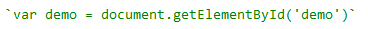
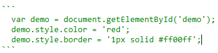

# markdown

## 文本引用
在markdown中用 `>` 来标记一段引用文本

```markdown
  > 春风又绿江南岸，
  > 明月何时照我还。
```

效果如下

> 春风又绿江南岸，
> 明月何时照我还。
  
## 粗体和斜体

Markdown 用一对两个* 标记粗体文字，用一对 一个* 标记斜体文字

```markdown
  **这是一段粗体文字**
  *这是一段斜体文字*
```

效果如下

**这是一段粗体文字**
*这是一段斜体文字*

### 代码片段引用
用一对 `（键盘esc下面的按键） 来引用一句代码




效果如下
`var demo = document.getElementById('demo')`


用一对 ``` 来引用一段代码

效果如下
```
  var demo = document.getElementById('demo');
  demo.style.color = 'red';
  demo.style.border = '1px solid #ff00ff';
```

## 表格
表格代码

```
| Tables        | Are           | Cool  |
| ------------- |:-------------:| -----:|
| col 3 is      | right-aligned | $1600 |
| col 2 is      | centered      |   $12 |
| zebra stripes | are neat      |    $1 |
```

效果

| Tables        | Are           | Cool  |
| ------------- |:-------------:| -----:|
| col 3 is      | right-aligned | $1600 |
| col 2 is      | centered      |   $12 |
| zebra stripes | are neat      |    $1 |