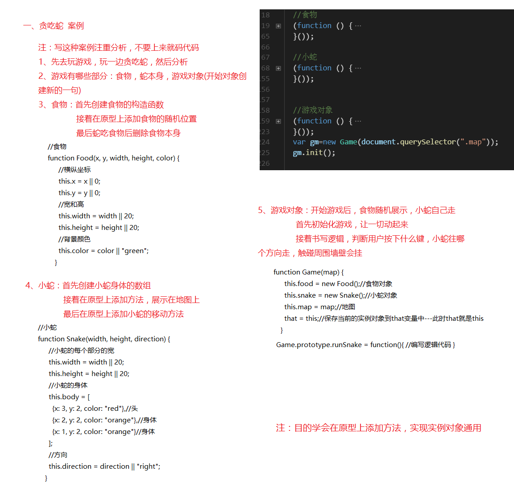

## 案例：小贪吃蛇




#### 分析对象


- 游戏对象

- 蛇对象

- 食物对象


#### 创建食物对象


- Food


  - 属性


    - x       

    - y

    - width

    - height

    - color       


  - 方法


    - render       随机创建一个食物对象，并输出到map上


- 创建Food的构造函数，并设置属性


```js

var position = 'absolute';

var elements = [];

function Food(x, y, width, height, color) {

  this.x = x || 0;

  this.y = y || 0;

  // 食物的宽度和高度(像素)

  this.width = width || 20;

  this.height = height || 20;

  // 食物的颜色

  this.color = color || 'green';

}

```


- 通过原型设置render方法，实现随机产生食物对象，并渲染到map上


```js

Food.prototype.render = function (map) {

  // 随机食物的位置，map.宽度/food.宽度，总共有多少分food的宽度，随机一下。然后再乘以food的宽度

  this.x = parseInt(Math.random() * map.offsetWidth / this.width) * this.width;

  this.y = parseInt(Math.random() * map.offsetHeight / this.height) * this.height;


  // 动态创建食物对应的div

  var div = document.createElement('div');

  map.appendChild(div);

  div.style.position = position;

  div.style.left = this.x + 'px';

  div.style.top = this.y + 'px';

  div.style.width = this.width + 'px';

  div.style.height = this.height + 'px';

  div.style.backgroundColor = this.color;

  elements.push(div);

}

```


- 通过自调用函数，进行封装，通过window暴露Food对象


```js

window.Food = Food;

```


#### 创建蛇对象


- Snake


- 属性


  - width    蛇节的宽度 默认20

  - height   蛇节的高度 默认20

  - body     数组，蛇的头部和身体，第一个位置是蛇头

  - direction    蛇运动的方向  默认right  可以是 left  top bottom


- 方法


  - render  把蛇渲染到map上


- Snake构造函数


```js

var position = 'absolute';

var elements = [];

function Snake(width, height, direction) {

  // 设置每一个蛇节的宽度

  this.width = width || 20;

  this.height = height || 20;

  // 蛇的每一部分, 第一部分是蛇头

  this.body = [

    {x: 3, y: 2, color: 'red'},

    {x: 2, y: 2, color: 'red'},

    {x: 1, y: 2, color: 'red'}

  ];

  this.direction = direction || 'right';

}

```


- render方法


```js

Snake.prototype.render = function(map) {

  for(var i = 0; i < this.body.length; i++) {

    var obj = this.body[i];

    var div = document.createElement('div');

    map.appendChild(div);

    div.style.left = obj.x * this.width + 'px';

    div.style.top = obj.y * this.height + 'px';

    div.style.position = position;

    div.style.backgroundColor = obj.color;

    div.style.width = this.width + 'px';

    div.style.height = this.height + 'px';

  }

}

```


- 在自调用函数中暴露Snake对象


```js

window.Snake = Snake;

```


#### 创建游戏对象


游戏对象，用来管理游戏中的所有对象和开始游戏


- Game


  - 属性


    - food


    - snake


    - map


  - 方法


    - start            开始游戏（绘制所有游戏对象）


- 构造函数


```js

function Game(map) {

  this.food = new Food();

  this.snake = new Snake();

  this.map = map;

}

```


- 开始游戏，渲染食物对象和蛇对象


```js

Game.prototype.start = function () {

  this.food.render(this.map);

  this.snake.render(this.map);

}

```


### 游戏的逻辑


#### 写蛇的move方法


- 在蛇对象(snake.js)中，在Snake的原型上新增move方法


1. 让蛇移动起来，把蛇身体的每一部分往前移动一下

2. 蛇头部分根据不同的方向决定 往哪里移动


```js

Snake.prototype.move = function (food, map) {

  // 让蛇身体的每一部分往前移动一下

  var i = this.body.length - 1;

  for(; i > 0; i--) {

    this.body[i].x = this.body[i - 1].x;

    this.body[i].y = this.body[i - 1].y;

  }

  // 根据移动的方向，决定蛇头如何处理

  switch(this.direction) {

    case 'left': 

      this.body[0].x -= 1;

      break;

    case 'right':

      this.body[0].x += 1;

      break;

    case 'top':

      this.body[0].y -= 1;

      break;

    case 'bottom':

      this.body[0].y += 1;

      break;

  }

}

```


- 在game中测试


```js

this.snake.move(this.food, this.map);

this.snake.render(this.map);

```


#### 让蛇自己动起来


- 私有方法


      不能被外部访问的方法

      使用自调用函数包裹

- 在game.js中 添加runSnake的私有方法，开启定时器调用蛇的move和render方法，让蛇动起来

- 判断蛇是否撞墙


```js

function runSnake() {

  var timerId = setInterval(function() {

    this.snake.move(this.food, this.map);

    // 在渲染前，删除之前的蛇

    this.snake.render(this.map);


    // 判断蛇是否撞墙

    var maxX = this.map.offsetWidth / this.snake.width;

    var maxY = this.map.offsetHeight / this.snake.height;

    var headX = this.snake.body[0].x;

    var headY = this.snake.body[0].y;

    if (headX < 0 || headX >= maxX) {

      clearInterval(timerId);

      alert('Game Over');

    }


    if (headY < 0 || headY >= maxY) {

      clearInterval(timerId);

      alert('Game Over');

    }


  }.bind(that), 150);

}

```


- 在snake中添加删除蛇的私有方法，在render中调用


```js

function remove() {

  // 删除渲染的蛇

  var i = elements.length - 1;

  for(; i >= 0; i--) {

    // 删除页面上渲染的蛇

    elements[i].parentNode.removeChild(elements[i]);

    // 删除elements数组中的元素

    elements.splice(i, 1);

  }

}

```


- 在game中通过键盘控制蛇的移动方向


```js

function bindKey() {

  document.addEventListener('keydown', function(e) {

    switch (e.keyCode) {

      case 37:

        // left

        this.snake.direction = 'left';

        break;

      case 38:

        // top

        this.snake.direction = 'top';

        break;

      case 39:

        // right

        this.snake.direction = 'right';

        break;

      case 40:

        // bottom

        this.snake.direction = 'bottom';

        break;

    }

  }.bind(that), false);

}
```


- 在start方法中调用


```js

bindKey();

```


#### 判断蛇是否吃到食物


```js

// 在Snake的move方法中


// 在移动的过程中判断蛇是否吃到食物

// 如果蛇头和食物的位置重合代表吃到食物

// 食物的坐标是像素，蛇的坐标是几个宽度，进行转换

var headX = this.body[0].x * this.width;

var headY = this.body[0].y * this.height;

if (headX === food.x && headY === food.y) {

  // 吃到食物，往蛇节的最后加一节

  var last = this.body[this.body.length - 1];

  this.body.push({

    x: last.x,

    y: last.y,

    color: last.color

  })

  // 把现在的食物对象删除，并重新随机渲染一个食物对象

  food.render(map);

}

```


