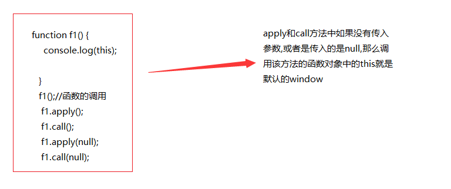

## 函数进阶

### 函数的定义方式

- 函数声明
- 函数表达式
- `new Function`

#### 函数声明

```javascript
function foo () {

}
```

#### 函数表达式

```javascript
var foo = function () {

}
```

#### 函数声明与函数表达式的区别

- 函数声明必须有名字
- 函数声明会函数提升，在预解析阶段就已创建，声明前后都可以调用
- 函数表达式类似于变量赋值
- 函数表达式可以没有名字，例如匿名函数
- 函数表达式没有变量提升，在执行阶段创建，必须在表达式执行之后才可以调用 

### 函数内 `this` 指向的不同场景

函数的调用方式决定了 `this` 指向的不同：

| 调用方式   | 非严格模式   | 备注                |
| ------ | ------- | ----------------- |
| 普通函数调用 | window  | 严格模式下是 undefined  |
| 构造函数调用 | 实例对象    | 原型方法中 this 也是实例对象 |
| 对象方法调用 | 该方法所属对象 | 紧挨着的对象            |
| 事件绑定方法 | 绑定事件对象  |                   |
| 定时器函数  | window  |                   |

### 函数也是对象

- 所有函数都是 `Function` 的实例

### 改变this指向

### call、apply、bind

call和apply初认识



#### call

`call()` 方法调用一个函数, 其具有一个指定的 `this` 值和分别地提供的参数(参数的列表)。

#### apply

`apply()` 方法调用一个函数, 其具有一个指定的 `this` 值，以及作为一个数组（或类似数组的对象）提供的参数。


#### bind

bind方法是复制的意思,参数可以在复制的时候传进去,也可以在复制之后调用的时候传入进去

apply和call是调用的时候改变this指向

bind方法,是复制一份的时候,改变了this的指向


#### 小结

- call 和 apply 特性一样
  + 都是用来调用函数，而且是立即调用
  + 但是可以在调用函数的同时，通过第一个参数指定函数内部 `this` 的指向
  + call 调用的时候，参数必须以参数列表的形式进行传递，也就是以逗号分隔的方式依次传递即可
  + apply 调用的时候，参数必须是一个数组，然后在执行的时候，会将数组内部的元素一个一个拿出来，与形参一一对应进行传递
  + 如果第一个参数指定了 `null` 或者 `undefined` 则内部 this 指向 window

- bind
  + 可以用来指定内部 this 的指向，然后生成一个改变了 this 指向的新的函数
  + 它和 call、apply 最大的区别是：bind 不会调用
  + bind 支持传递参数，它的传参方式比较特殊，一共有两个位置可以传递
    * 1. 在 bind 的同时，以参数列表的形式进行传递
    * 2. 在调用的时候，以参数列表的形式进行传递
    * 那到底以谁 bind 的时候传递的参数为准呢还是以调用的时候传递的参数为准
    * 两者合并：bind 的时候传递的参数和调用的时候传递的参数会合并到一起，传递到函数内部

#### 什么是闭包

闭包就是能够读取其他函数内部变量的函数，
由于在 Javascript 语言中，只有函数内部的子函数才能读取局部变量，
因此可以把闭包简单理解成 “定义在一个函数内部的函数”。
所以，在本质上，闭包就是将函数内部和函数外部连接起来的一座桥梁。

闭包的用途：

- 可以在函数外部读取函数内部成员
- 让函数内成员始终存活在内存中

### 函数闭包

函数模式的闭包:在一个函数中有一个函数


#### 作用域、作用域链、预解析

- 全局作用域
- 函数作用域
- **没有块级作用域**


 #### 作用域

-  作用域:就是变量的使用范围

- 作用域分为局部作用域和全局作用域

- 函数中定义的变量是局部变量

  **各个变量所在作用域的案例**

  

  #### 作用域链:

  作用域链:变量的使用,从里向外,层层的搜索,搜索到了就可以直接使用了

  层层搜索,搜索到0级作用域的时候,如果还是没有找到这个变量,结果就是报错

  

  ​


#### 预解析


### 沙箱---就是一个封闭的环境

沙箱介绍


沙箱案例分析


#### 

### 函数递归

#### 递归:函数中调用函数自己,此时就是递归,递归一定要有结束的条件

#### 

---