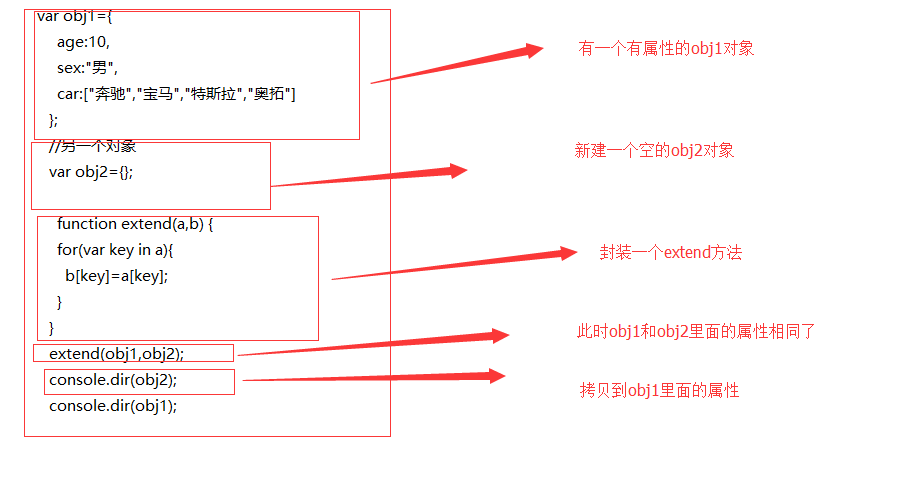
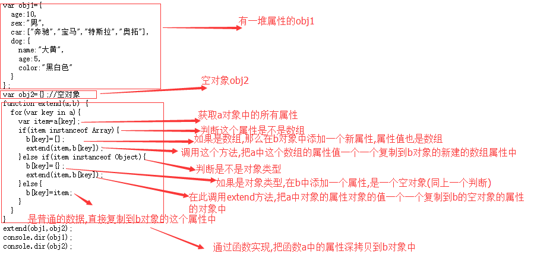
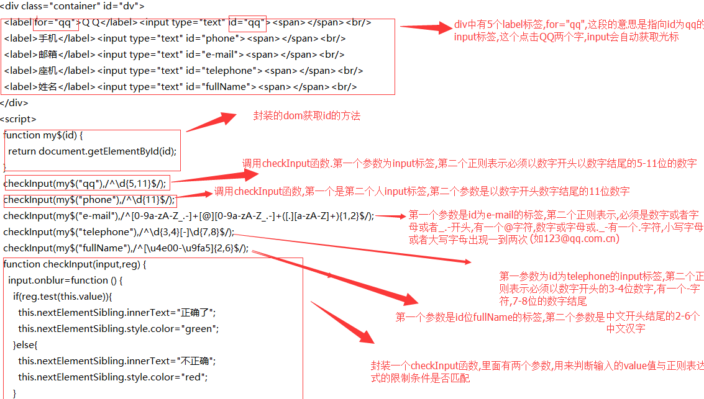

## 浅拷贝

浅拷贝:就是复制,就相当于把一个对象中的所有的内容,复制一份给另一个对象,直接复制,或者说,就是把一个对象的地址给了另一个对象,他们指向相同,两个对象之间有共同的属性或者方法,都可以使用



## 深拷贝

深拷贝:深:把一个对象中所有的属性或者方法,一个一个的找到.并且在另一个对象中开辟相应的空间,一个一个的存储到另一个对象中




## 正则表达式

正则案例



- 了解正则表达式基本语法
- 能够使用JavaScript的正则对象

#### 正则表达式的特点

1. 灵活性、逻辑性和功能性非常的强
2. 可以迅速地用极简单的方式达到字符串的复杂控制

### 正则表达式的组成

- 普通字符
- 特殊字符(元字符)：正则表达式中有特殊意义的字符

#### 常用元字符串

| 元字符  | 说明              |
| ---- | --------------- |
| \d   | 匹配数字            |
| \D   | 匹配任意非数字的字符      |
| \w   | 匹配字母或数字或下划线     |
| \W   | 匹配任意不是字母，数字，下划线 |
| \s   | 匹配任意的空白符        |
| \S   | 匹配任意不是空白符的字符    |
| .    | 匹配除换行符以外的任意单个字符 |
| ^    | 表示匹配行首的文本(以谁开始) |
| $    | 表示匹配行尾的文本(以谁结束) |

#### 限定符

| 限定符   | 说明       |
| ----- | -------- |
| *     | 重复零次或更多次 |
| +     | 重复一次或更多次 |
| ?     | 重复零次或一次  |
| {n}   | 重复n次     |
| {n,}  | 重复n次或更多次 |
| {n,m} | 重复n到m次   |

#### 其它

```
[] 字符串用中括号括起来，表示匹配其中的任一字符，相当于或的意思
[^]  匹配除中括号以内的内容
\ 转义符
| 或者，选择两者中的一个。注意|将左右两边分为两部分，而不管左右两边有多长多乱
() 从两个直接量中选择一个，分组
   eg：gr(a|e)y匹配gray和grey
[\u4e00-\u9fa5]  匹配汉字
```


## JavaScript 中使用正则表达式

### 创建正则对象

方式1：

```javascript
var reg = new Regex('\d', 'i');
var reg = new Regex('\d', 'gi');
```

方式2：

```javascript
var reg = /\d/i;
var reg = /\d/gi;
```

#### 参数

| 标志   | 说明         |
| ---- | ---------- |
| i    | 忽略大小写      |
| g    | 全局匹配       |
| gi   | 全局匹配+忽略大小写 |


###正则表达式案例
1.验证密码强弱
2.验证邮箱：[0-9a-zA-Z_.-]+[@][0-9a-zA-Z._-]+([.][a-zA-Z]+){1,2}
3.验证中文名字[\u4e00-\u9fa5]

### 正则提取.match()

       var str="中国移动:10086,中国联通:10010,中国电信:10000";
       //把里面所有的数字全部显示出来
       var array=str.match(/\d{5}/g);
       console.log(array);
### 正则替换.replace

所有的h都替换成S

       var str="HhpphH";
       str=str.replace(/[h]/gi,"S");
       console.log(str);


### 案例：表单验证

```html
QQ号：<input type="text" id="txtQQ"><span></span><br>
邮箱：<input type="text" id="txtEMail"><span></span><br>
手机：<input type="text" id="txtPhone"><span></span><br>
生日：<input type="text" id="txtBirthday"><span></span><br>
姓名：<input type="text" id="txtName"><span></span><br>
```


## 补充

### 伪数组和数组

在JavaScript中，除了5种原始数据类型之外，其他所有的都是对象，包括函数（Function）。

#### 对象与数组的关系

在说区别之前，需要先提到另外一个知识，就是 JavaScript 的原型继承。
所有 JavaScript 的内置构造函数都是继承自 `Object.prototype` 。
在这个前提下，可以理解为使用 `new Array()` 或 `[]` 创建出来的数组对象，都会拥有 `Object.prototype` 的属性值。

可以得到对象和数组的第一个区别：对象没有数组 Array.prototype 的属性值。

#### 什么是数组

数组具有一个最基本特征：索引，这是对象所没有的.

#### 什么是伪数组

1. 拥有 length 属性，其它属性（索引）为非负整数(对象中的索引会被当做字符串来处理，这里你可以当做是个非负整数串来理解)
2. 不具有数组所具有的方法

伪数组，就是像数组一样有 `length` 属性，也有 `0、1、2、3` 等属性的对象，看起来就像数组一样，但不是数组，比如:

常见的伪数组有：

- 函数内部的 `arguments`
- DOM 对象列表（比如通过 `document.getElementsByTags` 得到的列表）
- jQuery 对象（比如 `$("div")` ）

伪数组是一个 Object，而真实的数组是一个 Array。

#### 小结

- 对象没有数组 Array.prototype 的属性值，类型是 Object ，而数组类型是 Array
- 数组是基于索引的实现， length 会自动更新，而对象是键值对
- 使用对象可以创建伪数组，伪数组可以正常使用数组的大部分方法
