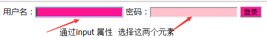
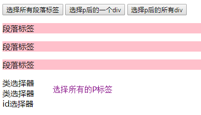
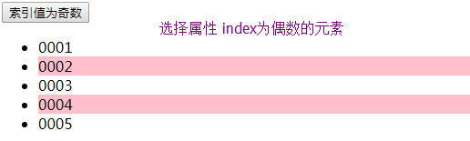

## Jquery 第一天

### 重要知识点图例
+ 1、体验jQuery同过案例进行对比
  + 1.1  总结：通过此案例可得出：
     + 1.1.1 首先从入口函数，jQuery可以写多个；JS的入口函数只能写一个
     + 1.1.2 获取元素简单，代码量少，JS代码量相对多

+ 2、jquery与JS的对比，JQ完胜 
  
   

+ 3、jQuery控制多个CSS图例 
  + 3.1 js 代码部分
     ```javascript
           $(function () {
            $('.btn01').click(function () {
                $('#box').css('width','200px')
                         .css('height','200px')
                         .css('background','pink');
            });
        });
     ```
   + 3.2 总结  通过点击按钮给 div 添加宽高和背景颜色，同时操作多个属性。

+ 4.jQuery 透明度隐藏动画效果图
   
  + 4.1 通过点击不同的按钮，让图片执行不同的动画，完成不同的效果
  + 4.2 js 代码部分 
     ```javascript

     ```
    $(function () {
    $('button').eq(0).click(function () {
     $('img').hide(1000);
     });
    }); 
    ​```
    + 4.3 html 代码
     ```html
    <button>隐藏</button>
    <button>显示</button>
    <button>切换</button>
    <br>
    
    
    ​```
+ 5、多属性动画效果图例
  + 5.1效果描述： 点击按钮的时候盒子改变宽高和颜色
  + 5.2 JS 代码部分

 ```javascript
  $(function () {
            $('button').click(function () {

                $('div').animate({
                    width:300,
                    height:300,
                    backgroundColor:'green',
                    lineHeight:"300px"
                },1000, function () {
                });
            });
        });
 ```
 + 5.3 HTMl部分代码
  ```html
    <button>按钮</button>
    <div>盒子</div>
  ```
+ 6、动画队列和停止动画图例

 + 6.1 JS代码部分
  ```javascript
   $(function () {
        $('button').click(function () {
        $('div').animate({width:300})
            .animate({height:300})
            .animate({height:280},100)
            .animate({height:300},100)
            .stop()
            .delay(1000)
            .animate({width:600},600)
            .animate({height:600},600);
            });
        });
  ```
  + 6.2 html 部分代码
   ```html
 <button>按钮</button>
 <div>盒子</div>
   ```

+ 7、属性选择器
  + 7.1 属性选择器效果图
    
  + 7.2 Js主要代码
 ```javascript
     $(function () {
            $('[class]').css({ backgroundColor:'deeppink' });
            $('[type=password]').css({ backgroundColor:'pink' });
        });
 ```
  + 7.3 HTML部分代码
 ```html
 <button>按钮</button>
 <div>盒子</div>  
 ```
+ 8、首先看要实现的效果图 
  + 8.1 具体思路：
       + 1、当鼠标移入li的时候，排他思想
       + 2、全部li变窄
       + 3、.当前的li要变宽
       + 4、当鼠标移出li的时候,
           + 4.1 全部li都的变回来本来宽度200
   + 8.2 实现代码
        ```javascript
         $(function () {
            $('li').mouseover(function () {
                $('li').stop().animate({ width:140 });
                $(this).stop().animate({ width:500 });
            })
            .mouseout(function () {
                $('li').stop().animate({ width:200 });
            });
        }); 
        ```
+ 9、基本选择器
  + 9.1 基本选择器代码
   ```javascript
    $(function () {
            $('button').eq(0).click(function () {
                $('p').css({backgroundColor:'pink'});
            });

            $('button').eq(7).click(function () {
                $('p+div').css({border:'1px solid pink'});
            });//            选择p后的所有div , 兄弟关系
            $('button').eq(8).click(function () {
                $('p~div').css({border:'1px solid pink'});
            });
        })
   ```
    + 9.2 html 代码

     ```html
     <button>选择所有段落标签</button>
     <button>选择p后的一个div</button>
     <button>选择p后的所有div</button>
        <p>段落标签</p>
        <p>段落标签</p>
        <p>段落标签</p>
        <div class="left">类选择器</div>
        <div class="left">类选择器</div>
        <div id="box">id选择器</div>
     ```

    + 9.3 实现效果
        

     + 9.4 总结：总结：跟css的选择器用法一模一样。

+ 10、 筛选选择器代码 过滤选择器
  ```javascript
   $(function () {

           $('button').eq(0).click(function () {
                $('li:odd').css({ backgroundColor:'pink' });
           });

            $('button').eq(1).click(function () {
                $('li:even').css({ backgroundColor:'pink' });
            });
        });
  ```
   ```html
      <ul>
        <li>0001</li>
        <li>0002</li>
        <li>0003</li>
        <li>0004</li>
        <li>0005</li> 
    </ul>
   ```
   + 10.1  效果图
      
   + 10.2筛选选择器的使用


+ 11、属性选择器
   ```html
     用户名：<input type="text" class="asdasd">
     密码：<input type="password">
    <input type="button" value="登录" class="ajasdlasjdl">
   ```
  ```

  ```javascript
     $(function () {

            // 第一种：
            // $([attibute]);
            // 作用：
            //  筛选包含attribute的所有元素
            $('[class]').css({ backgroundColor:'deeppink' });

            //  第二种：
            //  $([atttibute = value]);
            //  作用：
            // 筛选属性的值是满足条件的标签
            $('[type=password]').css({ backgroundColor:'pink' });
        });
  ```
+ 12、对联广告
    + 12、1 思路：点击广告栏上的按钮  广告消失
    + 12.2  实现代码

     ```javascript
    $(function () {
     $('.close-btn').click(function () {
     $(this).parent().slideUp();
     });
    });
     ```

 ```html
    <div class="left-box">
	
	<span class="close-btn">×</span>
    </div>
 ```
   12.3 实现效果图
     


### 案例
+ 案例唱大戏案例
+ 案例 360开机效果


##### 唱大戏案例分析
+ 1、案例效果图
+ 2、涉及到知识点
   + 2.1 入口函数
   + 2.2 选择器
   + 2.3 事件
   + 2.4 排他思想(干掉所有人，设置我自己，先将所有人全设置为"",然后再设置当前的值)
+ 3、思路
  + 我们要实现这样的效果首先要看我们手里有哪些资源，我们要用到哪些属性和方法
    + 3.1 手里有现成的样式
    + 3.2 会用到入口函数、动画 fadeTof方法
    + 3.3  让自己变亮，其他的兄弟元素变暗，排他思想
+ 4、代码
```javascript

$(function () {
//入口函数
$('li').mouseover(function () {
//给所有的li注册鼠标移入事件
$('li').stop().fadeTo(400,0.2);
//给所有的li停止所有的动画执行下面的动画,fadeTo动画
$(this).stop().fadeTo(400,1);
//当前的停止所有的动画，执行fadeTo 方法
})

.mouseout(function () {
// 给当前的li注册鼠标离开事件
$('li').stop().fadeTo(400,1);
//让所有的li停止动画队列，执行 fadeTo 方法
});
});

```
##### 360开机效果案例分析
+ 1、
+ 2、涉及到知识点
   + 2.1 入口函数
   + 2.2 选择器
   + 2.3 事件

+ 3、思路
  + 需求：
     当点击关闭按钮时：控制整个大盒子，先下去，再往右走，动画结束后还会弹窗

+ 4、代码
```javascript
$(function () {
			$('.btn').click(function () {

				$('.ad').animate({ bottom: -165 })
						.animate({ right : -320 }, function () {
							alert("请继续保持开机时间.");
						});
			});
		});

```


