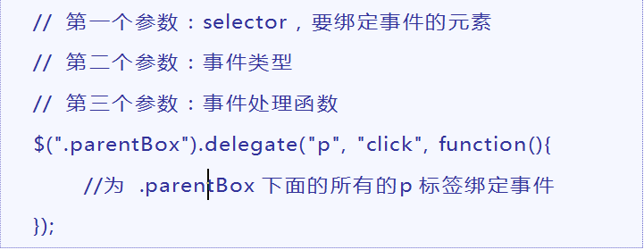

## Jquery 第二天

### 重要知识点图例
+ 1、下拉菜单案例
    + 1.1 实现效果图
    + 1.2 实现思路：
       + 1.2.1 当鼠标移入的时候，显示对应的二级菜单
       + 1.2.2 当鼠标移出的时候，隐藏对应的二级菜单
    + 1.3 js 代码部分
    ```javascript
        $(function () {
    	$('.nav-in>li').hover(function () {
    	$(this).children('ul').stop().slideToggle();
    	});
    	});
    ```
    1.4 HTM代码部分
    ```HTML
    	<div id="nav">
    	<ul class="nav-in">
    	<li id="li01">
    	<a href="#">一级菜单1</a>
    	<ul id="ul01">
                    <li><a href="#">二级内容1</a></li>
                    <li><a href="#">二级内容2</a></li>
                    <li><a href="#">二级内容3</a></li>
                    <li><a href="#">二级内容4</a></li>
    	</ul>
    	</li>
    	</ul>
    </div>
    ```
+ 2、JQuery类名操作 
  + 2.1 类名操作效果图
    
  + 2.2 js 部分代码
     ```javascript
        $(function () {
           $('button').click(function () {
               $('div').toggleClass('box');
           });
        });
     ```
    ```
    + 2.3 总结：类操作分为三种：添加类名、删除类名、切换类名
    ```
+ 3、类名切换案例
    + 3.1 具体案例效果
      
    + 3.2 js 代码
     ```javascript
         $(function () {
         $('.tab-item').mouseover(function () {
            $(this).addClass('active')
            .siblings().removeClass('active');
            $('.main').eq( $(this).index() ).addClass('selected')
            .siblings().removeClass('selected');
        });
        
    });
     ```
    + 3.3 总结 利用了原生JS的排他原则，hover 哪个元素时下面的展示哪个下面内容。
+ 4、事件的绑定实例图
  
    + 4.1 快速方式注册事件
      + 4.1.1  对应代码

        ```javascript
         $(function () {
            $('.father').hover(function () {
                $(this).css({ border:'10px solid red' });
            },function () {
                $(this).css({ border:'' });
            });
        });
        ```

    + 4.2 on 方式注册事件
      + 4.2.1对应代码

        ```javascript
               $(function () {
            $('.father').on('click','.son',{ name:"小明" },function (event) {
                console.log( event.data );
            });
            });
        ```
      + 4.2.2 书写方式以及参数
        
      + 4.2.3 特点：最推荐的，最简单的。

    + 4.3 bing 方式注册事件
      + 4.3.1 对应代码

        ```javascript
             $(function () {
            $('.father').bind('click',{name:123},function (event) {
                console.log( event.data.name );
            });
         });
        ```
     + 4.3.2书写方式以及参数
        
     + 4.3.3 bind 绑定缺点：不支持动态创建出来的元素绑定事件。
    + 4.4 delegate 的方式注册事件.
      + 4.4.1 对应代码
        ```javascript
          $(function () {
            $('.father').delegate('.son','click',{name:123}, function   (event) {
                alert(event.data.name);
            });
         });
        ```
     + 4.4.2 书写方式及参数
     + 4.4.3 特点：事件是绑定到父元素上的，由子元素触发。
          
+ 4.3 总结：事件的发展历程：简单事件绑定>>bind事件绑定>>delegate事件绑定>>on事件绑定(推荐)
+ 5、获取和设置表单值 
 + 5.1 获取表单元素的值
    + 5.1.0 Html 代码
    ```html
    <input type="text" value="内容">
    <textarea>123</textarea>
    ```
 + 5.1.1 Js 代码

    ```javascript
    $(function () {
    console.log(   $('[type=text]').val()  );
    console.log(   $('textarea').val()  );
    });
    ```
 + 5.1.3 运行结果
    
 + 5.2 设置表单元素的值
  + 5.2.1  Html 代码
    ```html
    <input type="text" value="内容">
    <textarea>123</textarea>

    ```
  + 5.2.2 Js代码
    ```javascript
    $(function () {
            $('[type=text]').val(123);
            $('textarea').val("你好");
            console.log(   $('[type=text]').val()  );
           console.log(   $('textarea').val()  );
        });

    ```
 + 5.2.3 查看运行结果
    

+ 6、节点的操作
   + 6.1 创建节点
    + 6.1.1 格式
       
   + 6.2 添加节点
    + 6.2.1 格式一
        
    + 6.2.2 格式二
       
   + 6.3 清空节点
    + 6.3.1 格式 一
       
     + 6.3.2 格式二
        
   + 6.4 删除节点
    + 6.4.1 格式
       
   + 6.5 克隆节点
    + 6.5.1 格式
       
+ 7、 DOM对象和JQ对象的相互转换
  
  + 1.0 基础代码

  ```javascript
   $('button').click(function () {
       //jQuery 对象 转 DOM对象
              $('ul')[0].innerHTML = '1231231';
      //Dom 对象 转 jQuery 对象
              var uls = document.getElementsByTagName('ul');
              $(uls).html('12345');
               console.log(  $('li')[1]   );

            });
  ```
+ 8、事件的解绑
  
  + 3.1 基本代码
   ```javascript
    $("#btn").click(function () {
                //off是解除所有的事件,能解除委托事件
                $("div").off();

                //解除click事件
                $("div").off("click");

                $("div").off("click","**");
            });
   ```
+ 9.获取和修改DOM的属性 
 + 9.1单属性获取
  + 9.1.0  单属性获取的基本代码
   ```javascript
      $('img').prop('title')
   ```
 + 9.2 单属性修改
  + 9.2.1 单属性修改基本代码

    ```javascript
    $('img').prop('data-src')
    ```
 + 9.3 多属性修改
  + 9.3.1 多属性修改的基本代码
    ```javascript
    $('img').prop({
            alt:'123213',
            title:'nihao'
    });

    ```
### 案例
+ 案例 微博发布
+ 案例 全选反选-点餐案例

##### 微博发布分析案例分析
+ 1、微博发布 
+ 2、涉及到知识点
   + 2.1 文本操作
   + 2.2 节点的增加和删除
   + 2.3 事件
   + 2.4 事件委托的使用
+ 3、需求
  + 点击按钮后，
       +  1.获取文本域的内容
            + 1.1判断一下文本域是否为空
            + 1.2判断文本内容是否超过120
      + 2.创建li节点把它添加到ul里
      + 3.发布完成后，要清空文本域

+ 4、代码
```javascript

 $(function () {

            $('.weibo button').click(function () {
                var txt = $('.weibo textarea').val();
                if( txt == "" ){
                    alert("内容不能为空。");
                }else if( txt.length > 120 ){
                    alert("微博内容不能超过120。");
                }else{
                    $('ul').prepend('<li><p>'+txt+'</p><span>删除</span></li>');
                    $('.weibo textarea').val('');  
                }

            });

            $('.weibo').on('click','span',function () {
                $(this).parent().remove();
            });
        });

```
##### 全选反选-点餐案例
+ 1、全选反选 案例效果图 
+ 2、涉及到知识点
   + 2.1 入口函数
   + 2.2 选择器
   + 2.3 标志位的使用

+ 3、思路
  + 需求：
   + 1.当上面的多选框选中，下面的三个多选也一起选中，否则就一起不选中
   + 2.当下面的三个多选框都选中的时候，上面的全选也一起选中，否则全选就不选中

+ 4、代码
```javascript
  $(function () {
            $('#checkAll').click(function () {
                var current = $(this).prop('checked');
                $('.check').prop({ checked:current });
            });

            $('.check').click(function () {
                var flag = true;
                for(var i=0;i<$('.check').length;i++){
                    if( $('.check').eq(i).prop('checked') == false ){
                        flag = false;
                        break;
                    }
                }
                $('#checkAll').prop({ checked:flag });
            });
        });

```


