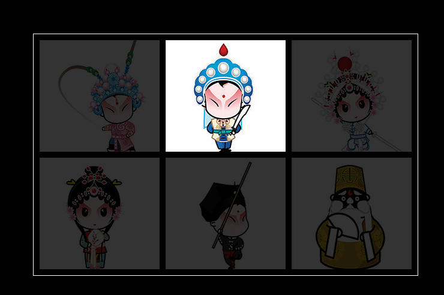
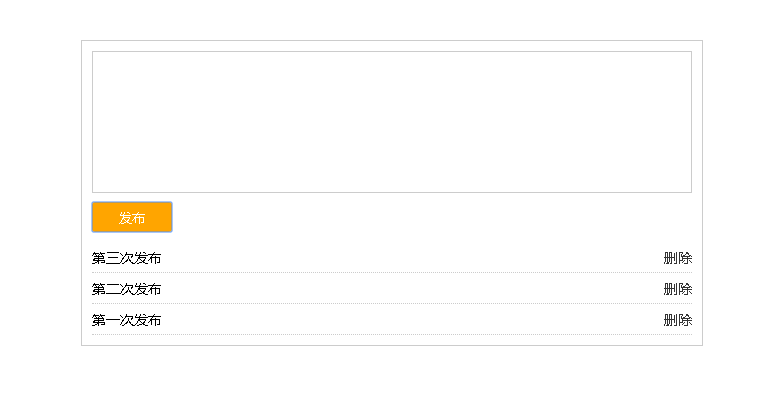
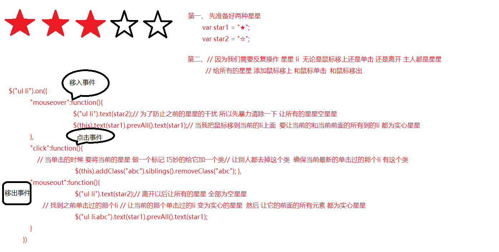

## jQuery强制自习

+ 案例唱大戏案例

### 唱大戏案例分析
+ 1、案例效果图
+ 2、涉及到知识点
   + 2.1 入口函数
   + 2.2 选择器
   + 2.3 事件
   + 2.4 排他思想(干掉所有人，设置我自己，先将所有人全设置为"",然后再设置当前的值)
+ 3、思路
   + 我们要实现这样的效果首先要看我们手里有哪些资源，我们要用到哪些属性和方法
     + 3.1 手里有现成的样式
     + 3.2 会用到入口函数、动画 fadeTof方法
     + 3.3  让自己变亮，其他的兄弟元素变暗，排他思想
+ 4、代码
```javascript

$(function () {
//入口函数
$('li').mouseover(function () {
//给所有的li注册鼠标移入事件
$('li').stop().fadeTo(400,0.2);
//给所有的li停止所有的动画执行下面的动画,fadeTo动画
$(this).stop().fadeTo(400,1);
//当前的停止所有的动画，执行fadeTo 方法
})

.mouseout(function () {
// 给当前的li注册鼠标离开事件
$('li').stop().fadeTo(400,1);
//让所有的li停止动画队列，执行 fadeTo 方法
});
});


+ 案例 微博发布
### 微博发布分析案例分析
+ 1、微博发布 
+ 2、涉及到知识点
   + 2.1 文本操作
   + 2.2 节点的增加和删除
   + 2.3 事件
   + 2.4 事件委托的使用
+ 3、需求
  + 点击按钮后，
       +  1.获取文本域的内容
            + 1.1判断一下文本域是否为空
            + 1.2判断文本内容是否超过120
      +   2.创建li节点把它添加到ul里
      +   3.发布完成后，要清空文本域

+ 4、代码
​```javascript

 $(function () {

            $('.weibo button').click(function () {
                var txt = $('.weibo textarea').val();
                if( txt == "" ){
                    alert("内容不能为空。");
                }else if( txt.length > 120 ){
                    alert("微博内容不能超过120。");
                }else{
                    $('ul').prepend('<li><p>'+txt+'</p><span>删除</span></li>');
                    $('.weibo textarea').val('');  
                }
            });
            $('.weibo').on('click','span',function () {
                $(this).parent().remove();
            });
        });


  ###星星评分

   分析一下思路：

              页面上 先放5个空星星
			  当我鼠标移上去以后 移到第几个星星 应该让从第1个到当前的星星全部为实心星星
			  单击星星的时候 做什么事情？ 在点击任何一个星星的时候
			  要记录一下 你单击了哪个星星 我记录了单击了哪个星星 之后 是为了 离开的时候 保留星星
			  当我鼠标移开以后 所有的星星都为空星星

在我离开所有的星星之后 到底是全部为空星星 还是 要保留一些实心星星


 