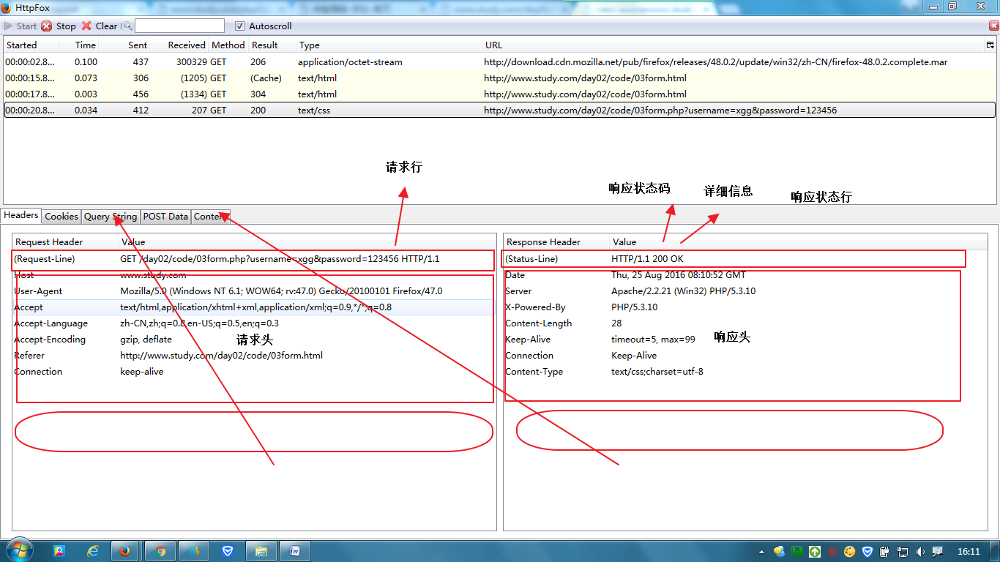
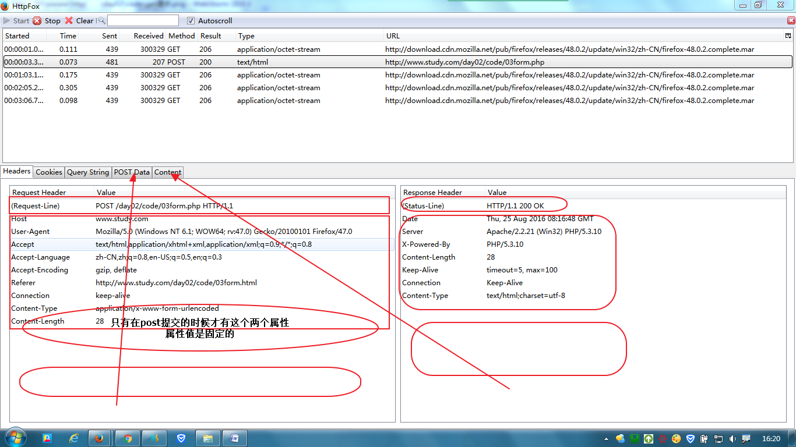
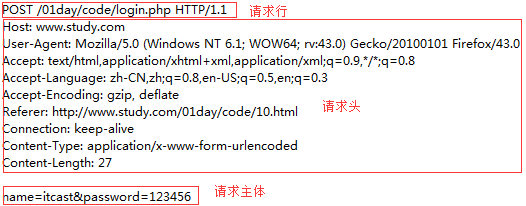
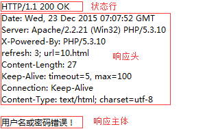
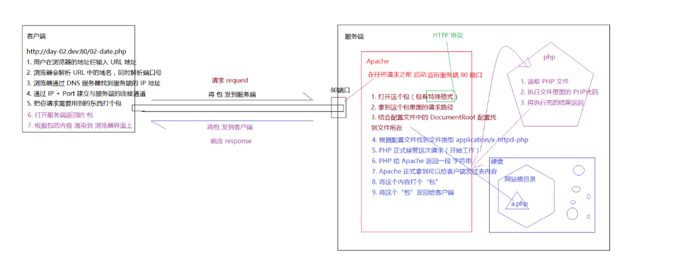
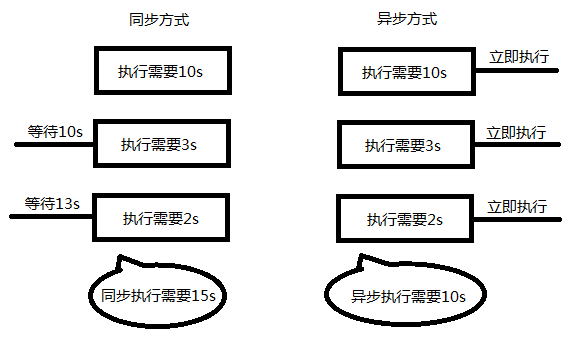
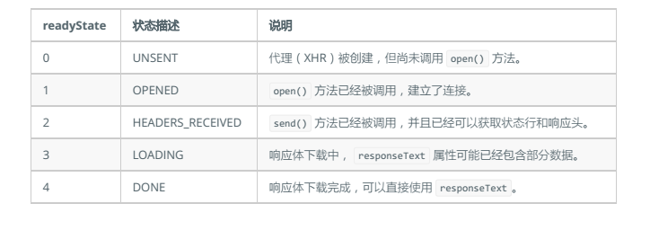
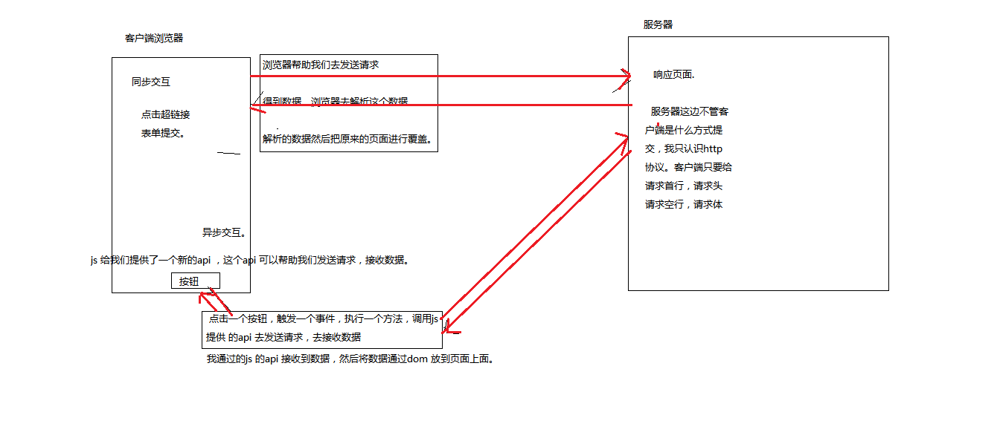
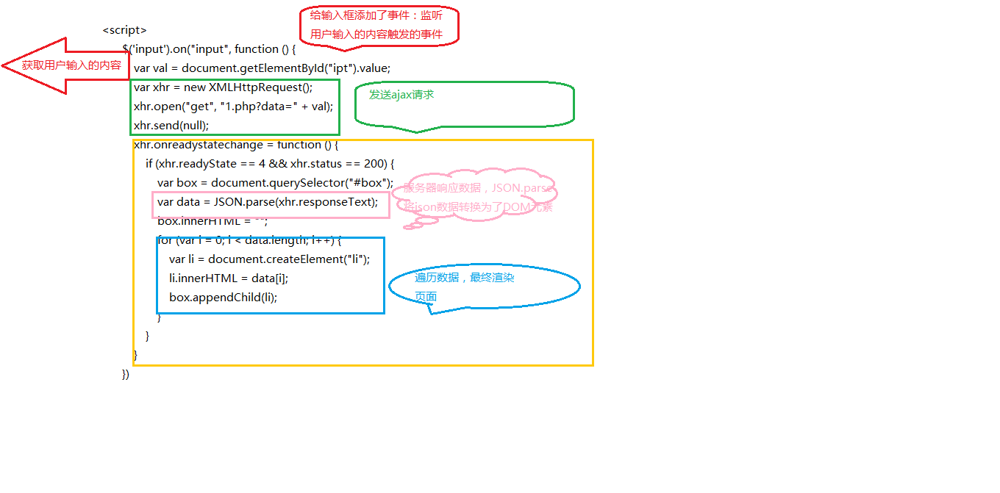

#ajax第一天讲义
## 1 HTTP协议
**超文本传输协议，网站是基于HTTP协议的，例如网站的图片、CSS、JS等都是基于HTTP协议进行传输的。HTTP协议是由从客户机到服务器的请求(Request)和从服务器到客户机的响应(Response)进行了约束和规范。即HTTP协议主要由请求和响应构成**


**常用的请求方法：GET、POST**<br/>
**<font color="red">GET请求</font>**
<br/>
**<font color="red">POST请求</font>**
<br/>
####**<font color="red">请求报文</font>**<br/>
**请求由客户端发起，其规范格式为：请求行、请求头、请求主体**
<br/>
**<font color="red" >注：当以post形式提交表单的时候，请求头里会设置Content-Type:application/x-www-form-urlencoded，以get形式当不需要</font><br/>**
####**<font color="red">响应报文</font>**<br/>
**响应由服务器发出，其规范格式为：状态行、响应头、响应主体**<br/>
<br/>
####**<font color="red">状态码</font>**<br/>
<br/>
#### 模拟客户端与服务端的请求与响应
<br/>
## 2 单线程与多线程
**js 是单线程,js 的代码执行必须是一步一步执行的. 写在前面的一定会在前面运行, js 代码是排队执行的.单线程的程序我们常常成为 同步代码.**
**计算机在多个线程间执行每一个程序的代码, 被称为多线程浏览器是多线程。**
## 3 异步请求
**指某段程序执行时不会阻塞其它程序执行，其表现形式为程序的执行顺序不依赖程序本身的书写顺序，相反则为同步,(见图例)**
<br/>
**XMLHttpRequest可以以异步方式的处理程序。**
## 4 ajax 
**AJAX（Asynchronous JavaScript and XML），最早出现在 2005 年的 Google Suggest，是一种通过 JavaScript 进行网络编程（发送请求、接收响应）的技术方案，它使我们可以获取和显示新的内容而不必载入一个新的 Web 页面。增强用户体验，更有桌面程序的感觉。**

**<font color="red">说白了，AJAX 就是浏览器提供的一套 API，可以通过 JavaScript 调用，从而实现代码控制请求与响应。</font>**
#### 4.1 XMLHttpRequest
**浏览器内建对象，用于在后台与服务器通信(交换数据) ，由此我们便可实现对网页的部分更新，而不是刷新整个页面。**
**举个例子来说明:**<br/>
```
//实例化
var xhr = new XMLHttpRequest();

//发起一个http请求
xhr.open('get','./index.php);
xhr.send(null);

//接收服务器响应
xhr.onreadystatechange = function(){
    if(xhr.readyState == 4 && xhr.status == 200 ){
        var resutl = doument.querySelector('.result');
        result.innerHTML = xhr.responseText;
    }
}

```
**由于XMLHttpRequest本质基于HTTP协议实现通信，所以结合HTTP协议和上面的例子我们分析得出如下结果：**
##### 4.1.1 请求
**HTTP请求3个组成部分与XMLHttpRequest方法的对应关系**
###### 请求行
```
xhr.open('get','./index.php');
```
###### 请求头
```
xhr.setRequestHeader('Content-Type','text/html');
```
**<font color="red">get请求可以不设置</font>**
###### 请求主体
```
xhr.send(null);
```
##### 4.1.2 响应
**HTTP响应是由服务端发出的，作为客户端更应关心的是响应的结果。HTTP响应3个组成部分与XMLHttpRequest方法或属性的对应关系。由于服务器做出响应需要时间（比如网速慢等原因），所以我们需要监听服务器响应的状态，然后才能进行处理。**
```
xhr.onreadystatechange = function(){
    if(xhr.readyState == 4 && xhr.status == 200){
        var result = document.querySelector('.result');
        result.innerHTML = xhr.responseText;
    }
}

```
**由于readystatechange事件是在xhr对象状态变化时触发，也就意味着这件事会被触发多次，图解为每个状态码的含义**
<br/>
**onreadystatechange是Javascript的事件的一种，其意义在于监听XMLHttpRequest的状态**
###### 获取状态行（包括状态码&状态信息）
```
xhr.status //状态码
xhr.statusText //状态信息
```
###### 获取响应头
```
//获取指定头头信息
xhr.getResponseHeader('Content-Type');
//获取所有响应头信息
xhr.getAllResponseHeaders();

```

###### 响应主体
```
xhr.responseText
```
#### 4.1.3 ajax 异步交互图例

## 5 JSON
**即 <font color="red">J</font>ava<font color="red">S</font>cript<font color="red">O</font>bject <font color="red">N</font>otation，另一种轻量级的文本数据交换格式，独立于语言。**
#### 5.1 语法规则
**1、数据在名称/值对中<br/>**
**2、数据由逗号分隔(最后一个健/值对不能带逗号)<br/>**
**3、花括号保存对象方括号保存数组<br/>**
**4、使用双引号<br/>**
#### 5.2 JSON解析
**JSON数据在不同语言进行传输时，类型为字符串，不同的语言各自也都对应有解析方法，需要解析完成后才能读取**
**JavaScript解析方法：JSON.parse()、JSON.stringify()**
```
//JSON.parse将数据转换为dom对象
var data = JSON.parse(xhr.responseText);
```
**PHP解析方法:json_encode()、json_decode()**
```
//对变量进行编码输出
echo json_encode($arr);
```
## 案例分析
**1、用户在输入框输入关键字**<br/>
**2、监测用户输入的关键字发起ajax请求**<br/>
**3、服务端接收请求，把对应的关键字渲染页面**<br/>
**图片分析**<br/>

**案例代码**
```
//客户端的代码：
<!DOCTYPE html>
<html lang="en">

<head>
    <meta charset="UTF-8">
    <meta name="viewport" content="width=device-width, initial-scale=1.0">
    <meta http-equiv="X-UA-Compatible" content="ie=edge">
    <title>Document</title>
    <style>
        #box {
            width: 172px;
            background: red;
        }

        li {
            list-style: none;
        }
    </style>
</head>

<body>

    <input type="text" id="ipt">
    <div id="box"></div>
    <script src="./jquery.js"></script>
    <script>
        // oninput事件监听用户输入内容
        $('input').on("input", function () {
            // 获取用户输入的内容
            var val = document.getElementById("ipt").value;
            // 创建浏览器对象
            var xhr = new XMLHttpRequest();
            // 请求行
            xhr.open("get", "1.php?data=" + val);
            // 请求主体
            xhr.send(null);

            // 响应监视
            xhr.onreadystatechange = function () {
                // 打印监视状态
                // console.log(xhr.readyState);
                // console.log(xhr.status);
                //，满足条件就执行下边的代码
                if (xhr.readyState == 4 && xhr.status == 200) {
                    // 获取数据展示的盒子
                    var box = document.querySelector("#box");
                    // 因为后台返回的数据是json格式的我们要转换成dom对象
                    var data = JSON.parse(xhr.responseText);
                    // 这样的数据展示不是我们想要的，是一条一条的展示数据
                    // box.innerHTML = data;
                    // 不想让每次数据重叠显示，所以在遍历前进行了清空
                    box.innerHTML = "";
                    // 遍历后台拿回来的数据，动态创建li 标签，最后把li标签添加到div中
                    for (var i = 0; i < data.length; i++) {
                        var li = document.createElement("li");
                        li.innerHTML = data[i];
                        box.appendChild(li);
                    }
                }

            }

        })

    </script>
</body>

</html>
```

```
//服务端的代码：
<?php
header('Content-Type:application/json; charset=utf-8');
//获取接收到的数据 
$str = $_GET['data'];
//获取字符串的长度 
$strlen = strlen($str);
// 模拟的数据
$ab = array('1','1a',
'12','2c','3c','5c','7v','11','aa',
'b12','b2c','b3c','c5c','c7v','d11','daa',
'eb12','eb2c','eb3c','ec5c','ec7v','ed11','edaa'
);
// 新定义了一个数组，存符合满足条件的假数据;
$arr = array();
// 遍历我们的假数据
foreach($ab   as  $key=>$val ){
    if($str == mb_substr ($val,0,$strlen)){       
       $arr[] = $val;
    }

}
//对变量进行json编码
echo  json_encode($arr);

?>
```


    


