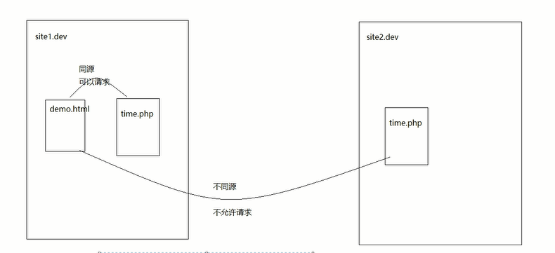
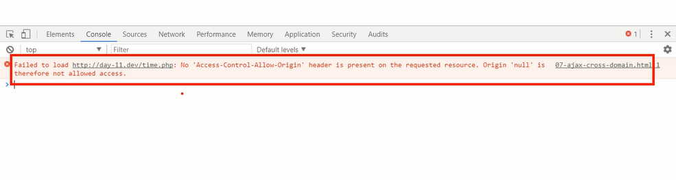

#ajax第二天讲义
## 1 jQuery中的ajax
#####**$.ajax({}) 可配置方式发起Ajax请求**<br/>
#####**$.get() 以GET方式发起Ajax请求**<br/>
#####**$.post() 以POST方式发起Ajax请求**<br/>
#####**$('form').serialize() 序列化表单（即格式化key=val&key=val）**<br/>
#####**url 接口地址**<br/>
#####**type 请求方式**<br/>
#####**timeout 请求超时**<br/>
#####**dataType 服务器返回格式**<br/>
#####**data 发送请求数据**<br/>
#####**beforeSend: function () {} 请求发起前调用**<br/>
#####**success 成功响应后调用**<br/>
#####**error 错误响应时调用**<br/>
#####**complete 响应完成时调用（包括成功和失败）**<br/>

**<font color ="red">封装jquery ajax方法</font>**
```
<!DOCTYPE html>
<html lang="en">
<head>
    <meta charset="UTF-8">
    <title>Title</title>
    <script src="js/jquery-1.12.4.js"></script>
    <script>
            $(function(){
                    //记住：这个是jQuery 封装的ajax 方法.
                   /*
                   * 1:事件的名称
                   * 2：事件的行为
                   * */
                   $("input[type=button]").on("click",function(){
                            $.ajax({
                                //url 代表的是请求的地址
                                url:"ajax.php",
                                //type 代表的是提交方式
                                type:"get",
                                //data 代表的发送到服务器的数据
                                //发送到服务的数据支持两种格式
                                //1：第一种格式 字符串
                                //data:"username=zhagnsan&age=11",
                                //2: 第二种格式 JavaScript 对象
                                data:{
                                      username:"zhangsan",
                                      age:11
                                },
                                //设置请求的超时时间,如果服务器端3秒之后还没有给我响应，连接就会断开.
                                timeout:3000,
                                //success 响应成功之后的回调函数.
                                success:function(data){
                                      alert("请求成功的时候调用");

                                },
                                //这个回调函数是在请求失败的时候调用.
                                //通过这个函数，一般可以给用户一些温馨的提示.
                                error:function(){
                                      alert("抱歉，服务器开了小差哦");
                                },
                                //请求完成的时候调用，不管出错，还是成功，都会请求完成，都会调用这里
                                complete:function(){
                                      alert("请求完成的时候调用");
                                },
                                //请求发送之前调用，一般我们可以通过该回调函数来检测发送到服务器的一些数据
                                //如果该回调函数，return false，就不发送请求了.
                                beforeSend:function(){
                                     alert("请求发送之前调用.");
                                     //我可以在数据发送之前检验. 比如说我要发送手机号到服务器，我先要校验手机号的格式是否正确
                                     //最后才发送到服务器.
                                     //可以获取到用户要提交的数据，校验这个数据，如果数据不通过，我就return false，然后给用户提示信息.
                                     return false;
                                }
                            });

                   })
            })
    </script>
</head>
<body>
<input type="button" value="jQuery ajax 方法的使用">
</body>
</html>
```

## 2 同源策略&&跨域
### 2.1 同源策略
**同源策略是浏览器的一种安全策略，所谓同源是指，<font color="red">域名</font>，<font color = "red">协议</font>，<font color = "red">端口</font>完全相同。**
### 2.2 跨域
**<font color ="red">不同源则跨域</font>**<br/>
**不同源现象(图解)**<br/>

### 2.3 jsonp
**其本质是利用了<font color ="red">``<script src=""></script>``</font>标签具有可跨域的特性，由服务端返回一个预先定义好的Javascript函数的调用，并且将服务器数据以该函数参数的形式传递过来，此方法需要前后端配合完成。**<br/>
```
<!DOCTYPE html>
<html lang="en">
<head>
    <meta charset="UTF-8">
    <title>Title</title>
</head>
<body>
<input type="button" value="使用script 标签去发送请求">
<script>

    function getInfo(obj){
        alert("函数被调用.");
        console.log(obj);
        //获取到数据，解析数据.
    }


    document.querySelector("input").onclick=function(){


        //发送请求，发送跨域请求，使用script 标签去发送跨域请求.
        var script=document.createElement("script");
        //script 标签能够发送跨域请求，不是跨域的请求当然也可以发送.
        script.src="03jsonp.php?callback=getInfo";
        //挂在到页面，浏览器就会解析这个标签.
        document.body.appendChild(script);
        //目的，在js 里面去接收到服务器返回的数据.
        //解决方案：
//                客户端：
//                1：给服务端传递一个参数，参数名叫做callback，参数值叫做getInfo
//                2:我在客户端定义一个getInfo 的函数. 定义的函数一定要是一个全局的函数.
//                服务端：
//                1：我接收一个callback 的参数.
//                2: 服务器端响应的是一个getInfo() 这样的一个内容响应到客户端浏览器
//                浏览器会以js 的方式去解析getInfo() 就会去调用这个getInfo 这个函数.


    };
</script>

</body>
</html>
```
**不跨域报错图例**



## 3 模板引擎
### 3.1 原理剖析
**其本质是利用正则表达式，替换模板当中预先定义好的标签。**
### 3.2 artTemplate
##### 1、引入template-native.js
##### 2、<% 与  %> 符号包裹起来的语句则为模板的<font color="red">逻辑表达式</font>
##### 3、<%= content %>为<font color="red">输出表达式</font>
```
<!DOCTYPE html>
<html lang="en">
<head>
    <meta charset="UTF-8">
    <title>Title</title>

    <script src="js/jquery.min.js"></script>
    <!--模板使用步骤
     1: 引入模板文件
    2：创建模板
    3：准备模板的内容,模板的内容跟写到页面上面的内容有关系
    4：将数据跟模板进行绑定【数据是在模板里面进行解析】
        在模板里面怎么解析，模板里面有对应的语法。
    5：将数据跟模板进行绑定之后，会返回一个新的内容
    6：将这个新的内容直接放在页面上面即可.

    -->
    <!--1: 引入模板文件-->
    <script src="js/template-native.js"></script>
    <!--2：创建模板 -->
    <!--3：准备模板的内容,模板的内容跟写到页面上面的内容有关系-->
    <!--
            在这个里面去解析数据 ，我要在模板里面去遍历这个obj 里面的数据.
     -->
    <script type="text/template" id="personId">
        <% for(var i=0;i<rows.length;i++) {%>
            <tr>
                <td><%=rows[i].personName%></td>
                <td><%=rows[i].personAge%></td>
                <td><%=rows[i].personDesc%></td>
                <td>"></td>
            </tr>
        <%}%>
    </script>
</head>
<body>
<input type="button" value="template 解析数据">
<table>
    <tr>
        <td>姓名</td>
        <td>年龄</td>
        <td>描述</td>
        <td>生活照</td>
    </tr>

</table>
<script>
        $(function(){
                $("input").on("click",function(){
                        $.ajax({
                            url:"01template.php",
                            type:"get",
                            success:function(data){
                                 //以我之前的方式解析。
                                 //alert(data);
//                                4：将数据跟模板进行绑定【数据是在模板里面进行解析】
//                                使用模板提供的方法进行绑定，template-native.js 文件提供的方法
//                                提供了一个template 方法  将模板跟数据进行绑定
//                                参数1:模板的id  personId
//                                参数2：要绑定的数据
//                                参数要求穿进去的数据必须是一个 {} 格式。 现在data [] 格式.
//                                转换成{} 格式
                                  var obj={
                                      rows:data
                                  }
                                 //会返回字符串内容.
                                 //怎么在模板里面解析数据
                                 //这个模板里面是可以写js 代码的
                                 //要求这个js 代码必须写在
                                 //语法要求：
                                 //  <%%> 这个里面可以写逻辑
                                 //  <%=%> 这里面用来向模板里面输出内容.

                                 console.log(obj);
                                 var html=template("personId",obj);
                                 $("table").append(html);

                            }
                        });
                });
        })


</script>
</body>
</html>
```
